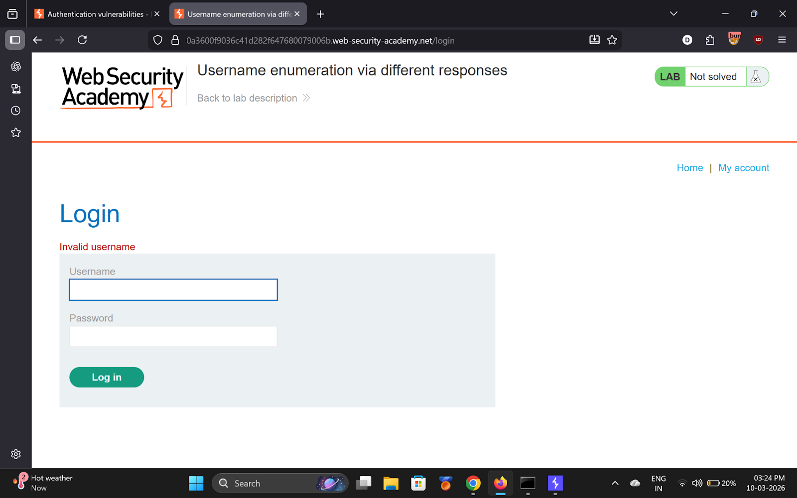
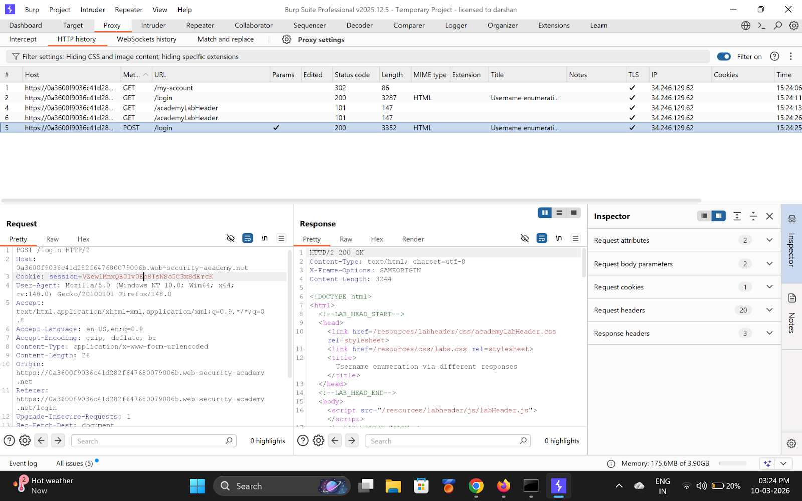
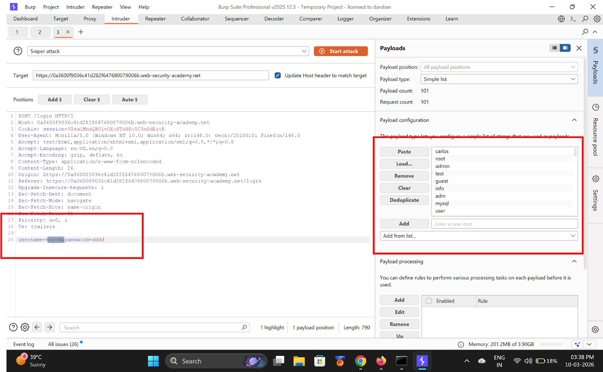
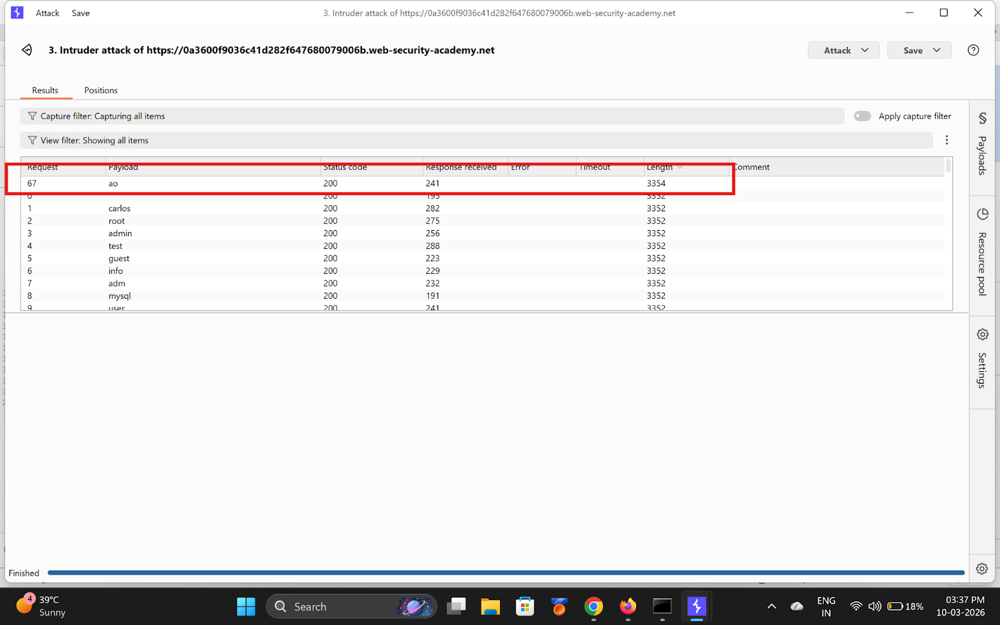
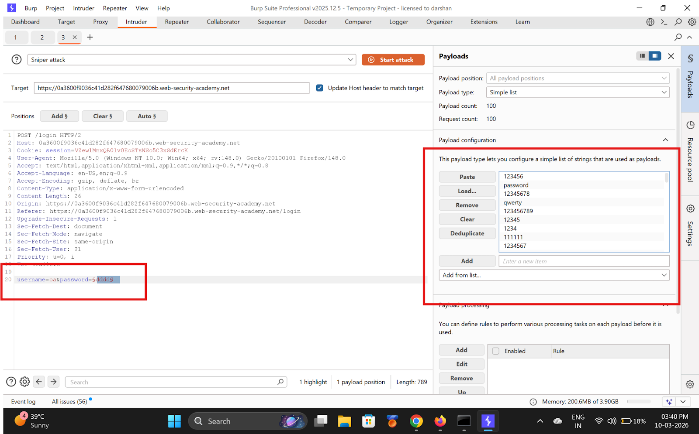
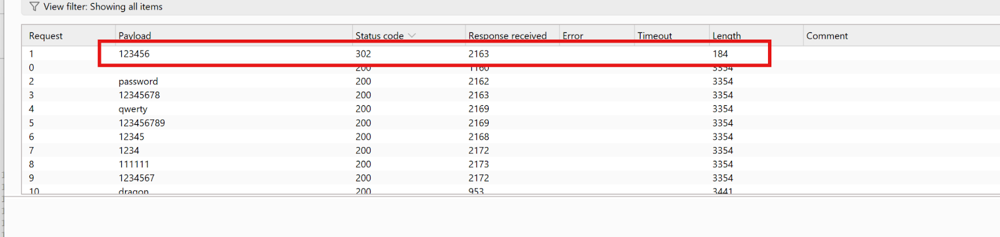
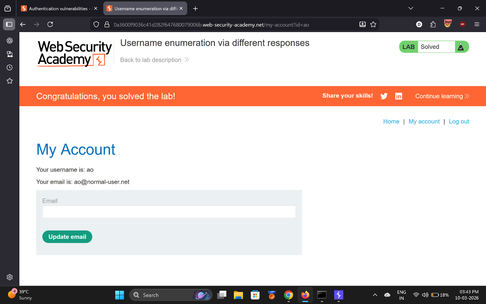

# Lab 1 — Username enumeration via different responses

> [← Back to Authentication](../README.md)

---

## 🎯 Objective
Enumerate a valid username via different error messages, then brute-force the password.

---

## 🪜 Steps

### Step 1 — Submit invalid login, investigate response

---

### Step 2 — Send to Intruder

---

### Step 3 — Sniper attack on username field
Payload: PortSwigger username wordlist. Look for response where message changes to `"Incorrect password"`.

**Found username: `ao`**

---

### Step 4 — Brute-force password
Fix `username=ao`, Sniper on password field.

**Found password: `123456`**

---

### Step 5 — Login and solved

---

## ✅ Result
- **Username:** `ao`
- **Password:** `123456`

---

## 💡 Key Takeaway
Different error messages for bad username vs bad password leak which users exist. Always return a single generic error.
