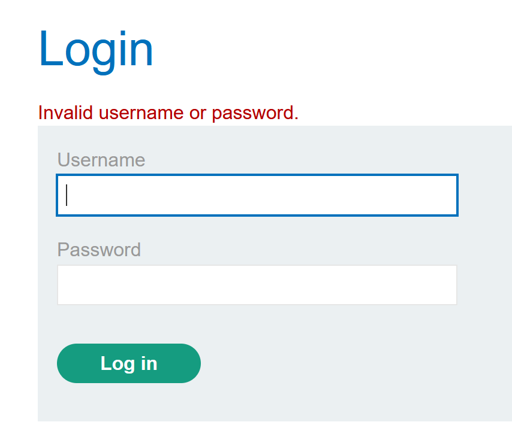
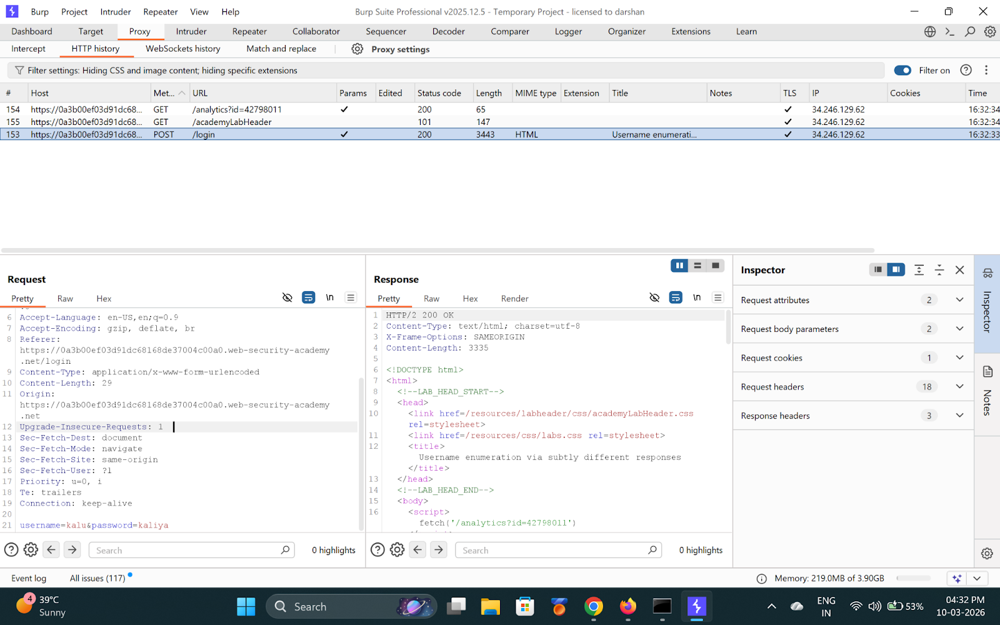
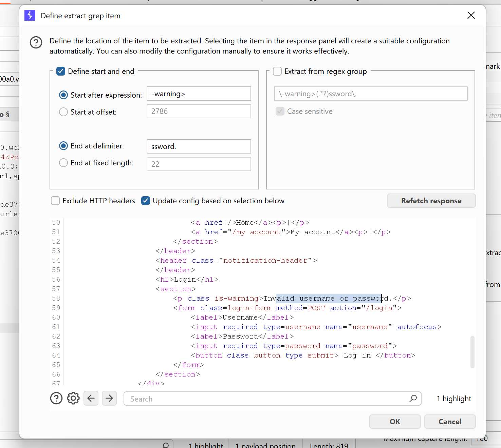
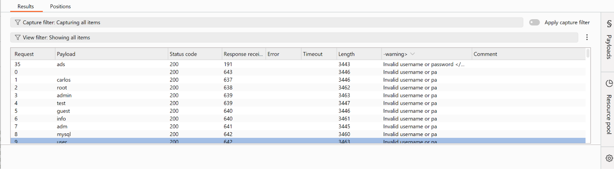
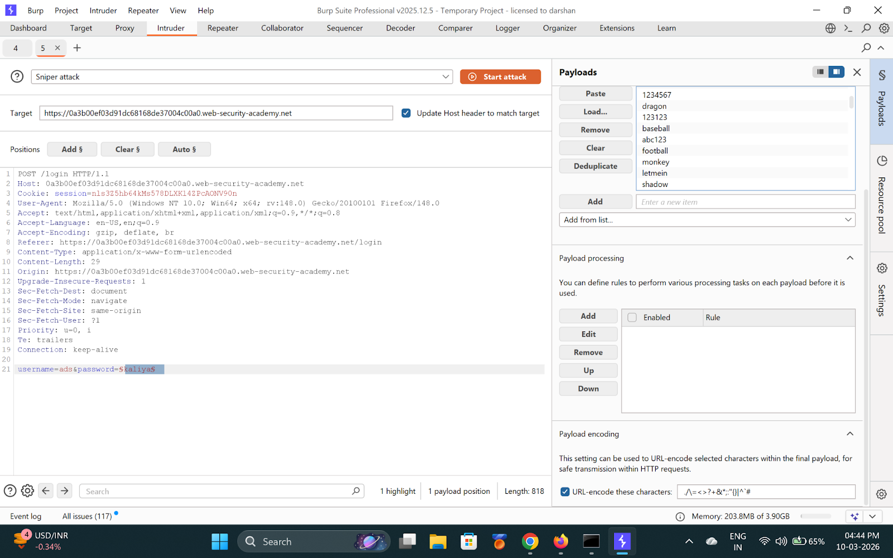
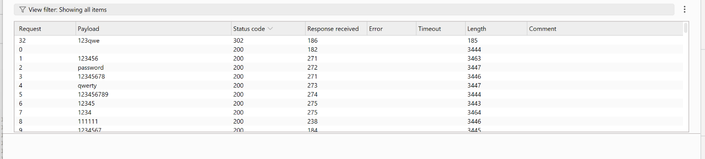
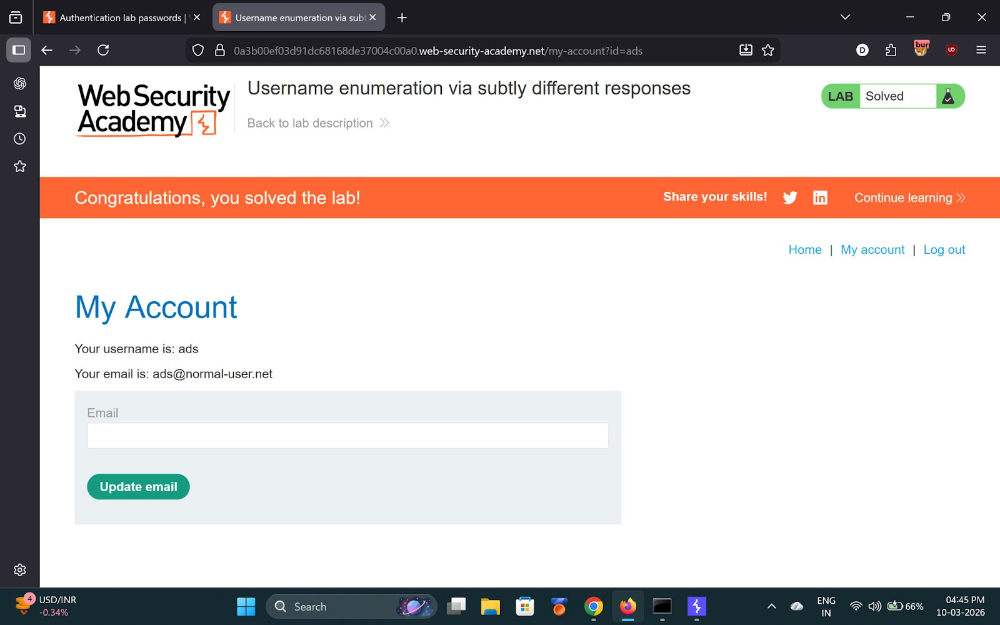

# Lab 2 — Username enumeration via subtly different responses

> [← Back to Authentication](../README.md)

---

## 🪜 Steps

### Step 1 — Submit invalid login

---

### Step 2 — Send to Intruder

---

### Step 3 — Add Grep-Extract for error message
Under **Grep - Extract → Add** → highlight `Invalid username or password.`

One response will have a subtle difference (e.g. missing trailing period).

**Found username: `ads`**

---

### Step 4 — Brute-force password

**Found password: `123qwe`**

---

### Step 5 — Login and solved

---

## ✅ Result
- **Username:** `ads`
- **Password:** `123qwe`
