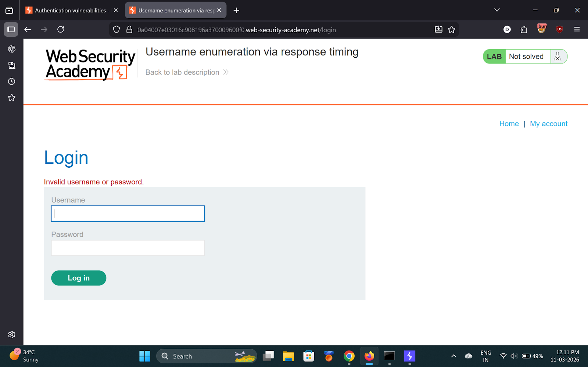
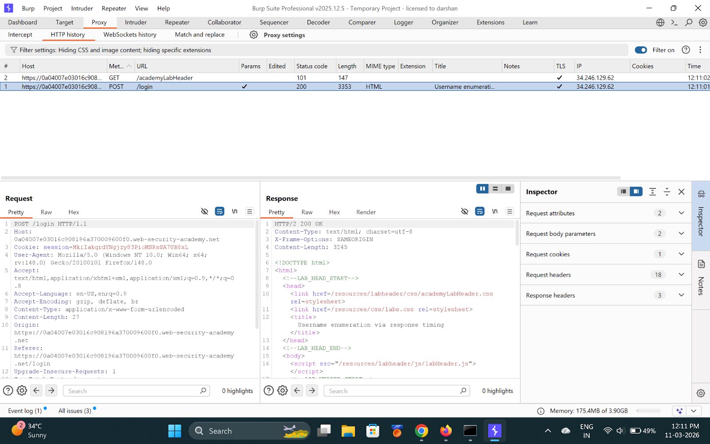
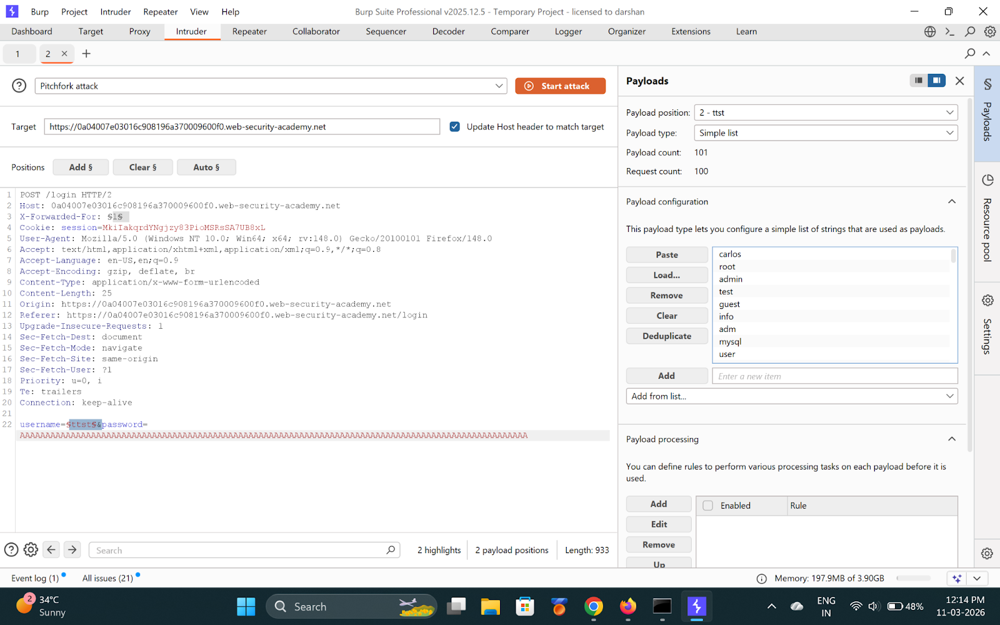
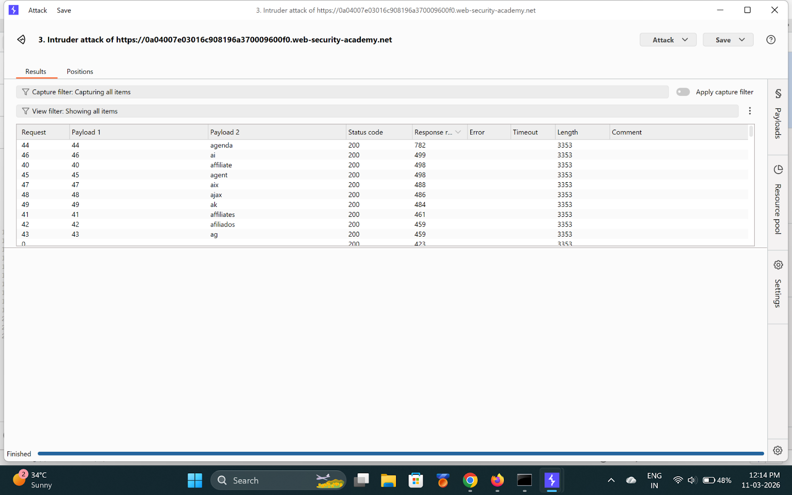
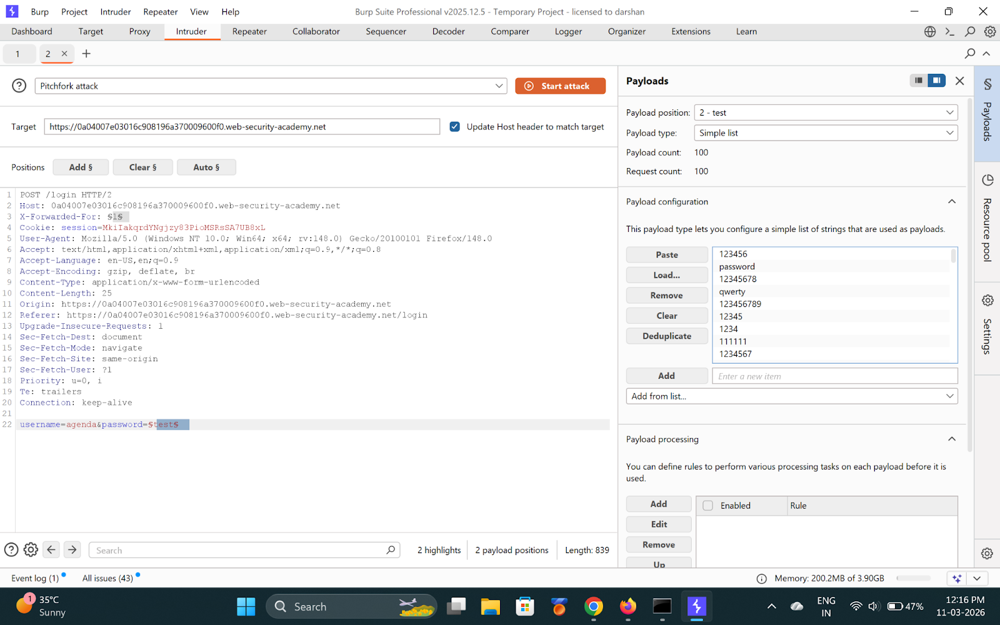
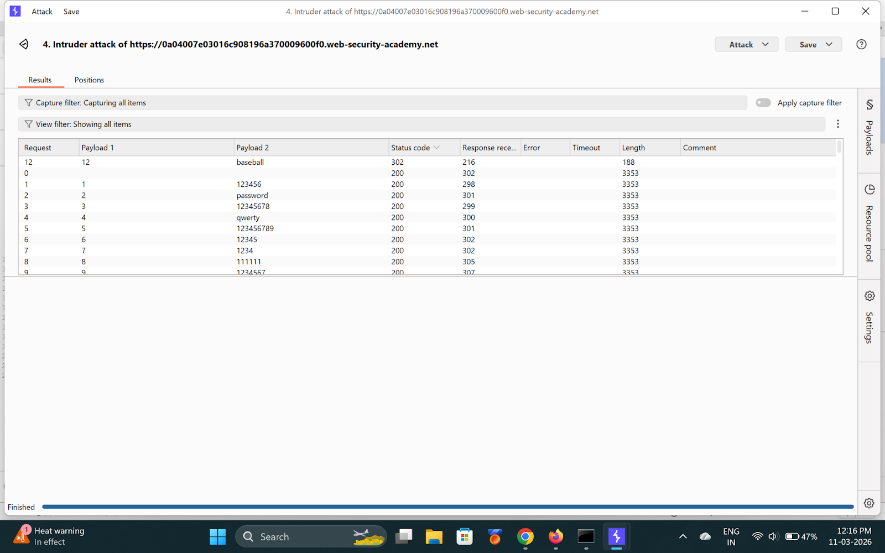
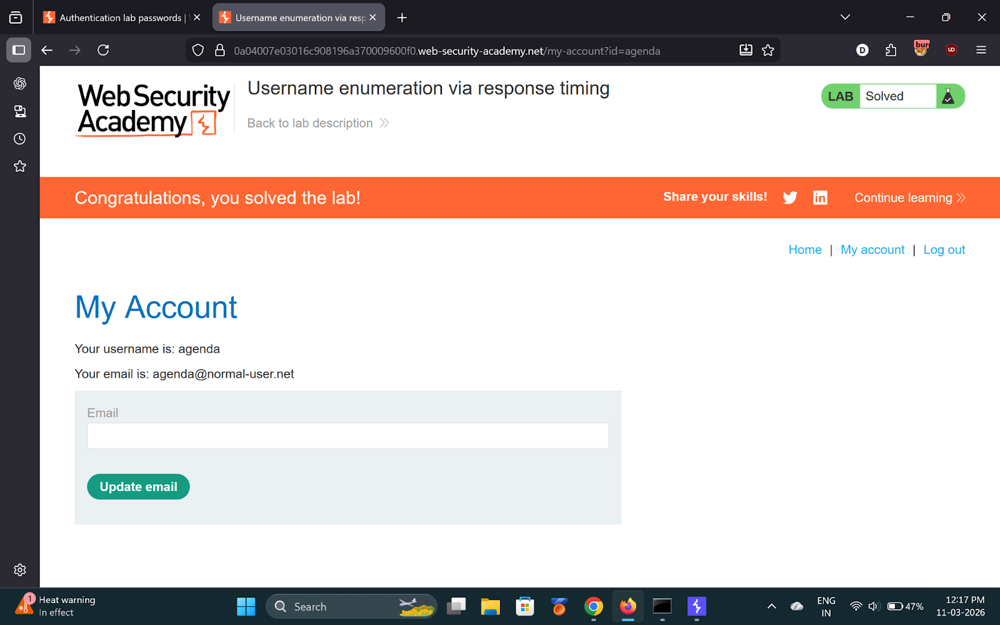

# Lab 3 — Username enumeration via response timing

> [← Back to Authentication](../README.md)

---

## 🪜 Steps

### Step 1 — Capture login request, send to Intruder

---

### Step 2 — Add X-Forwarded-For header (bypass rate limit)
Add: `X-Forwarded-For: 1` as a payload position.

---

### Step 3 — Pitchfork attack: X-Forwarded-For + username
Use a very long password (100+ chars) to amplify timing differences.

---

### Step 4 — Analyze response times
Sort by response time. One username takes noticeably longer.

**Found username: `agenda`**

---

### Step 5 — Brute-force password

**Found password: `baseball`**

---

### Step 6 — Login and solved
- **Username:** `agenda`
- **Password:** `baseball`

---

## ✅ Result
- **Username:** `agenda`
- **Password:** `baseball`
