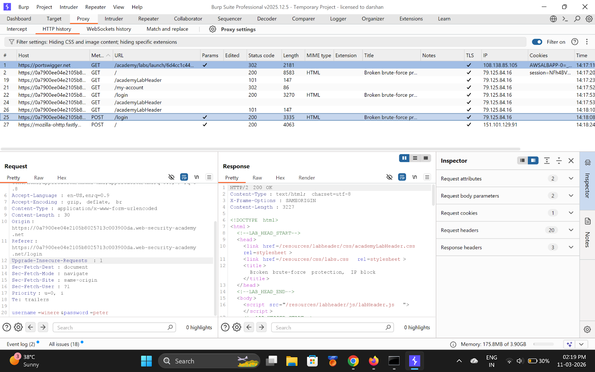
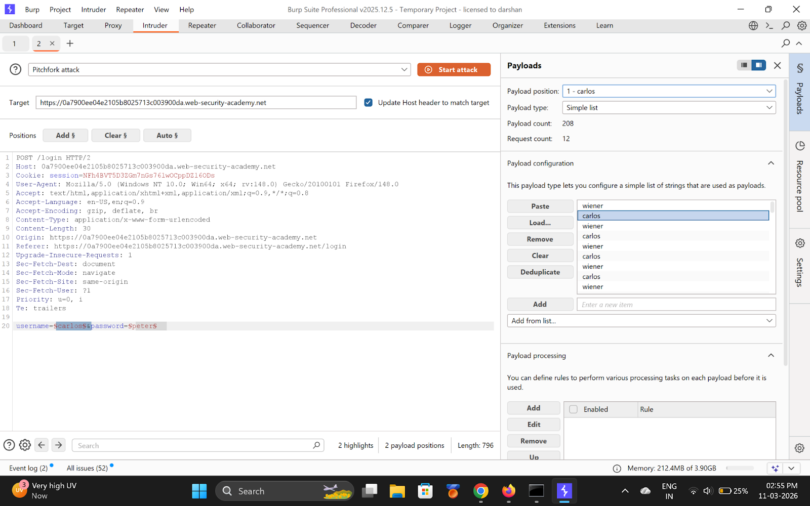
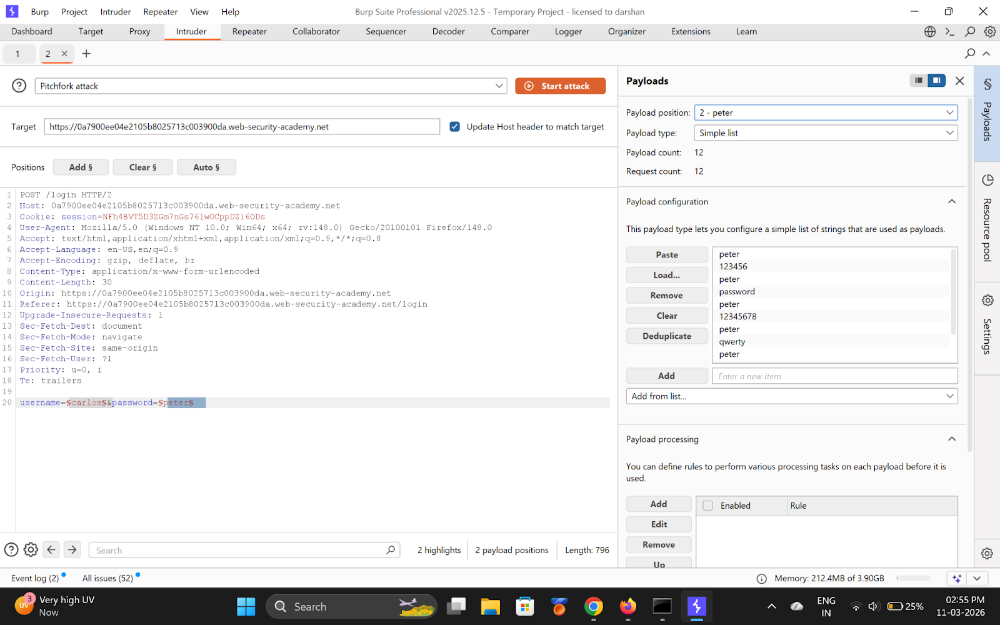
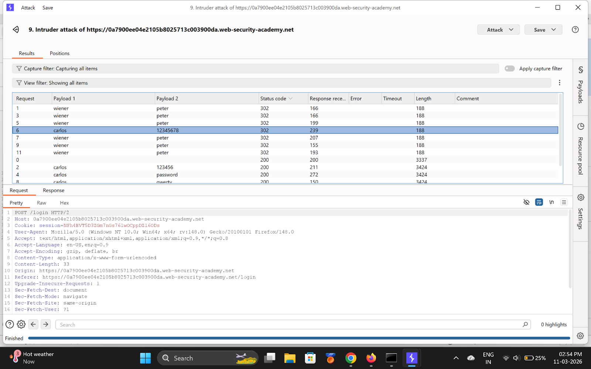
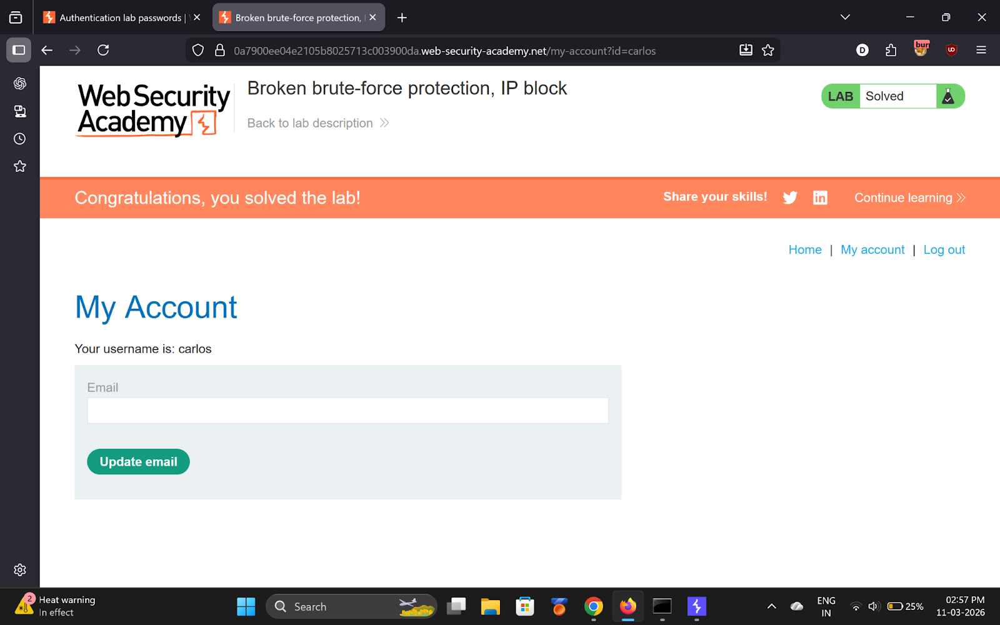

# Lab 4 — Broken brute-force protection, IP block

> [← Back to Authentication](../README.md)

---

## 🪜 Steps

### Step 1 — Capture login, send to Intruder
Intercept `POST /login` → **Intruder**.

---

### Step 2 — Pitchfork attack + Resource Pool (1 concurrent request)
**Username payload** — alternating wiener/carlos:
```
wiener, carlos, wiener, carlos, wiener, carlos ...
```

**Password payload** — wiener's real password after every carlos attempt:
```
peter, 123456, peter, password, peter, 12345678 ...
```

---

### Step 3-6 — Attack runs in order
Every 2nd request is `wiener:peter` (valid) → resets the IP counter.







---

### Step 7 — Login as Carlos
**Username:** `carlos`
**Password:** `12345678`

---

## ✅ Result
- **carlos password:** `12345678`

## 💡 Key Takeaway
IP-based rate limiting is bypassable by resetting the counter with valid logins.
