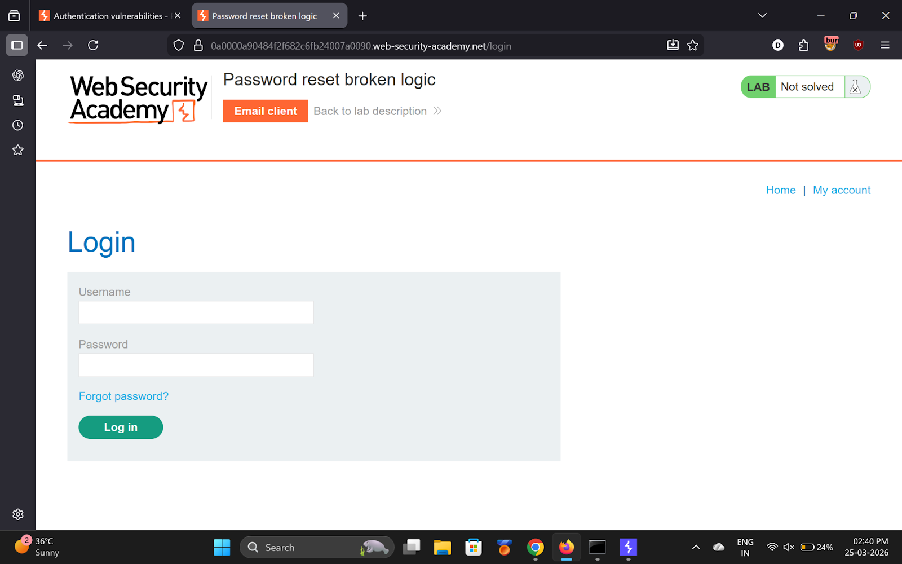
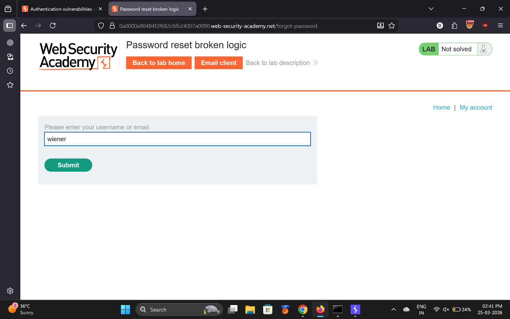
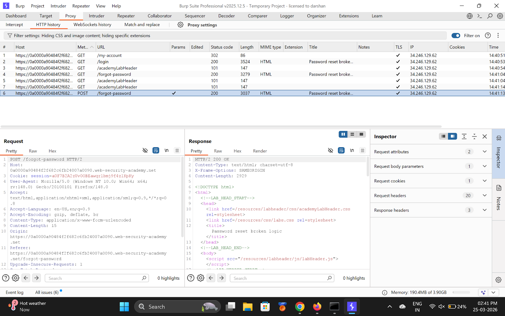
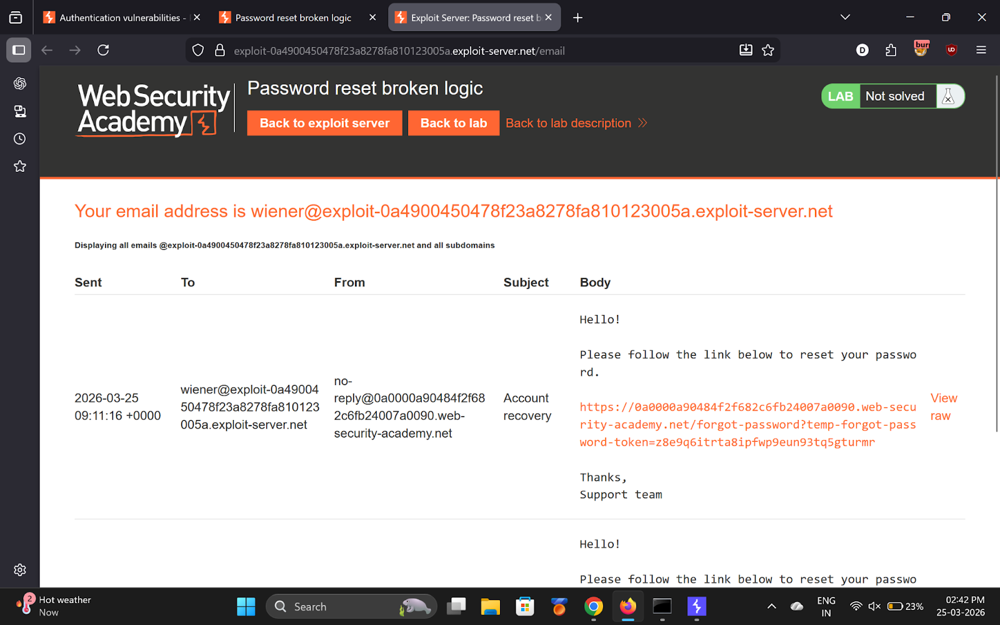
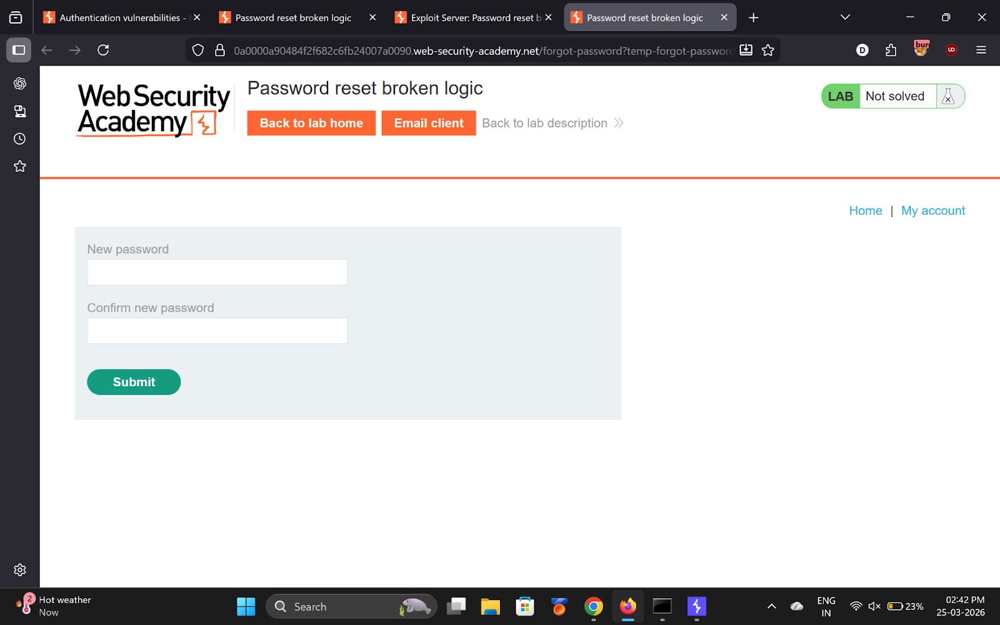
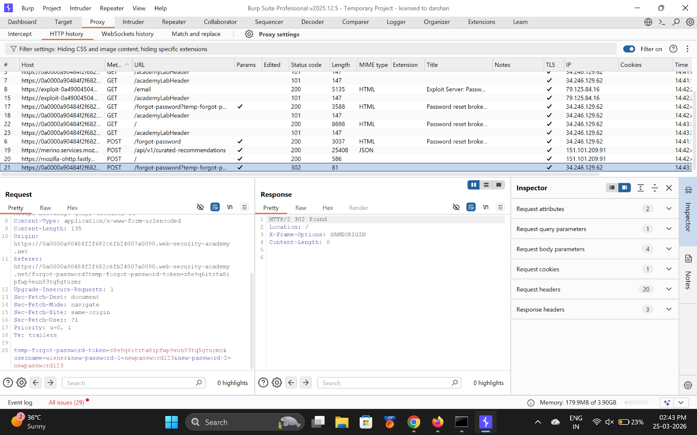
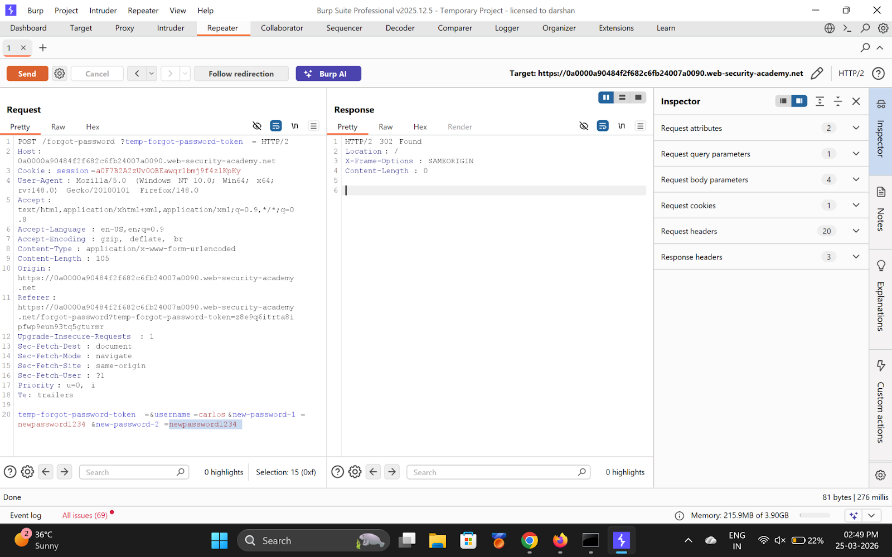
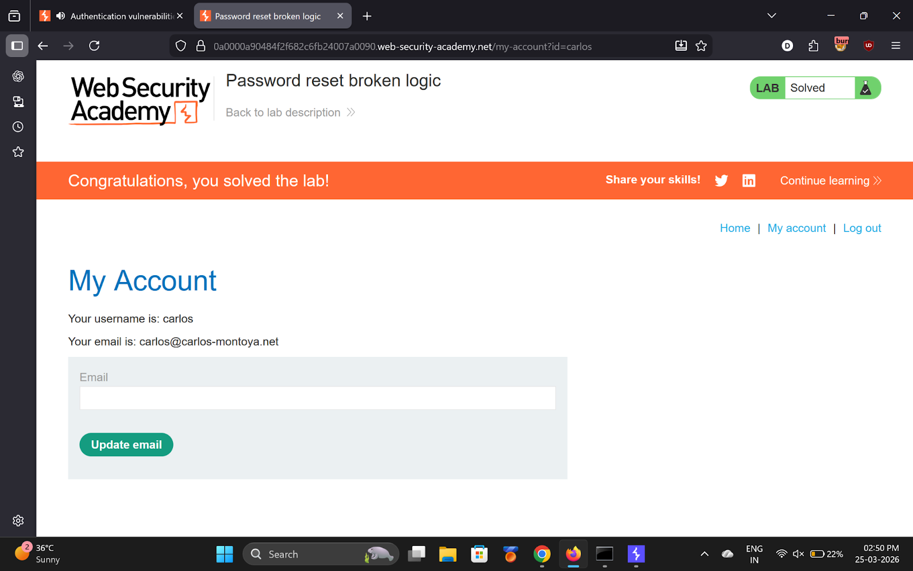

# Lab 5 — Password reset broken logic

> [← Back to Authentication](../README.md)

---

## 🪜 Steps

### Step 1 — Trigger password reset for wiener
Go to **Forgot password?** → enter `wiener` → open reset link from email.

---

### Step 2 — Submit new password, capture in Burp
Find `POST /forgot-password?temp-forgot-password-token=XXXX` in HTTP history.

---

### Step 3 — Send to Repeater

---

### Step 4 — Break the logic
Modify the POST body:
- `temp-forgot-password-token=` ← **clear the token**
- `username=carlos` ← **change username**

---

### Step 5 & 6 — Send and login as Carlos
Response: **200 OK** → attack worked.

Login using `carlos` with the password you set.

---

## ✅ Result
Lab solved!

## 💡 Key Takeaway
Never trust the username from the POST body — always derive it from the validated reset token.
