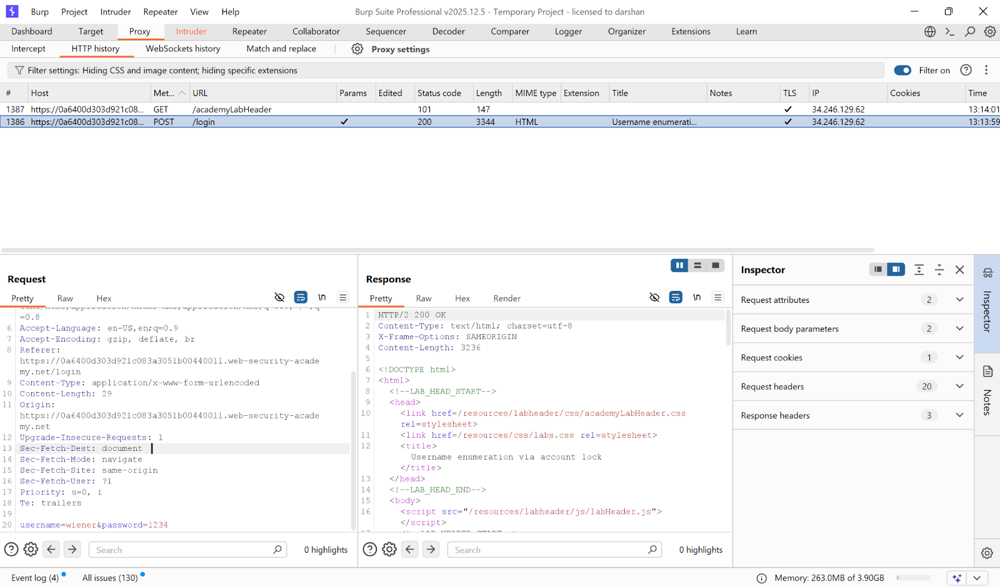
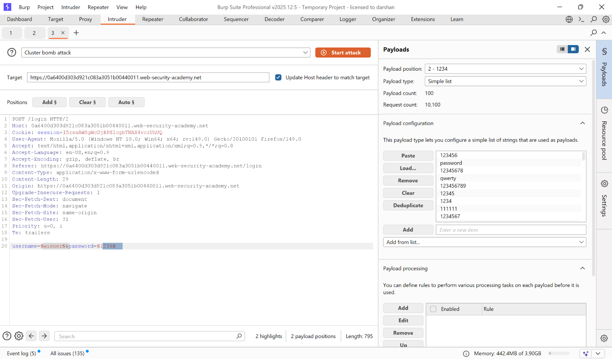
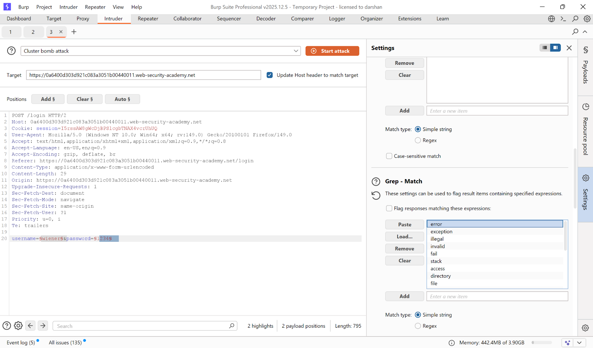

# Lab 6 — Username enumeration via account lock

> [← Back to Authentication](../README.md)

---

## 🪜 Steps

### Step 1 — Login with random credentials

---

### Step 2 — Send to Intruder

---

### Step 3 — Cluster Bomb attack
- Payload 1: username wordlist
- Payload 2: null payload × 5 (sends each username 5 times)

Valid accounts get locked → different response.

---

### Step 4 — Find locked account
Response with lockout message = valid username.

**Found username: `agent`**

---

### Step 5 — Login as victim
Wait ~1 minute, then brute-force password.

**Password: `princess`**

---

## ✅ Result
- **Username:** `agent`
- **Password:** `princess`
