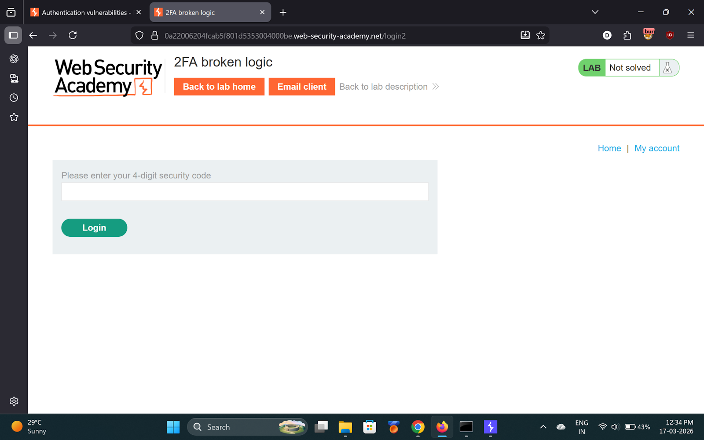
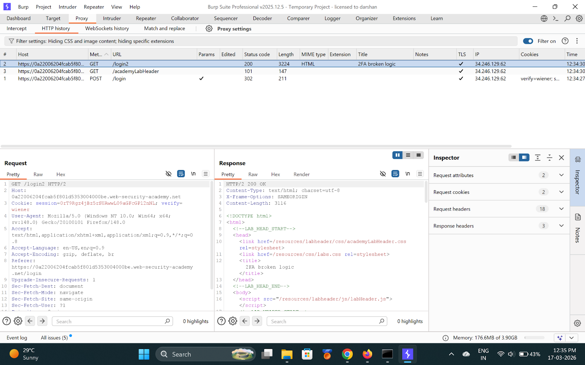
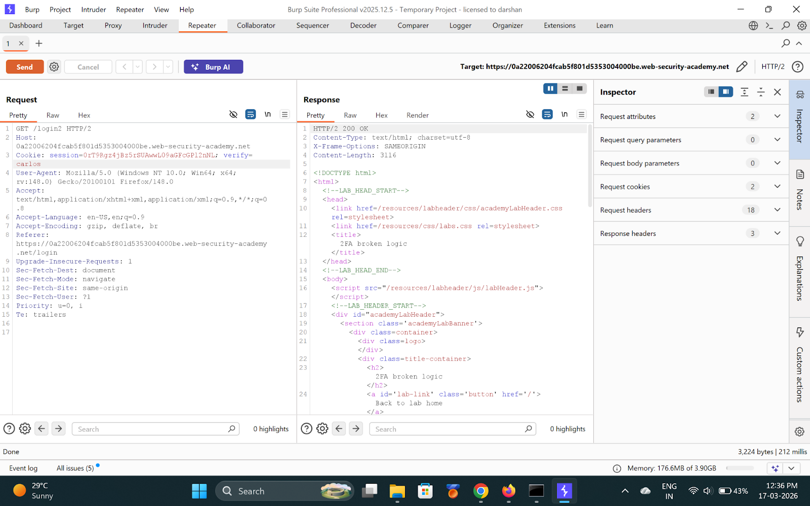
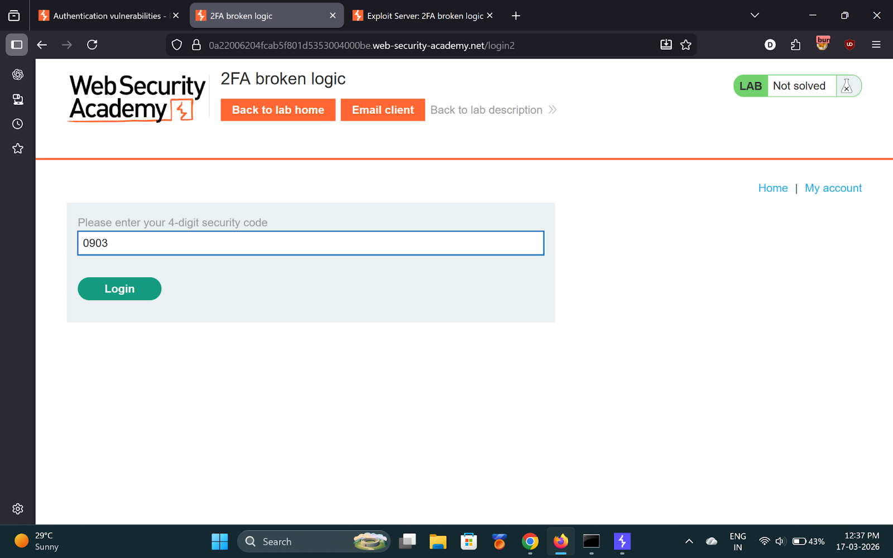
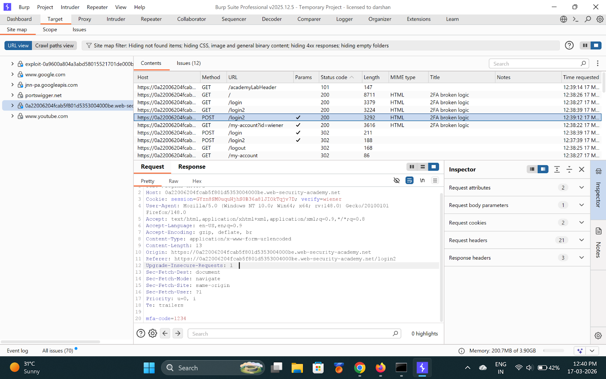
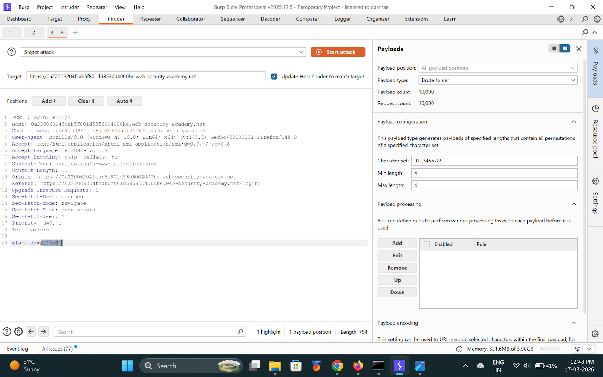
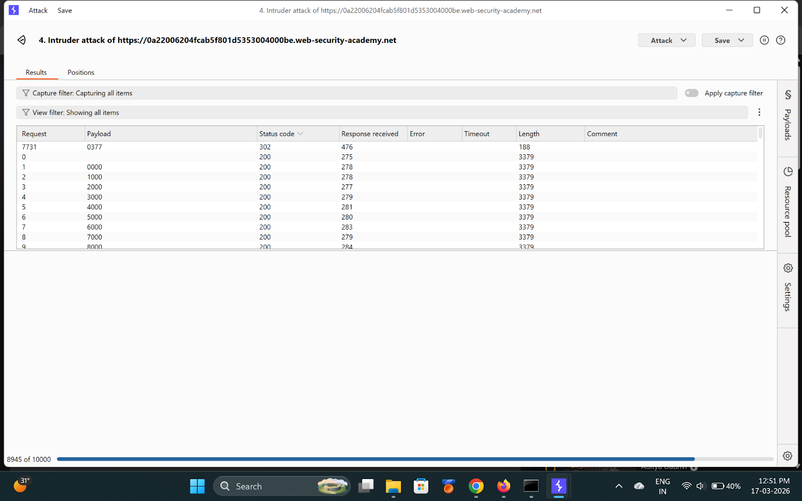
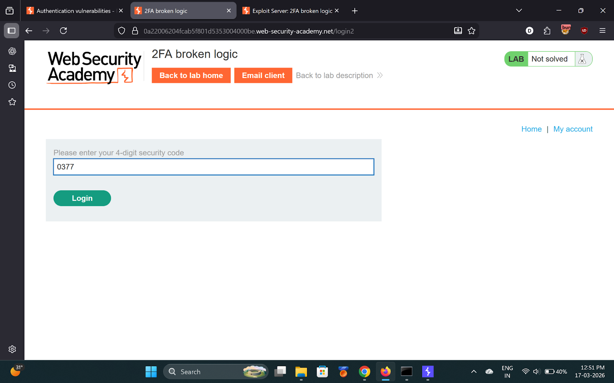
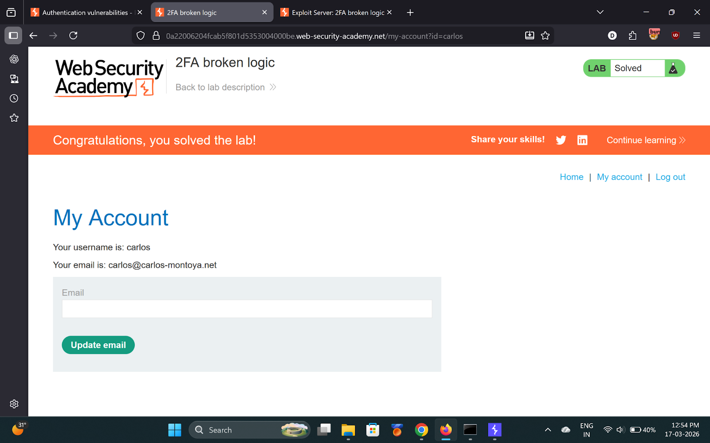

# Lab 7 — 2FA broken logic

> [← Back to Authentication](../README.md)

---

## 🪜 Steps

### Step 1 — Login as wiener, reach /login2
Login with `wiener:peter`. Intercept flow. Reach `GET /login2`.




---

### Step 2 — Change verify cookie to carlos in Repeater
```
Cookie: verify=carlos
```
Server now generates OTP for Carlos.




---

### Step 3 — Login again, intercept POST /login2
Enter any wrong 2FA code. Intercept `POST /login2`.




---

### Step 4 — Intruder: brute-force OTP (0000-9999)
- Cookie: `verify=carlos`
- Payload position: `mfa-code`
- Type: Brute force, 4 digits




---

### Step 5 — Found OTP
Look for **302** → **OTP: `0377`**



---

## ✅ Result
Enter `0377` in browser → Logged in as Carlos!

- **OTP:** `0377`

## 💡 Key Takeaway
2FA codes must be bound to the specific user session — never rely on an attacker-controllable cookie.
