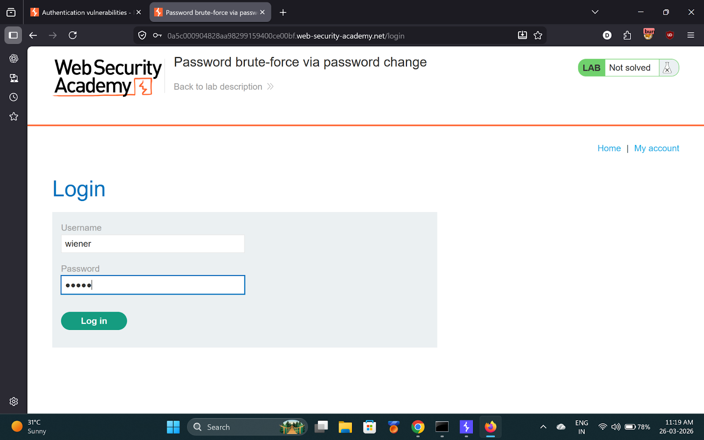
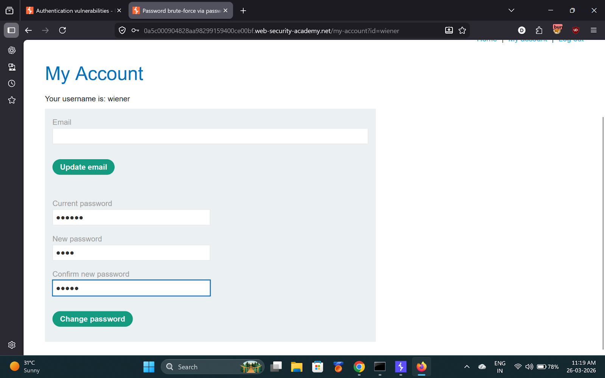
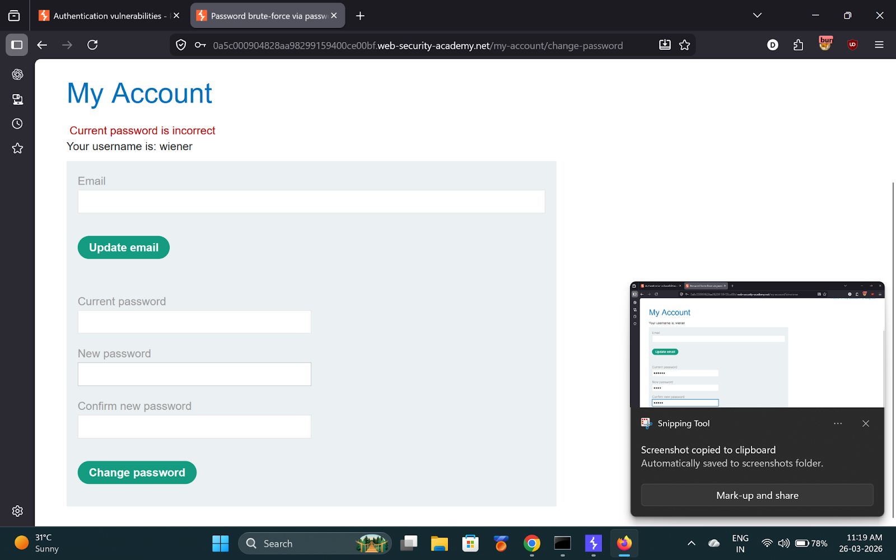
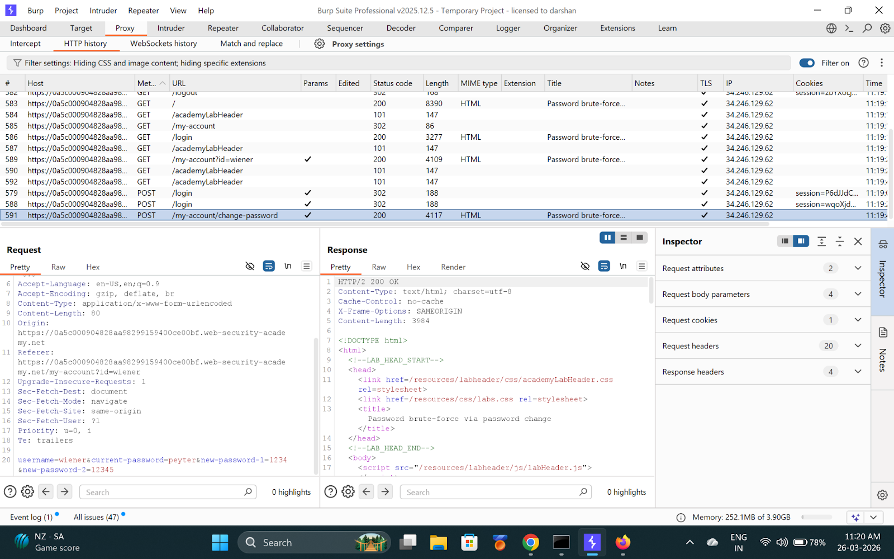
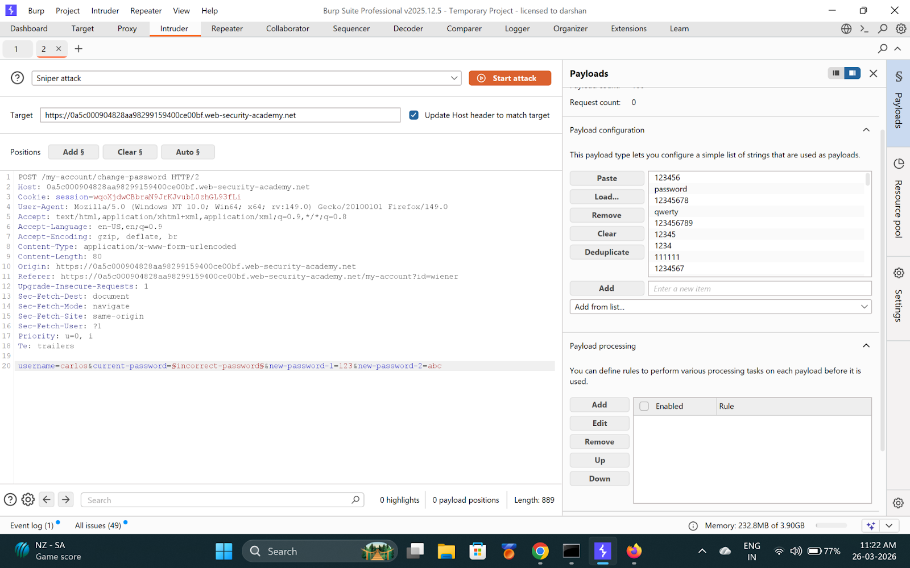
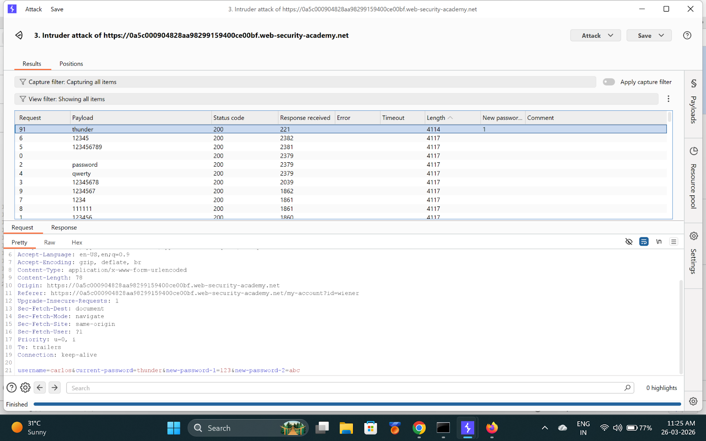
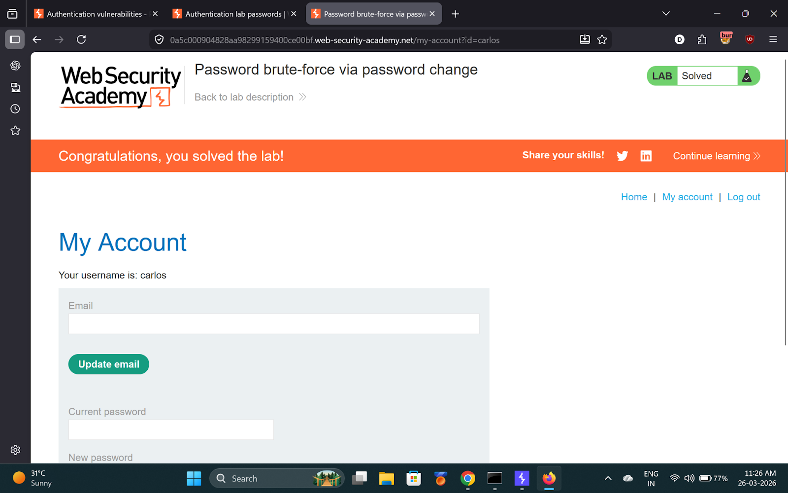

# Lab 8 — Password brute-force via password change

> [← Back to Authentication](../README.md)

---

## 🪜 Steps

### Step 1 — Login as wiener


---

### Step 2 — Submit password change with wrong current password
- Current: `wrongvalue`
- New: `123`
- Confirm: `abc` (deliberately different)

Capture in Burp.





---

### Step 3 — Send to Intruder, target carlos
Modify body:
```
username=carlos&current-password=§pass§&new-password-1=123&new-password-2=abc
```

Add **Grep-Match**: `New passwords do not match`

This fires only when current password is **correct**.



---

### Step 4 — Launch attack, find password
When grep match fires = correct current password for carlos.

**Found password: `thunder`**



---

### Step 5 — Login as Carlos


---

## ✅ Result
- **carlos password:** `thunder`

## 💡 Key Takeaway
Password change forms can be exploited as brute-force oracles if error messages differ based on current password correctness.
