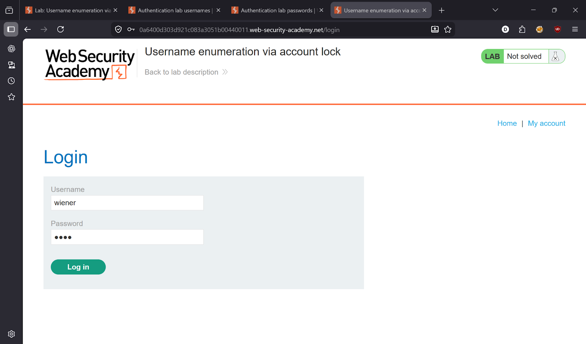
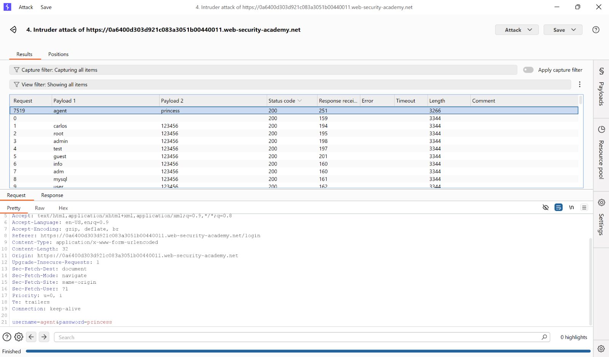
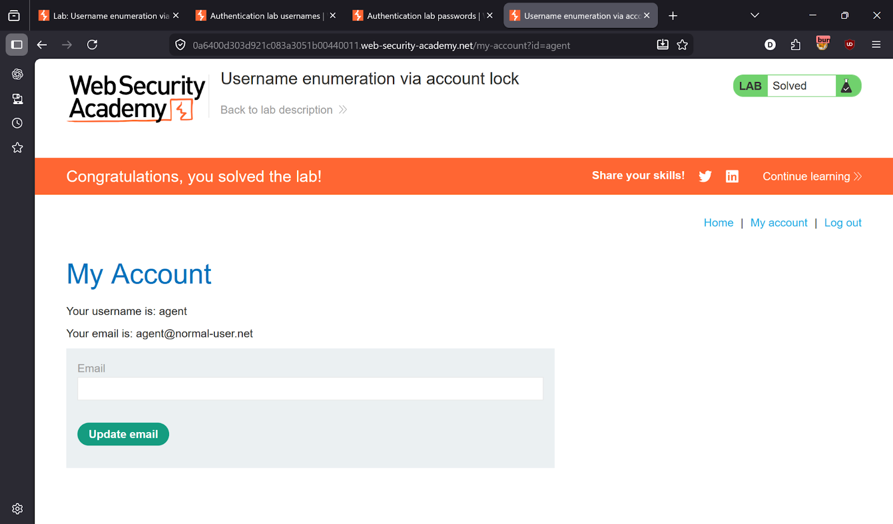

# Lab 9 — Username enumeration via account lock

> [← Back to Authentication](../README.md)

---

## 🪜 Steps

### Step 1 — Login with random credentials

### Step 2 — Intercept and send to Intruder

### Step 3 — Cluster Bomb attack
Attack type: **Cluster Bomb** — payload on both username and password.

### Step 4 — Find locked account = valid username

### Step 5 — Login as victim
- **Username:** `agent`
- **Password:** `princess`

---

## ✅ Result
Lab solved!
