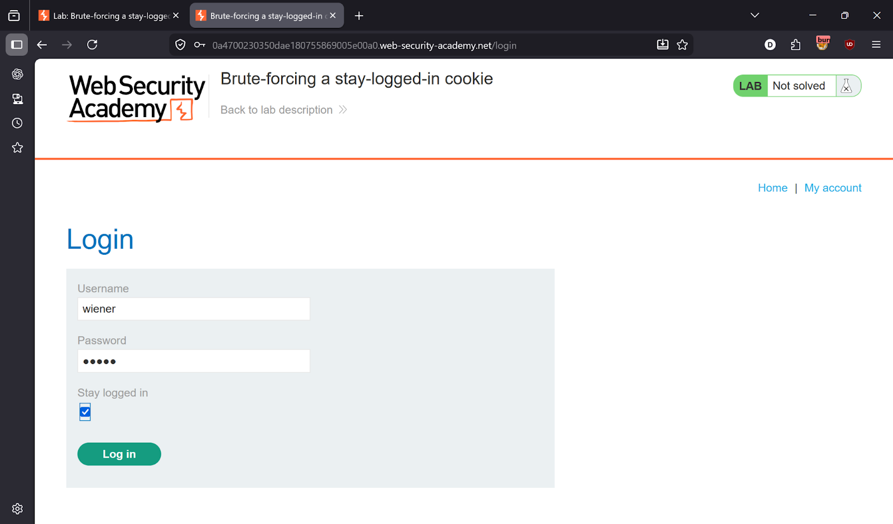
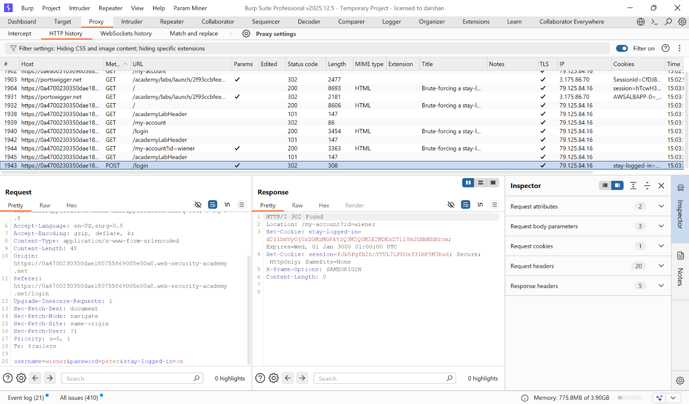
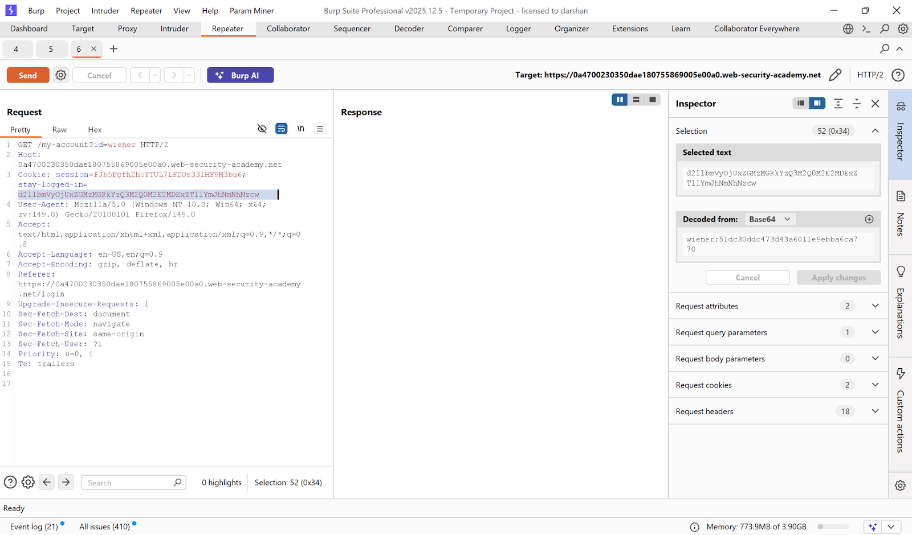
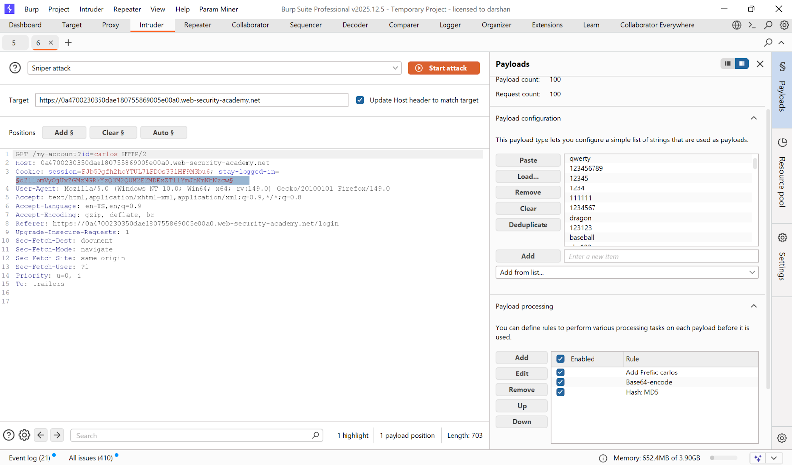
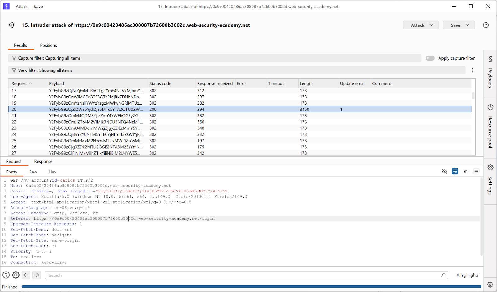
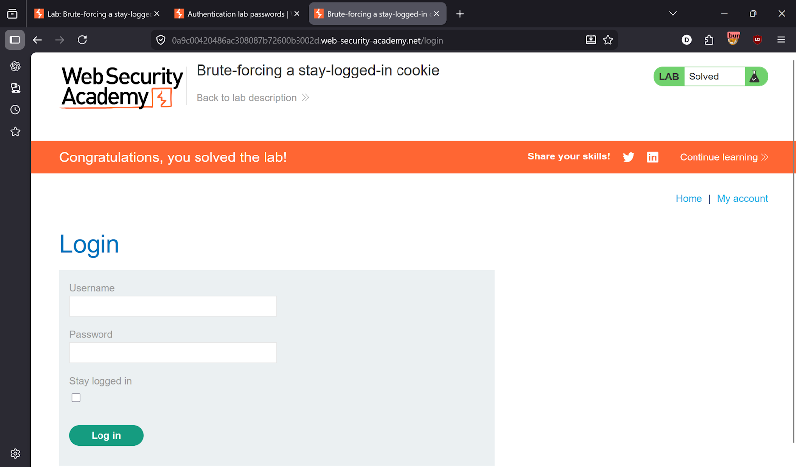

# Lab 10 — Brute-forcing a stay-logged-in cookie

> [← Back to Authentication](../README.md)

---

## 🎯 Objective
The stay-logged-in cookie is a base64-encoded `username:MD5(password)`. Brute-force it to access Carlos's account.

---

## 🪜 Steps

### Step 1 — Login and capture cookie
Enable **Stay logged in** checkbox when logging in as wiener.




---

### Step 2 — Decode the cookie
Base64 decode the `stay-logged-in` cookie value:
```
wiener:51dc30ddc473d43a6011e9ebba6ca770
```
Format: `username:MD5(password)`

---

### Step 3 — Send to Intruder
Send the `/my-account?id=carlos` request to **Intruder**. Set payload on the cookie value.




---

### Step 4 — Configure payload processing rules
Add these processing rules in order:
1. Hash: **MD5**
2. Add prefix: `carlos:`
3. Encode: **Base64**

Payload list: PortSwigger password wordlist.

---

### Step 5 — Identify valid cookie
Look for response containing Carlos's account page.



---

### Step 6 — Access Carlos's account
Use the valid cookie to access the account.



---

## ✅ Result
Lab solved!

---

## 💡 Key Takeaway
Stay-logged-in cookies must be cryptographically signed and unpredictable. Never base them on a hash of the password.
