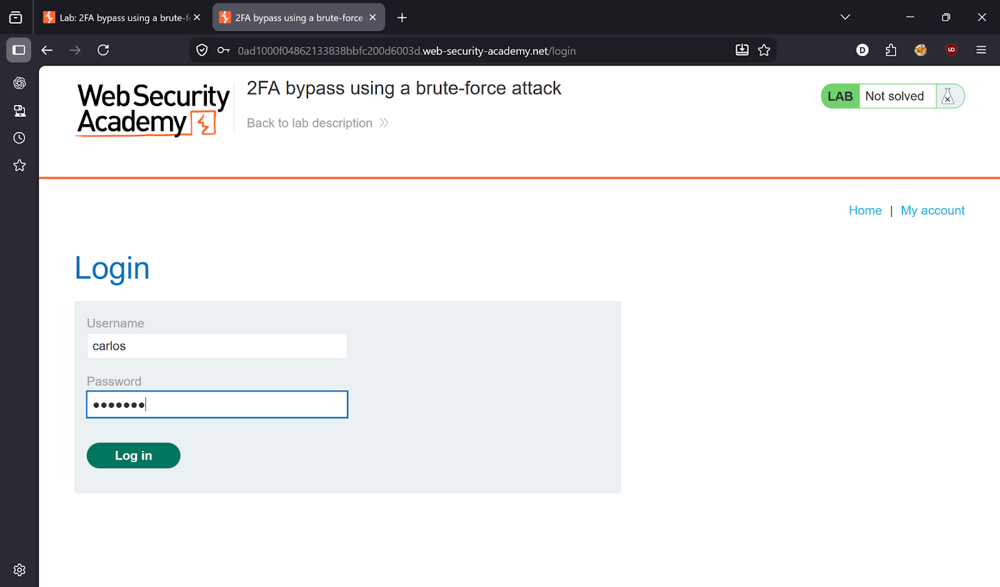
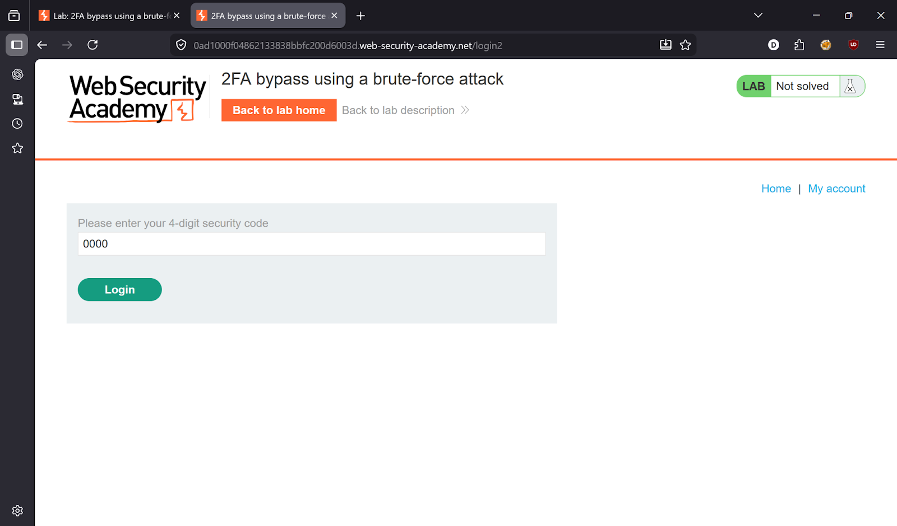
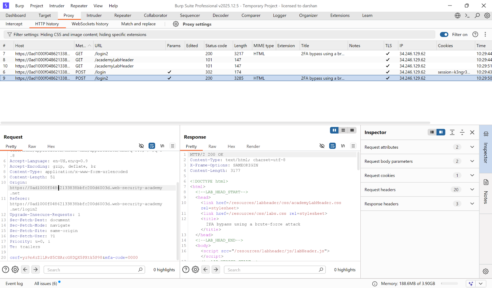
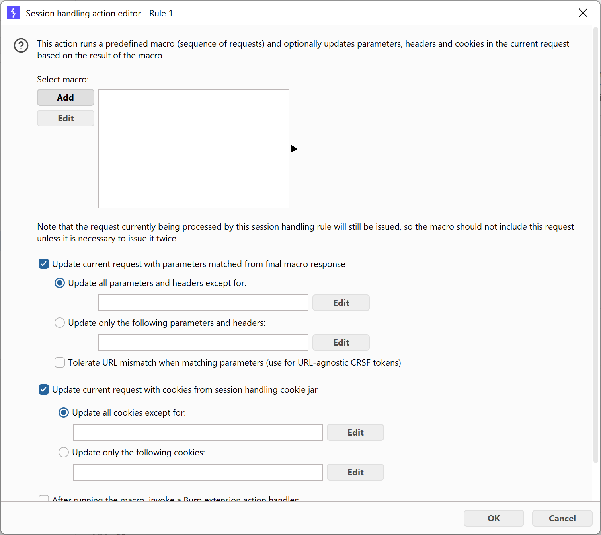
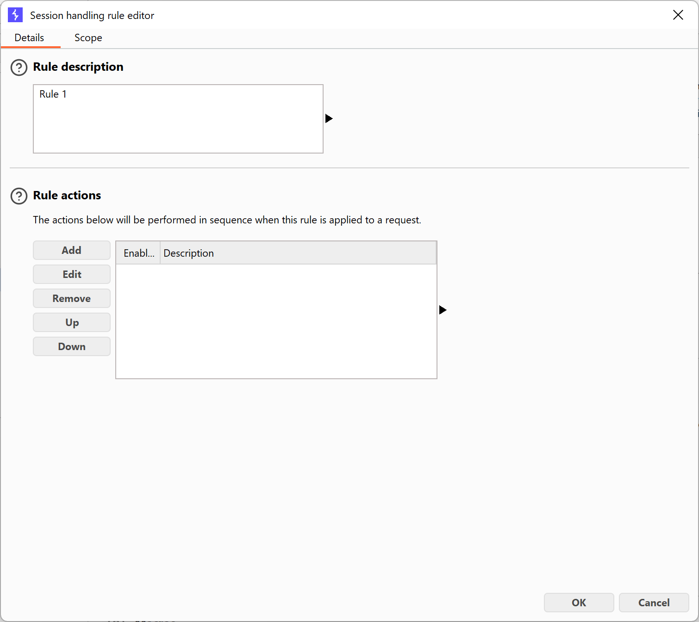
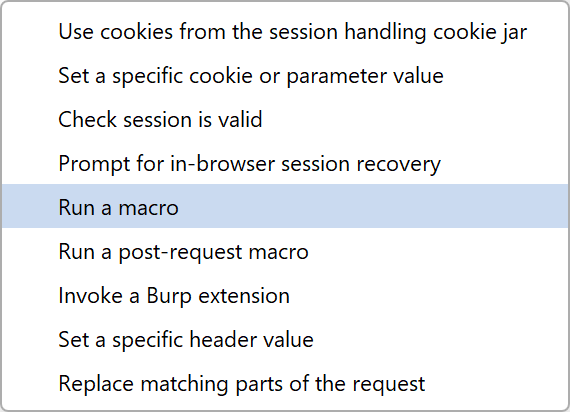
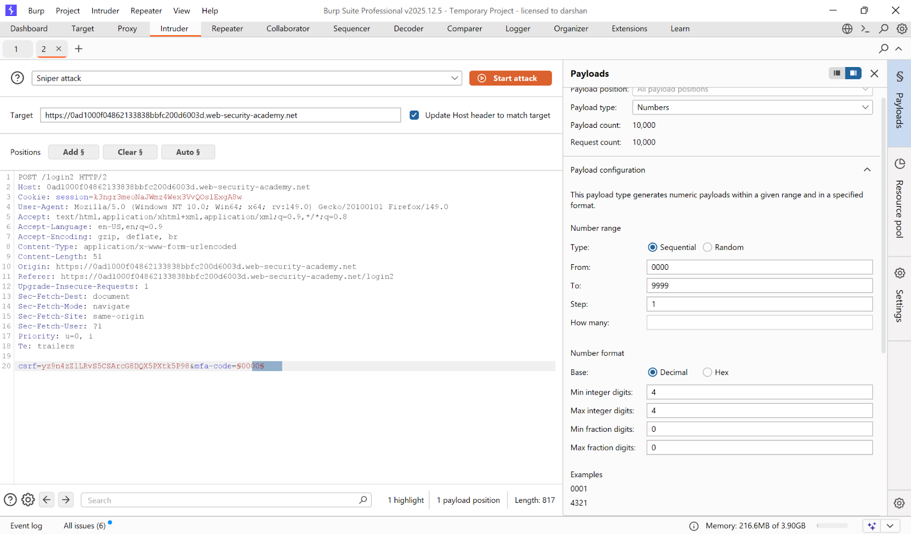
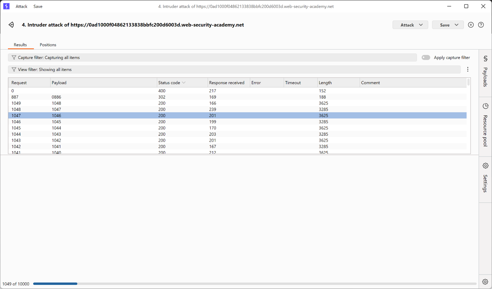
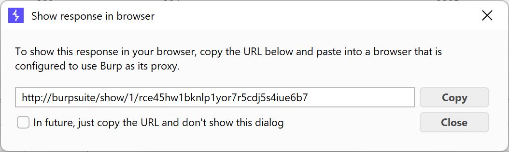
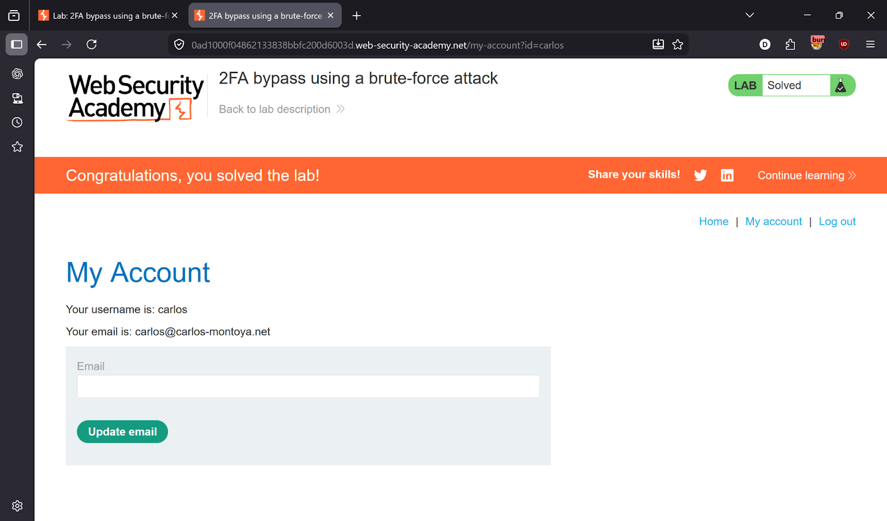

# Lab 14 — 2FA bypass using a brute-force attack

> [← Back to Authentication](../README.md)

---

## 🎯 Objective
Brute-force Carlos's 2FA code using a macro to automatically re-login between each attempt (session stays valid).

---

## 🪜 Steps

### Step 1 — Login as Carlos, reach 2FA page
- **Username:** `carlos`
- **Password:** `montoya`

Intercept in Burp — observe redirect to `/login2` (2FA page).




---

### Step 2 — Capture required requests
From **HTTP history**, identify these 3 requests needed for the macro:
```
GET  /login
POST /login
GET  /login2
```



---

### Step 3 — Configure Session Handling Macro
Go to: **Settings → Sessions → Add Rule**
- Scope: Include all URLs
- Rule Action: **Run a macro**
- Macro requests: `GET /login` → `POST /login` → `GET /login2`

This macro re-logs in as Carlos before every Intruder request, keeping the session valid.





---

### Step 4 — Send MFA request to Intruder
Configure Intruder:
- Position: `mfa-code=§0000§`
- Payload type: **Numbers**
- From: `0000`, To: `9999`, Step: `1`, Min/Max digits: `4`
- Resource Pool: **Max concurrent requests = 1**



---

### Step 5 — Launch attack, find valid OTP
Look for **302** status code.





---

## ✅ Result
Lab solved!

---

## 💡 Key Takeaway
2FA codes must have a short expiry and strict attempt limits per session. Without these, brute-forcing 0000–9999 is trivially possible.
