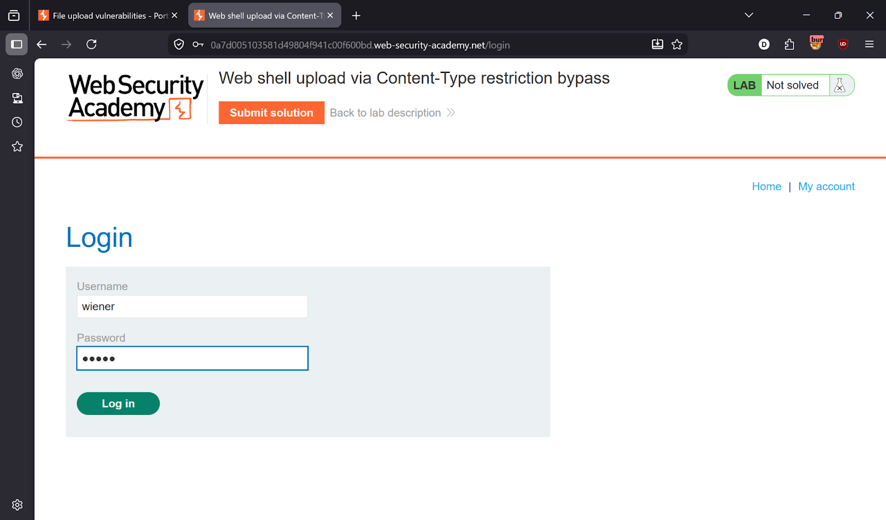
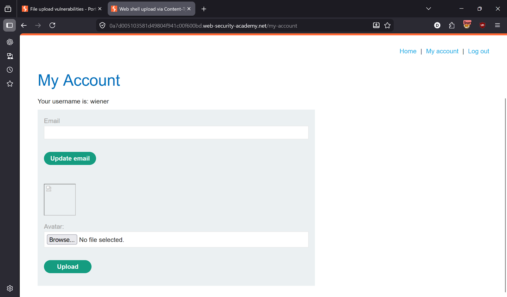
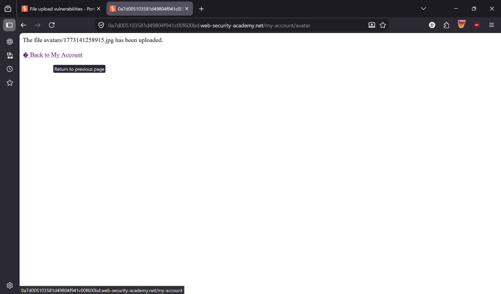
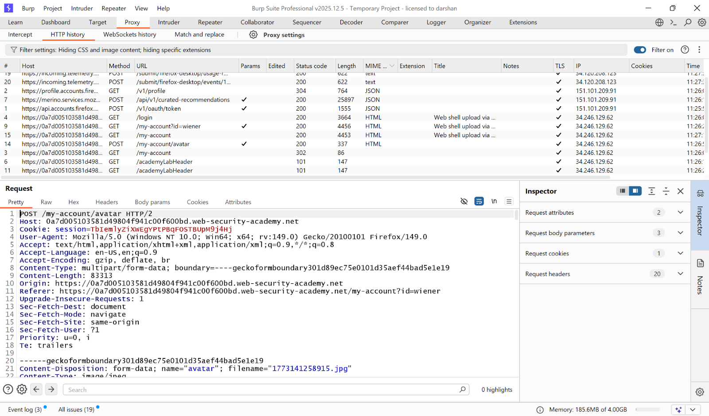
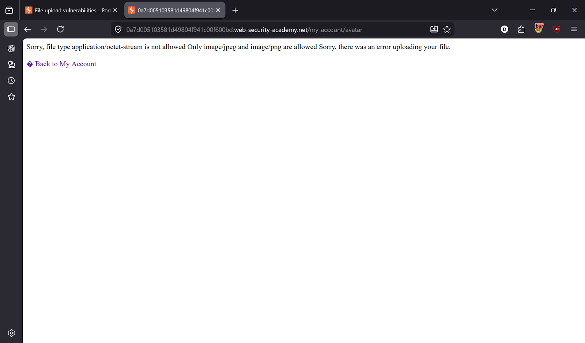
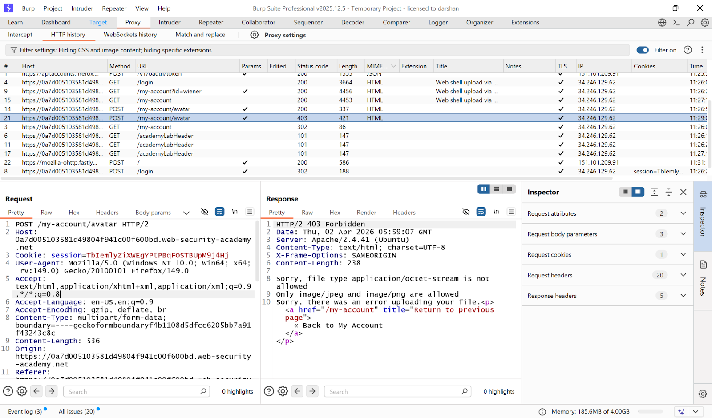
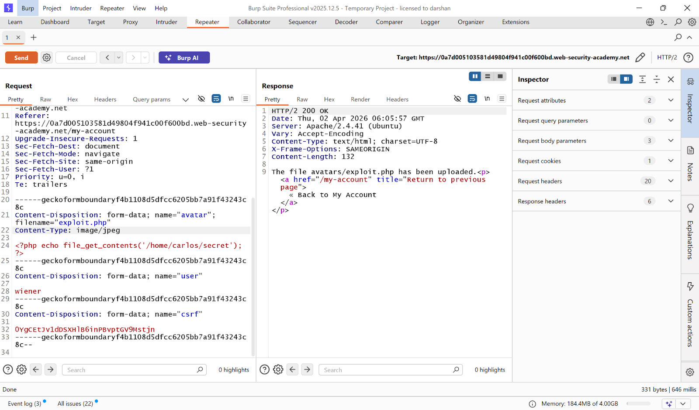
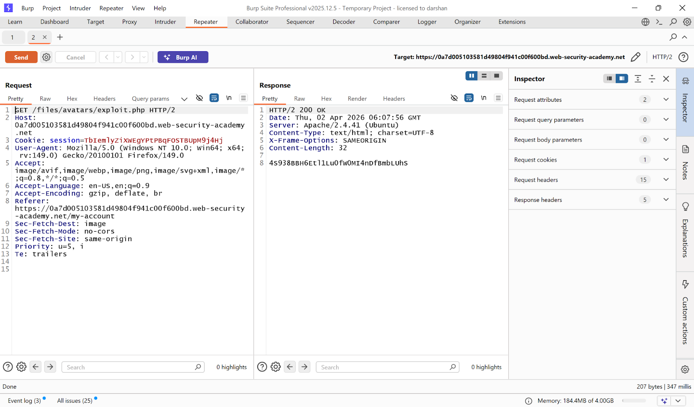
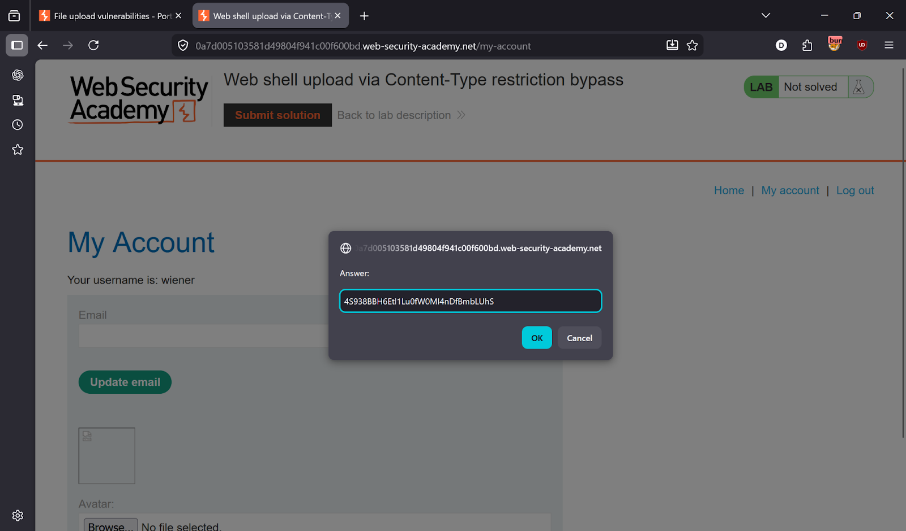
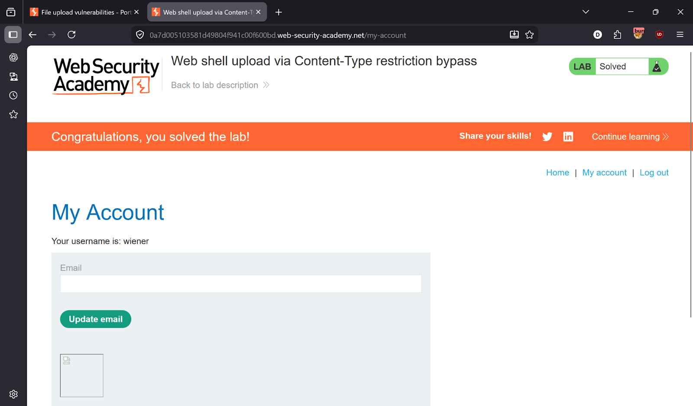

# Lab 2 — Web Shell Upload via Content-Type Restriction Bypass

> [← Back to File Upload Vulnerabilities](../README.md)

---

## 🎯 Objective
The server validates file type using the `Content-Type` header only — not the actual file content. Spoof it to upload a PHP web shell.

---

## 🪜 Steps

### Step 1 — Login
Credentials: `wiener:peter`

Upload a legitimate image first to observe normal behaviour.





---

### Step 2 — Capture upload request in Burp
Go to **Burp → Proxy → HTTP history** → find `POST /my-account/avatar`.



---

### Step 3 — Try uploading PHP directly — blocked
Upload `exploit.php` with `Content-Type: application/x-php` → server rejects it.




---

### Step 4 — Spoof Content-Type to bypass
Send the upload request to **Repeater**. Change:
```
Content-Disposition: form-data; name="avatar"; filename="exploit.php"
Content-Type: image/jpeg      ← spoof as image
```

The server trusts the `Content-Type` header and accepts the file.




---

### Step 5 — Execute the payload
Request the uploaded file:
```
GET /files/avatars/exploit.php
```



---

### Step 6 — Submit solution
Copy secret → Submit → Lab solved ✅




---

## ✅ Result
Lab solved!

---

## 💡 Key Takeaway
Never trust the `Content-Type` header for file validation — it is fully controlled by the client and can be changed in Burp in seconds. Always validate the actual file content (magic bytes) server-side.
