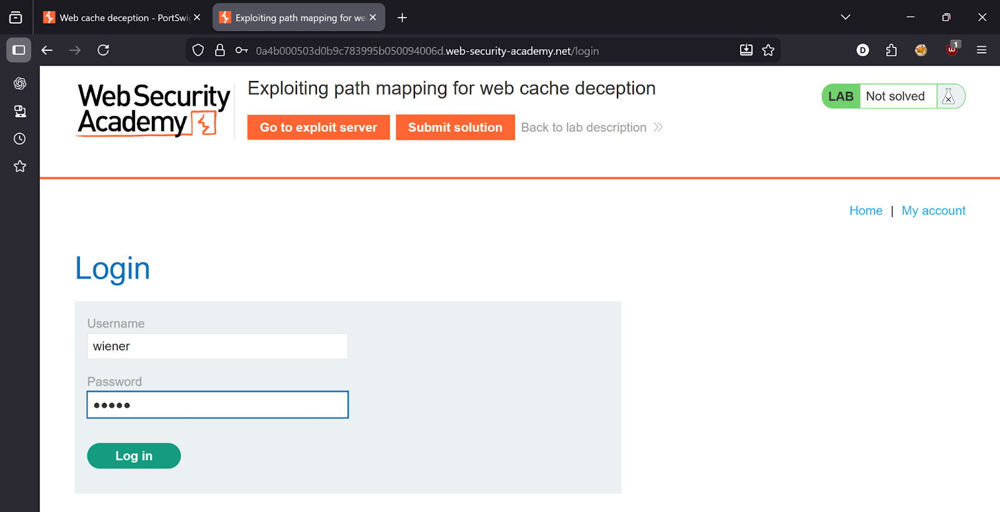
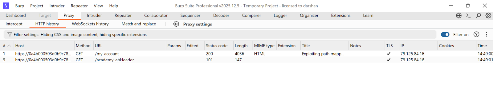
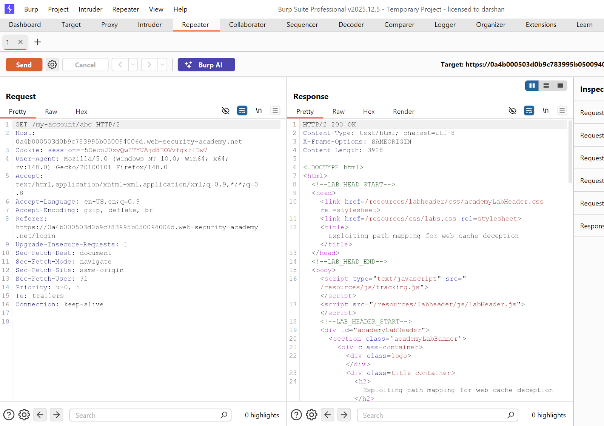
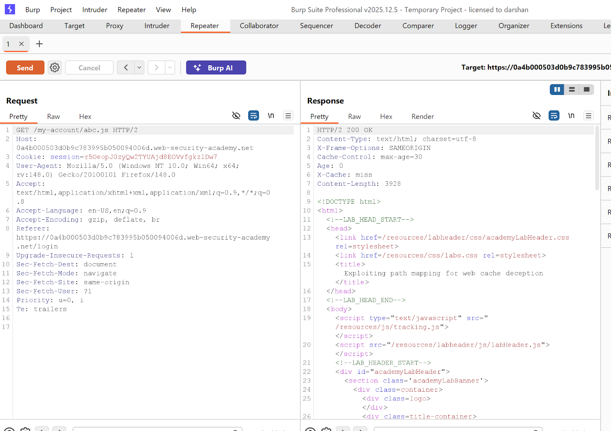
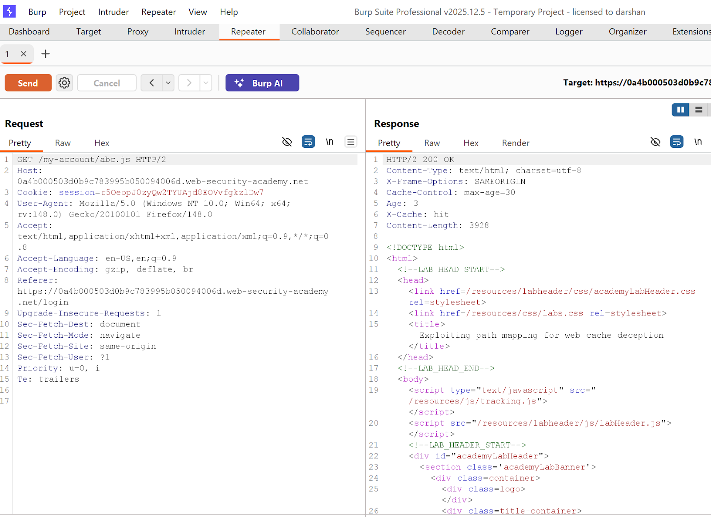
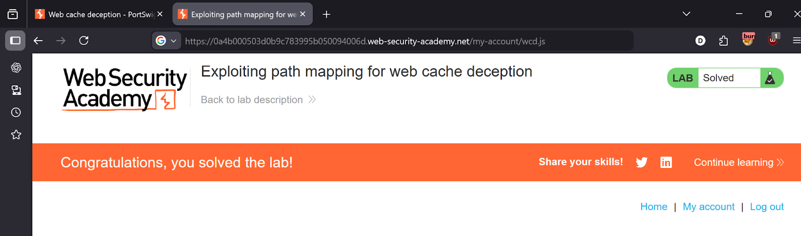

# Lab 1 — Exploiting path mapping for web cache deception

> [← Back to Web Cache Deception](../README.md)

---

## 🎯 Objective
Exploit a path mapping discrepancy between the cache and origin server to steal Carlos's API key.

---

## 🪜 Steps

### Step 1 — Login to wiener account
Login using valid credentials: `wiener:peter`



---

### Step 2 — Intercept and send to Repeater
Intercept the `/my-account` request in Burp Suite and send it to **Repeater**.



---

### Step 3 — Identify path mapping discrepancy
Add `/abc` to the URL: `GET /my-account/abc`

Got **200 OK** — the origin server ignores the extra path. This is the discrepancy we exploit.



---

### Step 4 — Add a static extension to trigger caching
Change the URL to `GET /my-account/abc.js`
- **1st request** → `X-Cache: miss`
- Send again within **30 seconds** → `X-Cache: hit` ✅




---

### Step 5 — Deliver exploit to victim
Go to **Exploit Server**. In the body paste:

```html
<script>
  document.location="https://YOUR-LAB-ID.web-security-academy.net/my-account/wcde.js"
</script>
```

Store → Deliver to victim.



---

## ✅ Result
Carlos's API key retrieved from the cached response. Lab solved!

---

## 💡 Key Takeaway
When cache and origin handle URL paths differently, attackers append a fake static extension to trick the cache into storing sensitive authenticated responses — accessible to anyone.
