# Lab 2 — Exploiting path delimiters for web cache deception

> [← Back to Web Cache Deception](../README.md)

---

## 🎯 Objective
Find a path delimiter accepted by the origin server but treated as part of the filename by the cache. Use it to cache Carlos's account page and steal his API key.

---

## 🪜 Steps

### Step 1 — Login and intercept
Login to wiener account and intercept the `/my-account` request.

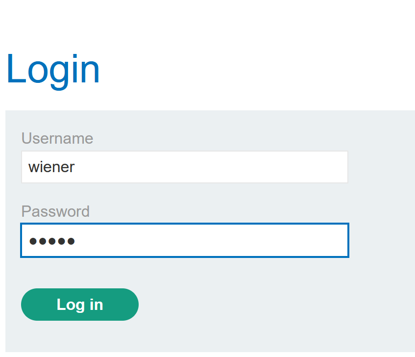

---

### Step 2 — Send to Repeater
Forward the intercepted request to **Repeater**.

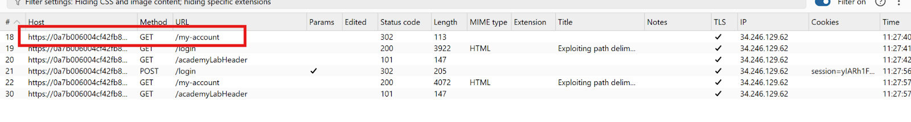

---

### Step 3 — Test path — get 404
Try `GET /my-account/abc` → **404**. Send to **Intruder**.

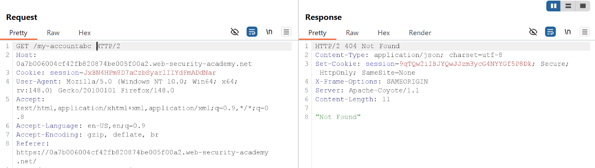

---

### Step 4 — Find working delimiter via Sniper
In Intruder, Sniper attack with delimiter list after `/my-account`. ⚠️ Uncheck URL-encode.

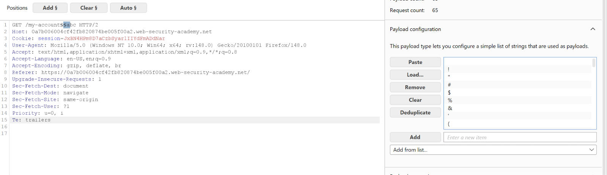
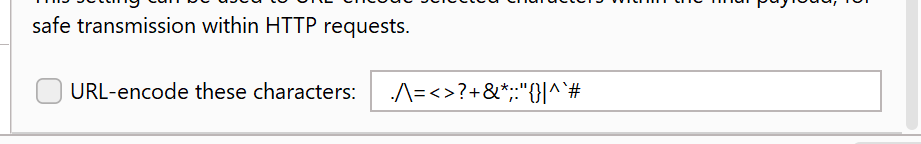

---

### Step 5 — Identify delimiter from results
**302 status code** = delimiter accepted by origin. Found: `;`

- `?` → no result
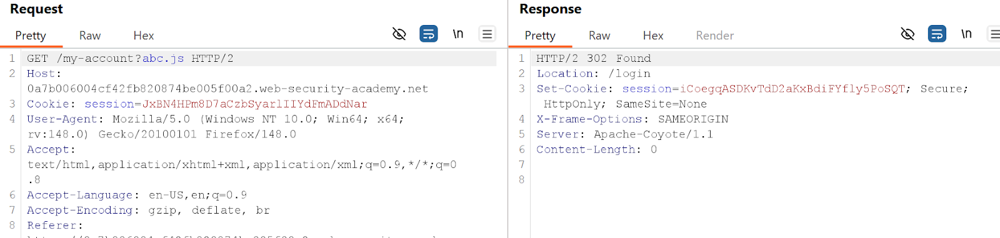

- `;` → **302** ✅
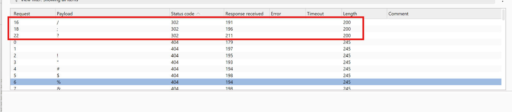

---

### Step 6 — Confirm caching with `;`
URL: `GET /my-account;wcd.js`
- 1st request → `X-Cache: miss`
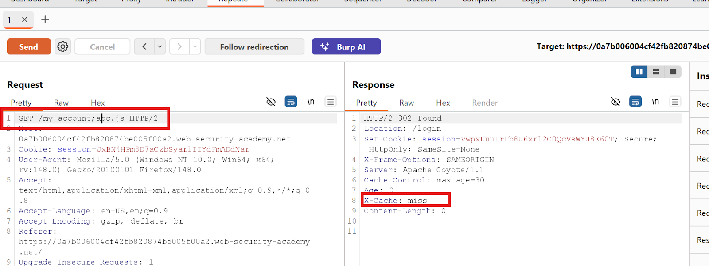
- 2nd request → `X-Cache: hit` ✅
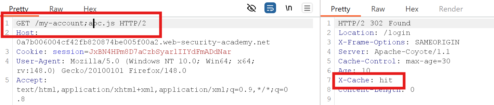

---

### Step 7 — Deliver exploit to victim
Go to **Exploit Server**, paste the script, store and deliver.

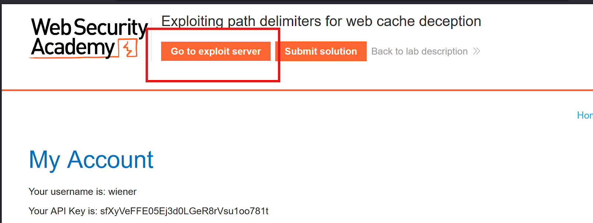
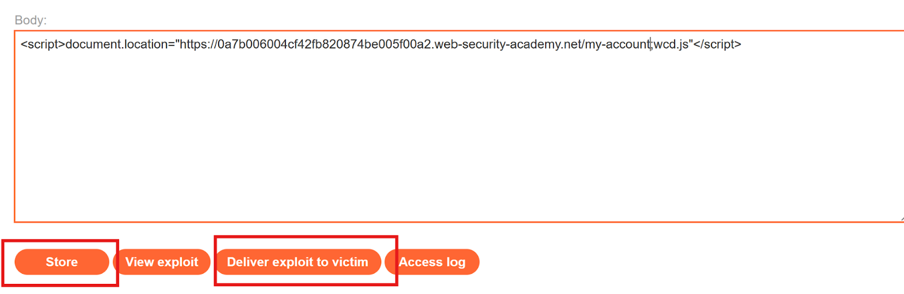

---

### Step 8 — Get Carlos's API key
Request `GET /my-account;wcd.js` → cached response contains Carlos's API key.

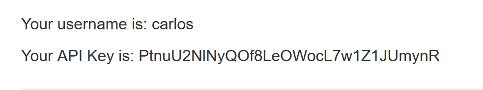

---

## ✅ Result
Lab solved!

---

## 💡 Key Takeaway
If the cache treats `;anything.js` as a static file but the origin ignores the `;` delimiter — attackers can cache sensitive authenticated responses.
