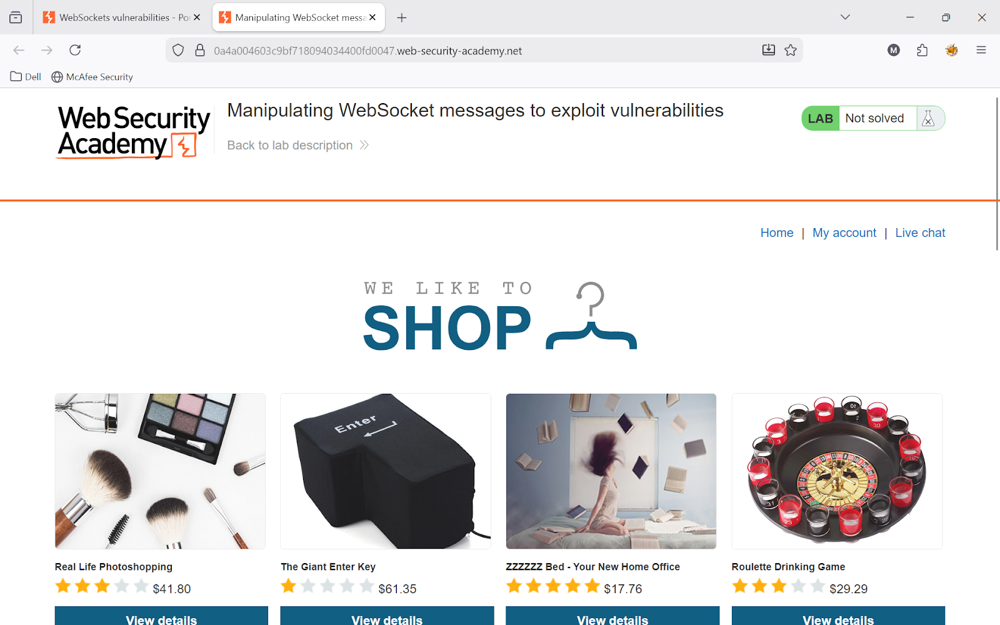
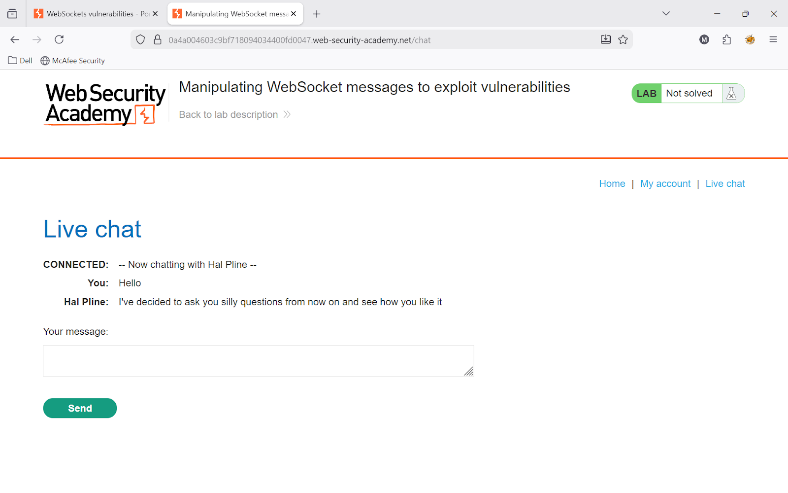
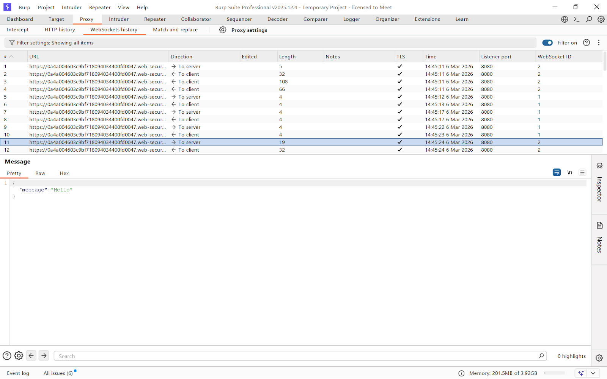
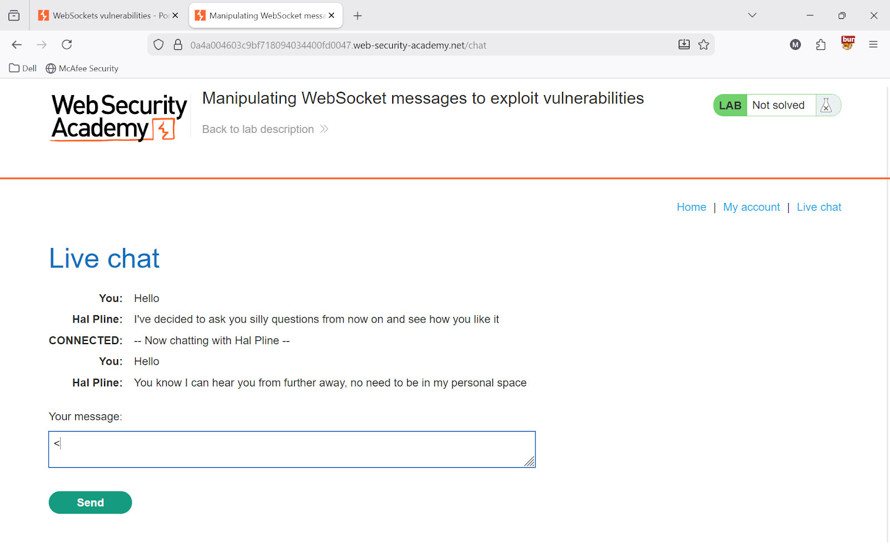
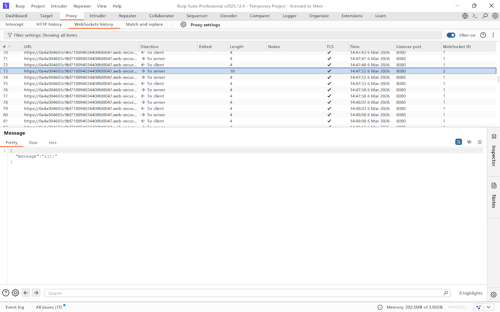
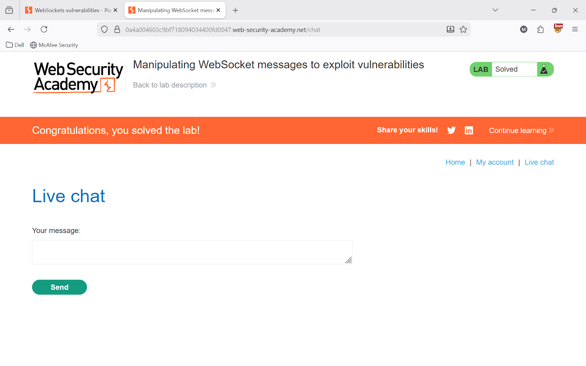

# Lab 1 — Manipulating WebSocket messages to exploit vulnerabilities

> [← Back to WebSockets](../README.md)

---

## 🎯 Objective
Inject an XSS payload through a WebSocket message to execute JavaScript in the browser.

---

## 🪜 Steps

### Step 1 — Open Live Chat
Open the lab, start Burp proxy, click **Live Chat**.



---

### Step 2 — Send "Hello" and capture in Burp
Send `Hello` in chat. It gets captured in Burp.



---

### Step 3 — View in WebSockets history
**Burp → Proxy → WebSockets history** — see `{"message":"Hello"}`



---

### Step 4 — Send `<` character
Send `<` in chat. Burp shows it encoded as `{"message":"&lt;"}`.




---

### Step 5 — Intercept and inject XSS payload
Enable **Intercept**. Send any message. When captured, modify to:

```json
{"message":""}
```

Forward the request.



---

## ✅ Result
Alert fires — Lab solved!

---

## 💡 Key Takeaway
Always sanitize WebSocket input server-side just like HTTP input.
