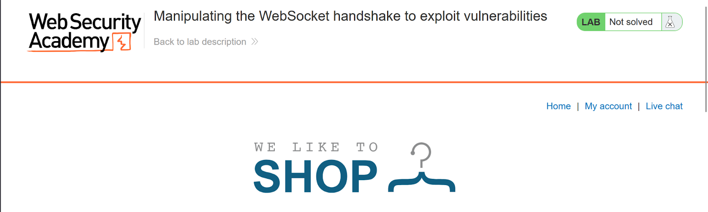
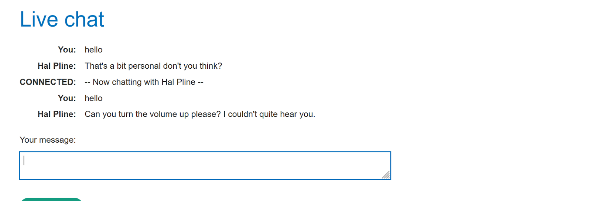
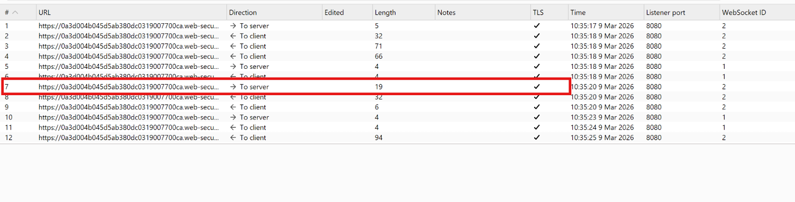
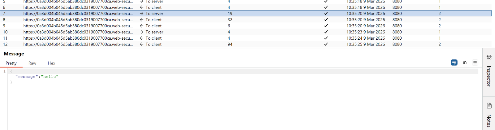
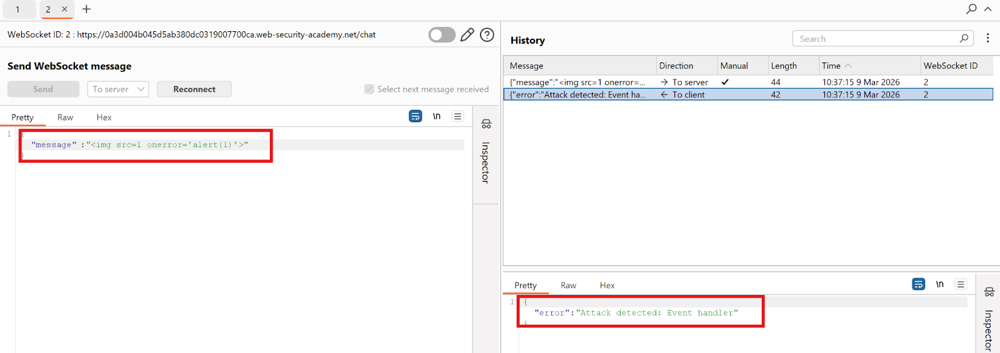
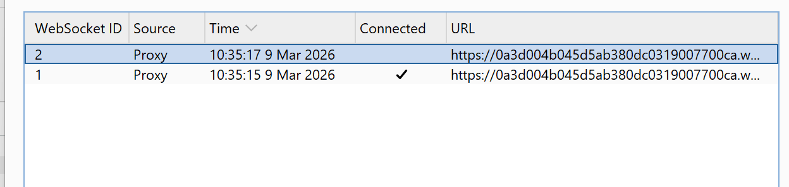
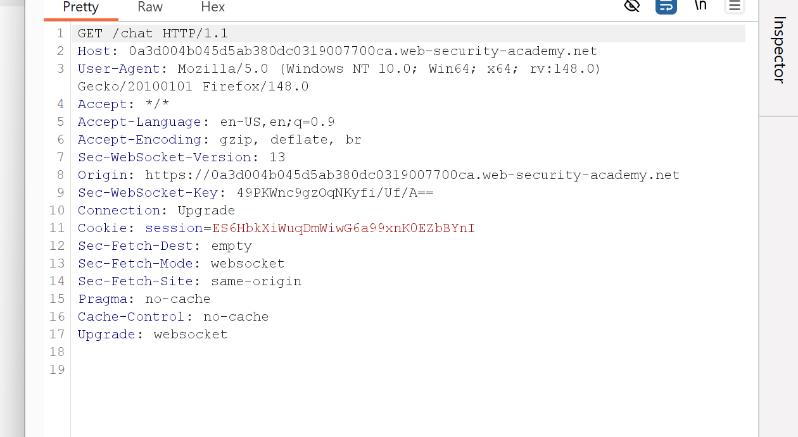
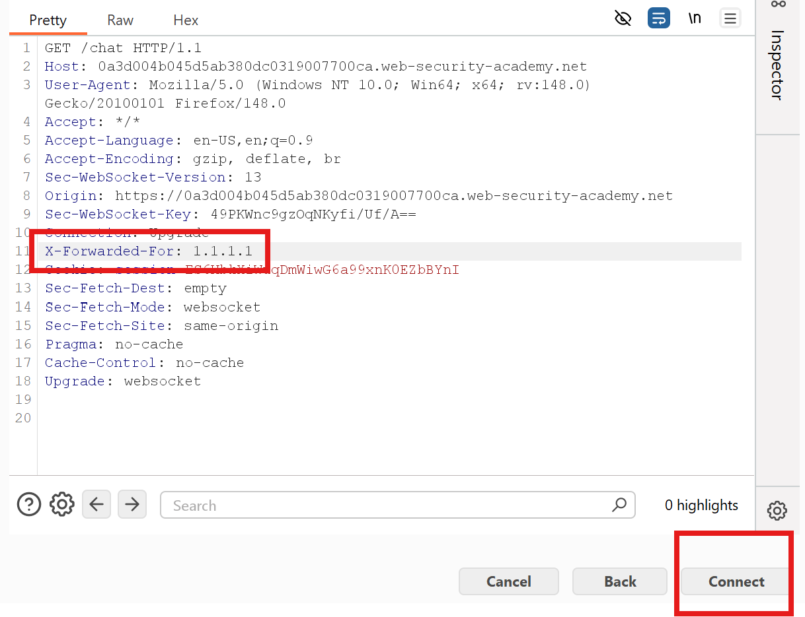
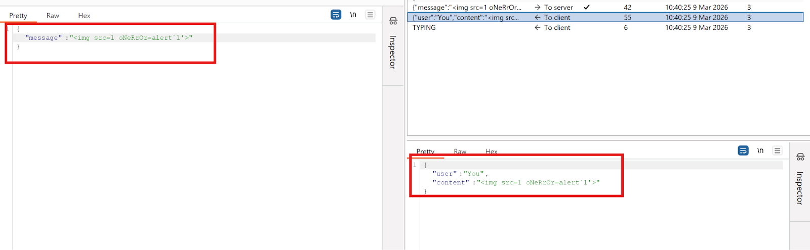
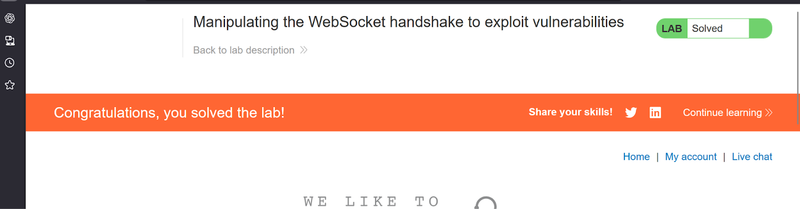

# Lab 2 — Manipulating the WebSocket handshake to exploit vulnerabilities

> [← Back to WebSockets](../README.md)

---

## 🎯 Objective
Bypass an IP ban by manipulating the WebSocket handshake headers, then exploit XSS with an obfuscated payload.

---

## 🪜 Steps

### Step 1 — Open Live Chat and send hello



---

### Step 2 — Capture in WebSockets history
See `{"message":"hello"}` in Burp.




---

### Step 3 — Send to Repeater, test XSS payload
Modify to `{"message":""}` → Send.



**Server response:** `{"error":"Attack detected: Event handler"}` — WAF blocks it + bans IP.



---

### Step 4 — Reconnect fails (IP banned)


---

### Step 5 — Bypass IP ban via handshake
Edit the WebSocket handshake request, add:
```
X-Forwarded-For: 1.1.1.1
```


---

### Step 6 — Send obfuscated XSS payload
```json
{"message":""}
```
Mixed case on the event handler bypasses the WAF filter.



---

### Step 7 — XSS fires


---

## ✅ Result
Lab solved!

---

## 💡 Key Takeaway
IP bans are bypassable with `X-Forwarded-For`. WAF keyword filters fail against case obfuscation.
