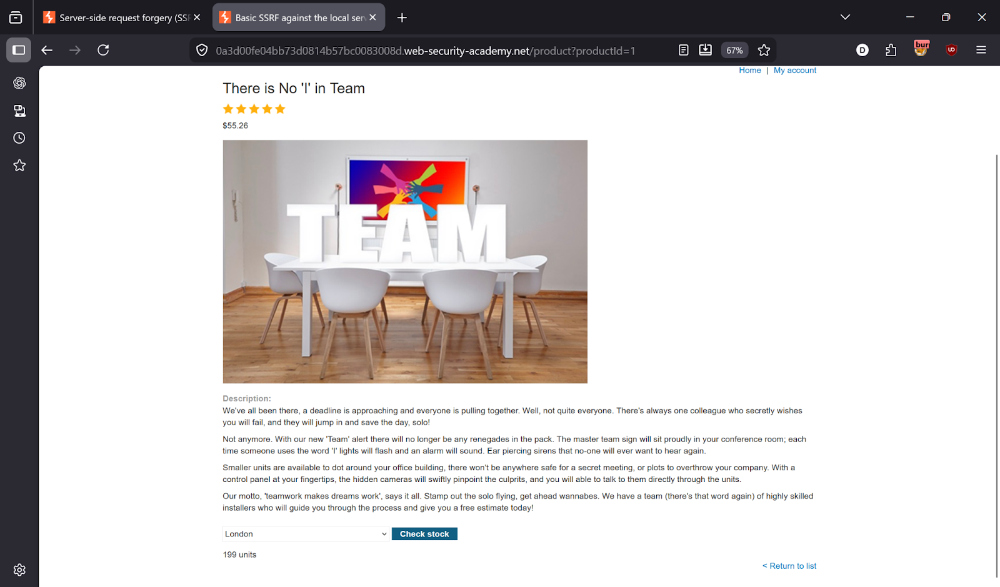
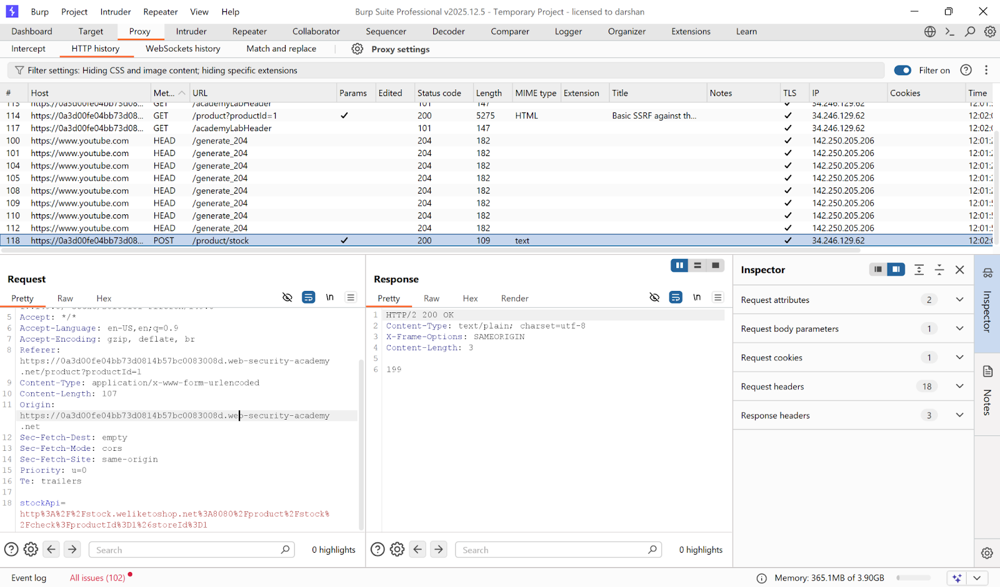
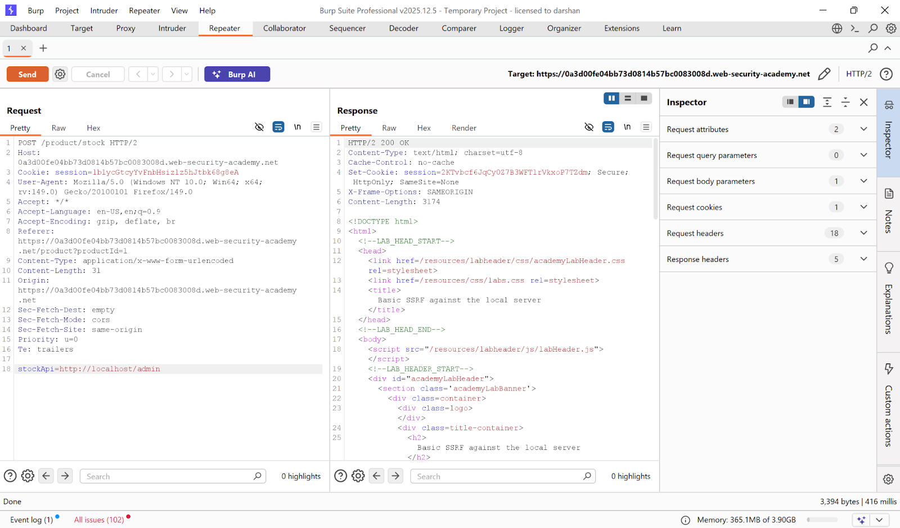
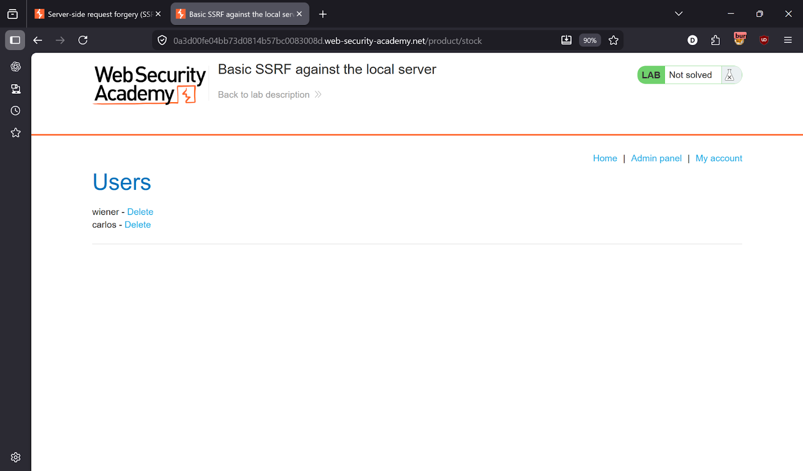
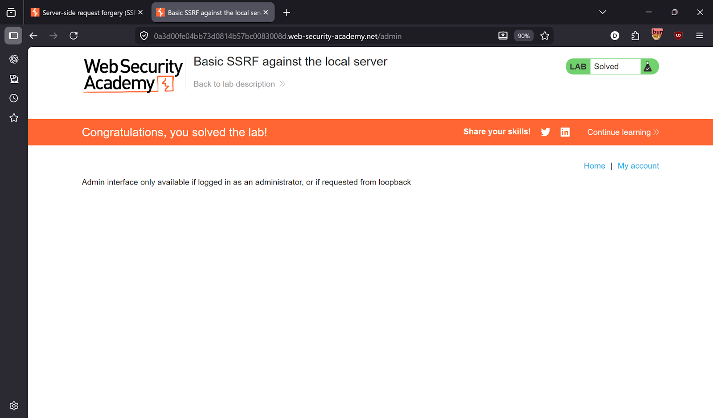

# Lab 1 — Basic SSRF against the local server

> [← Back to SSRF](../README.md)

---

## 🎯 Objective
Force the server to make a request to its own localhost admin panel, then delete the user carlos.

---

## 🪜 Steps

### Step 1 — Intercept the stock check request
Go to any product page → click **Check stock** → capture the request in Burp.




---

### Step 2 — Send to Repeater, test SSRF
Modify the `stockApi` parameter:
```
stockApi=http://localhost/admin
```
Server responds with the internal admin panel.



---

### Step 3 — Delete carlos via SSRF
Update the request:
```
stockApi=http://localhost/admin/delete?username=carlos
```




---

## ✅ Result
Carlos deleted — Lab solved!

---

## 💡 Key Takeaway
Never trust user-supplied URLs in server-side requests. Validate and whitelist allowed destinations to prevent SSRF.
