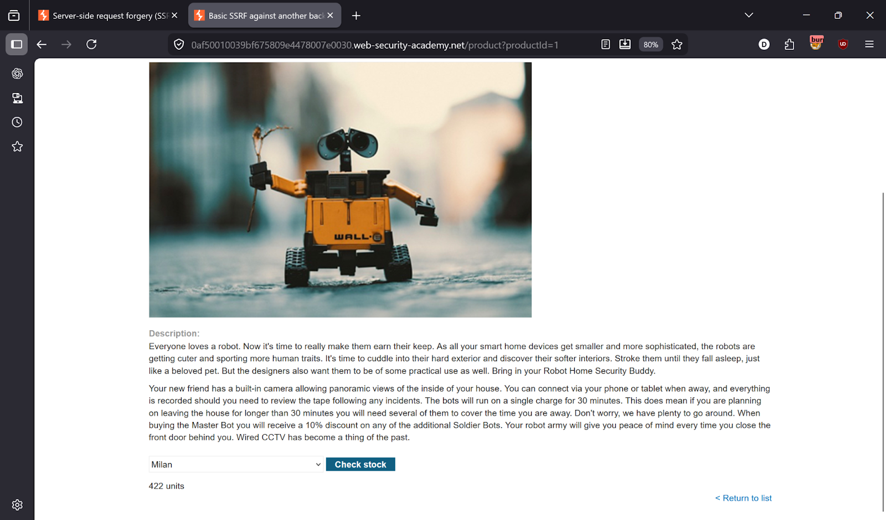
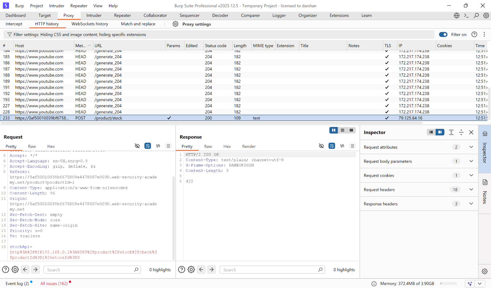
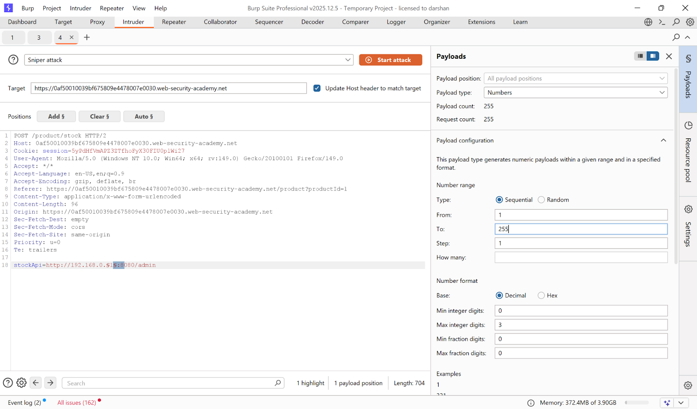
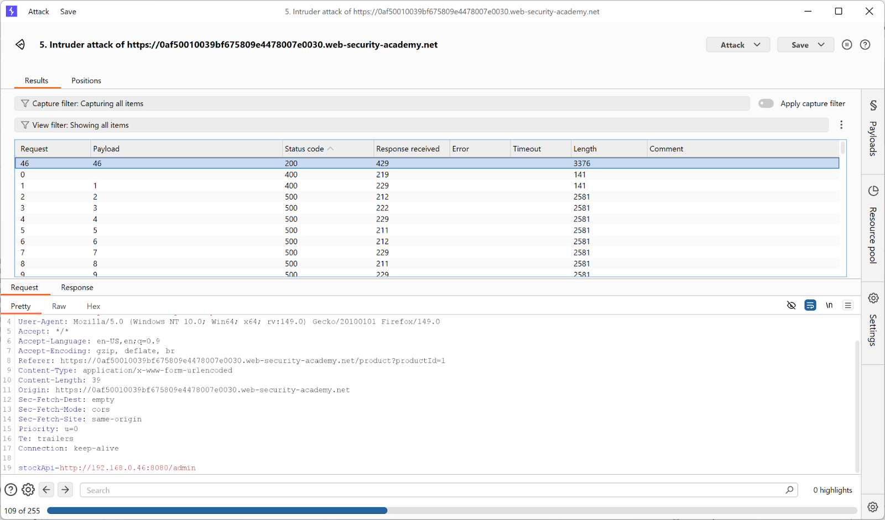
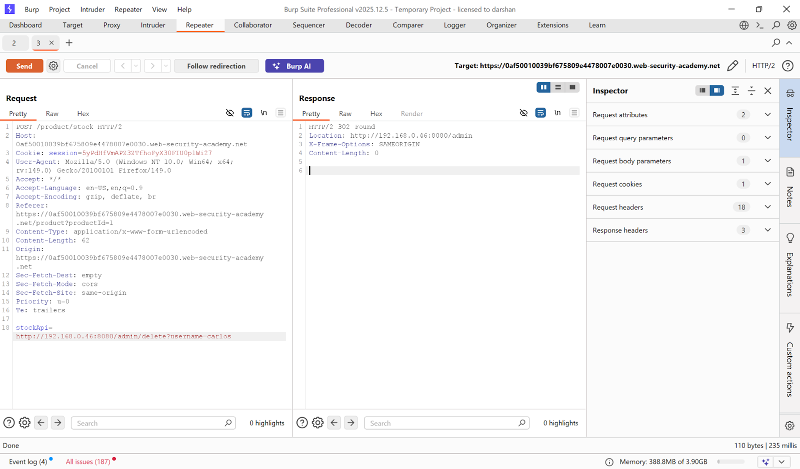
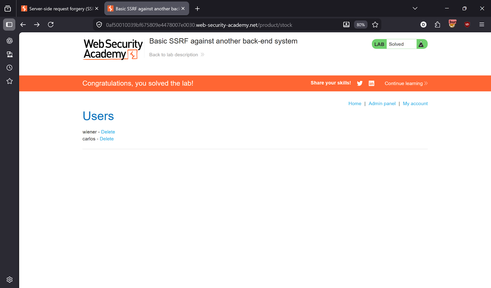

# Lab 2 — Basic SSRF against another back-end system

> [← Back to SSRF](../README.md)

---

## 🎯 Objective
Scan the internal 192.168.0.x network to find the admin panel, then delete carlos.

---

## 🪜 Steps

### Step 1 — Capture the stock check request
Intercept the Check stock request in Burp.




---

### Step 2 — Internal network scan with Intruder
Modify the request and send to **Intruder**:
```
stockApi=http://192.168.0.§1§:8080/admin
```
- Payload type: **Numbers**
- From: `1`, To: `255`, Step: `1`

Start attack.



---

### Step 3 — Identify valid host
Look for **200 OK** response.

**Found: `192.168.0.46`**



---

### Step 4 — Access admin panel in Repeater
```
stockApi=http://192.168.0.46:8080/admin
```




---

## ✅ Result
Internal admin panel accessed — Lab solved!

---

## 💡 Key Takeaway
Internal networks are not safe from SSRF. Attackers can use the vulnerable server as a proxy to scan and access internal systems.
