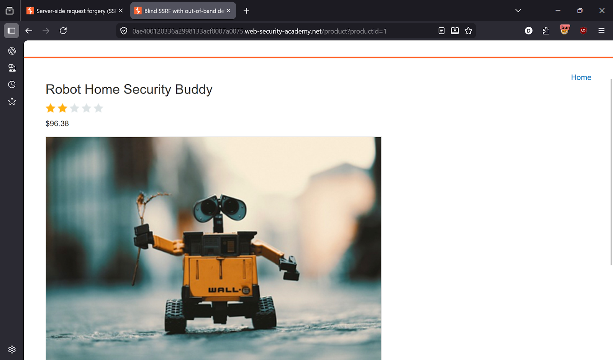
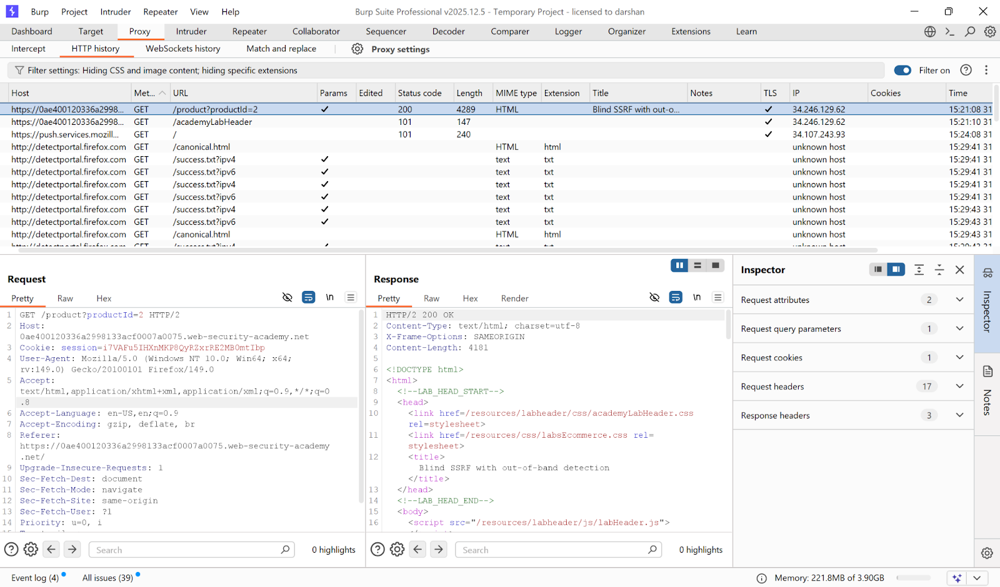
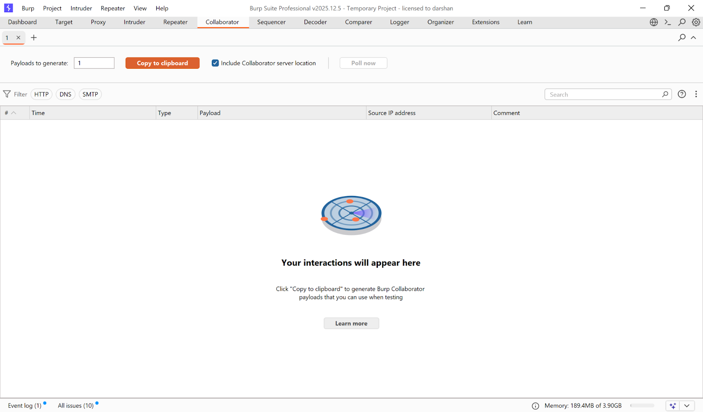
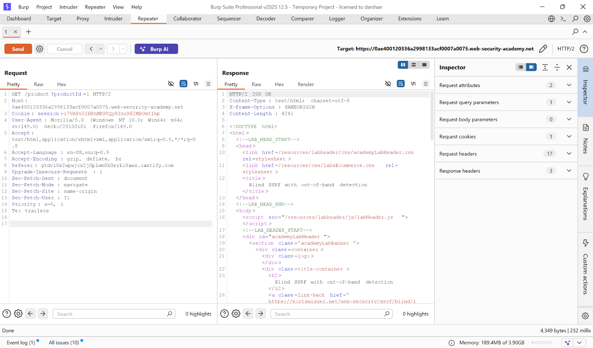
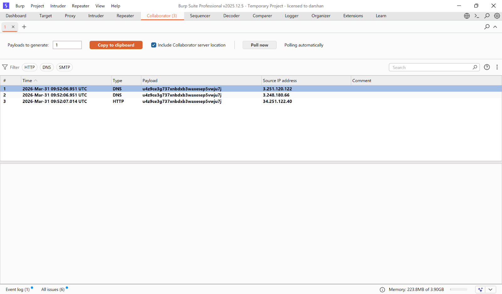
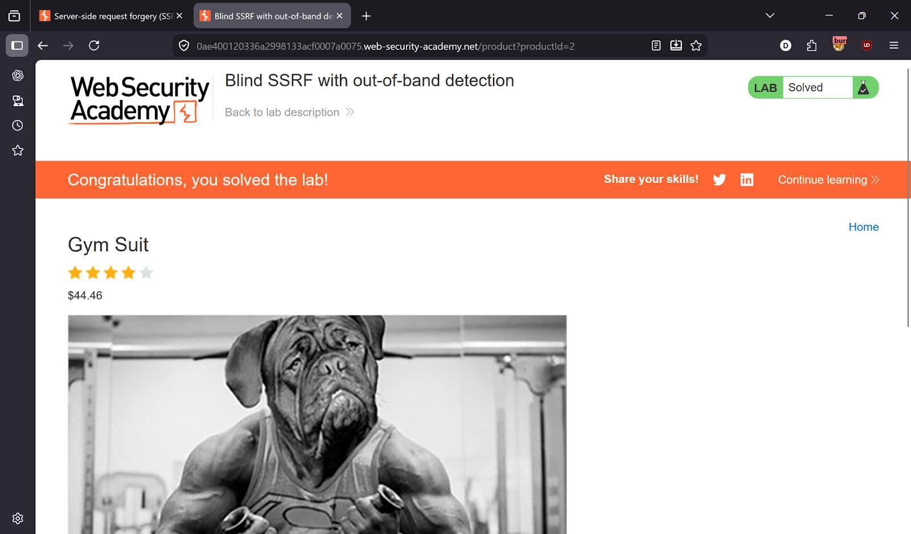

# Lab 5 — Blind SSRF with out-of-band detection

> [← Back to SSRF](../README.md)

---

## 🎯 Objective
The app makes a server-side request based on the `Referer` header but doesn't return the response — detect this blind SSRF using Burp Collaborator.

---

## 🪜 Steps

### Step 1 — Intercept a product page request
Open any product page → intercept in **Burp Proxy → HTTP history** → send to **Repeater**.




---

### Step 2 — Insert Collaborator payload into Referer header
In Repeater, right-click on the `Referer` header value → click **"Insert Collaborator payload"**.

The request now looks like:
```
Referer: https://YOUR-COLLABORATOR-ID.oastify.com
```

Send the request. The response looks completely normal — no visible sign of SSRF. This is what makes it **blind**.




---

### Step 3 — Check Burp Collaborator
Go to **Burp → Collaborator tab** → click **"Poll now"**.

You'll see a DNS/HTTP interaction — the server made a request to your Collaborator URL. Blind SSRF confirmed! ✅



---

### Step 4 — Lab solved


---

## ✅ Result
Lab solved!

---

## 💡 Key Takeaway
Blind SSRF has no visible response but can be detected out-of-band via DNS/HTTP callbacks. Burp Collaborator is the go-to tool for this. Even without visible output, blind SSRF can be used to probe internal networks and exfiltrate data via DNS.
